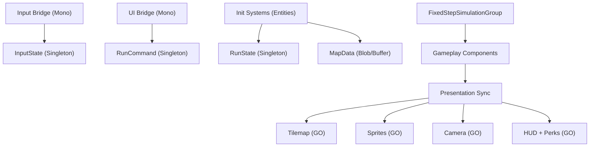

# План миграции на Unity DOTS (Entities) без изменения геймплея

Документ описывает полный и последовательный план замены текущего кастомного ECS на Unity DOTS. Цель — сохранить геймплей 1:1, переписав системы и компоненты «с нуля» как это принято в DOTS, cоблюдая все его Best Practice даже если они полностью противоречат текущей логике.

## 1) Цели и ограничения

- Полная замена текущего ECS (вся логика геймплея — DOTS).
- Геймплейная логика не меняется.
- Визуал и UI остаются на текущем URP 2D (гибридный подход).
- Рендер DOTS Graphics не используется как основной (из-за URP 2D Renderer).
- Код пишется заново под DOTS, без адаптации существующего ECS-фреймворка.

## 2) Инварианты геймплея (должны сохраниться)

Источник механик: `Docs/RuntimeRoguelike_CurrentMechanics.md`.

- Карта 200x200, комнаты + коридоры, стены по периметру.
- Детеминизм по seed.
- Safe radius вокруг старта (без лута/врагов/ловушек).
- Движение по сетке, 4 направления, плавная визуальная интерполяция.
- Occupancy: одна клетка занята одним блокирующим существом (player/enemy).
- Атака игрока по направлению последнего движения, с кулдауном.
- Враги: aggro по радиусу, путь обновляется с интервалом, idle-бродилки.
- Атака врагов по кулдауну при дистанции <= range.
- Spike: урон при входе + периодический тик.
- Poison: DoT на время с интервалами тика.
- Лут после смерти врага с шансом (gold/xp/heal).
- XP/Level-up, выдача перков (по умолчанию 3).
- Difficulty растет со временем + бонус по уровню.
- Restart без перезагрузки сцены (новый seed).
- DevTools: gizmos, teleport, restart.

## 3) Архитектура DOTS (что и где живет)

### 3.1 Слои

- Simulation (DOTS, Burst-friendly): только unmanaged данные, ECB для структурных изменений.
- Presentation (Hybrid): Tilemap, SpriteRenderer, UI, камера, Gizmos. Все на main thread.

### 3.2 Поток данных



## 4) Структура кода (новая)

Рекомендуемая структура:

```
Assets/_Project/Dots/
  Runtime/
    Components/
    Systems/
      Initialization/
      Simulation/
      Fixed/
      Presentation/
    Map/
    Navigation/
  Hybrid/
    Input/
    Rendering/
    UI/
    Debug/
  Authoring/ (опционально)
```

Asmdef:

- `Assets/_Project/Dots/Runtime/RuntimeRoguelike.Dots.Runtime.asmdef`
- `Assets/_Project/Dots/Hybrid/RuntimeRoguelike.Dots.Hybrid.asmdef`
- `Assets/_Project/Dots/Authoring/RuntimeRoguelike.Dots.Authoring.asmdef` (опционально)

## 5) Компоненты DOTS (основные)

### 5.1 Компоненты сущностей

Позиции и движение:

- `GridPosition : IComponentData` (int2)
- `RenderPosition : IComponentData` (float2)
- `MoveIntent : IComponentData` (int2)
- `MoveSpeed : IComponentData` (float)
- `MoveCooldown : IComponentData` (float)
- `LastMoveDirection : IComponentData` (int2)

Комбат:

- `Health : IComponentData` (current, max)
- `Damage : IComponentData` (int)
- `AttackCooldown : IComponentData` (remaining, interval)
- `AttackRange : IComponentData` (float)
- `AttackRequest : IComponentData` (enableable/tag)

AI:

- `AggroRange : IComponentData` (float)
- `Target : IComponentData` (Entity, hasTarget)
- `PathRefreshCooldown : IComponentData`
- `IdleMoveCooldown : IComponentData`
- `PathIndex : IComponentData`
- `PathStep : IBufferElementData` (int2)

Hazards:

- `HazardState : IComponentData` (currentHazard, spikeTickRemaining)
- `PoisonEffect : IComponentData` (remaining, dps, tickInterval, nextTick)

Loot/Progress:

- `LootPickup : IComponentData` (PickupType, amount)
- `PlayerStats : IComponentData` (gold, xp, level, xpToNext, moveSpeedMult, bonusDamage)

Теги:

- `PlayerTag`, `EnemyTag`, `LootTag`

### 5.2 Singleton-компоненты

- `RunState` (seed, mapSize, startCell, safeRadius, runId, isInitialized)
- `DifficultyState` (elapsedTime, enemyMultiplier, spawnRateMultiplier)
- `PerkOfferState` (isVisible, optionsBuffer)
- `RngState` (Unity.Mathematics.Random streams)
- `InputState` (moveDir, attackPressed, restartPressed, toggleGizmos, teleport)
- `RunCommand` (restart, perkChosen, chosenPerkIndex)

### 5.3 Карта и occupancy

Рекомендуется:

- `MapBlob` (BlobAssetReference) с 3 слоями: base, obstacle, hazard.
- `DynamicBuffer<CellOccupant>` на singleton entity для occupancy (Entity.Null если свободно).
- Loot не записываем в occupancy (как сейчас).

## 6) Порядок систем (для паритета)

### Update (SimulationSystemGroup)

- `InputReadSystem` (main thread) — читает input в `InputState`.
- `RestartRequestSystem` — инициирует reset.
- `PerkApplySystem` — применяет выбранный перк.

### FixedStep (FixedStepSimulationSystemGroup)

Строго повторяем порядок текущего проекта:

1. `CooldownTickSystem`
2. `DifficultyTickSystem`
3. `EnemySpawnerSystem`
4. `EnemyTargetAcquireSystem`
5. `EnemyPathfindSystem`
6. `EnemyMoveIntentSystem`
7. `MovementResolveSystem`
8. `PlayerAttackSystem`
9. `EnemyAttackSystem`
10. `HazardSystem`
11. `PoisonTickSystem`
12. `LootPickupSystem`
13. `DeathSystem`
14. `LevelProgressSystem`

Важно: сохраняем поведение где враг может атаковать в том же тике, что умер (как сейчас).

### Presentation

- `RenderInterpolationSystem` (PresentationSystemGroup): RenderPosition -> LocalTransform.
- `TilemapRenderBridge` (Mono): перестройка карты по `MapRenderRequest`.
- `SpriteRenderBridge` (Mono): пул, создание и позиционирование спрайтов.
- `CameraFollowBridge` (Mono).
- `HudBridge` (Mono).
- `PerkUiBridge` (Mono).
- `GizmosBridge` (Mono).

## 7) Подробные шаги реализации

### Шаг 1 — Подключение DOTS пакетов

Через Package Manager:

- `com.unity.entities` (1.4.x для 2022.3)
- `com.unity.entities.graphics` (1.4.x для hybrid/companion)
- `com.unity.burst`, `com.unity.collections`, `com.unity.mathematics` (если не подтянулись)

### Шаг 2 — Новый каркас DOTS

- Создать директории `Assets/_Project/Dots/...`.
- Создать asmdef’ы для Runtime/Hybrid.
- Написать базовый `RunBootstrapSystem`, который:
  - создает singleton entity
  - инициализирует `RunState`, `DifficultyState`, `InputState`, `PerkOfferState`, `RngState`

### Шаг 3 — Map + Hazards

- Переписать генерацию карты в DOTS.
- Записать карту в `MapBlob`.
- Применить hazards в DOTS (spike/poison) и сохранить в `MapBlob`.
- Инициализировать `CellOccupant` буфер по размерам карты.
- Поднять `MapRenderRequest`.

### Шаг 4 — Спавн сущностей

- `SpawnPlayerSystem`: player entity + occupancy.
- `SpawnInitialEnemiesSystem`: initial count, safe radius, occupancy.
- `EnemySpawnerSystem`: регулярный спавн, difficulty multiplier.

### Шаг 5 — Симуляция

- Реализовать все FixedStep системы в нужном порядке.
- Pathfinding переписать под DOTS:
  - `NativeArray` и `TempJob`
  - путь в `DynamicBuffer<PathStep>`
  - occupancy учитываем (кроме цели)

### Шаг 6 — Гибридная визуализация

- Tilemap читает `MapBlob`, создает layers (ground/walls/hazards).
- Entity views: SpriteRenderer pool, привязка к entity.
- RenderPosition -> Transform с плавной интерполяцией.
- HUD/Perks: UI на Mono, данные из singletons/компонентов.

### Шаг 7 — Restart

В `RestartSystem`:

- инкрементировать `RunState.runId`
- уничтожить все run-entities
- пересоздать map/occupancy/singletons
- установить `MapRenderRequest`

### Шаг 8 — Проверка паритета

- Проверить все инварианты из раздела 2.
- Сравнить поведение на нескольких seed.

## 8) Изменения сцены

После готовности DOTS-логики:

- Обновить `Assets/_Project/Scenes/Main.unity`:
  - убрать `SceneContext` и `MainInstaller`
  - добавить новый bootstrap Mono (Input/UI/Presentation bridges)

## 9) Удаление старого кода

После полного паритета:

- Удалить:
  - `Assets/_Project/Scripts/Ecs`
  - `Assets/_Project/Scripts/DI` (если Zenject не нужен)
  - `Assets/_Project/Scripts/Map` и `Assets/_Project/Scripts/Navigation` (если полностью заменены)
  - старый Rendering/Presentation, если не используется

## 10) Чеклист паритета (кратко)

- seed детерминирует карту и спавн
- safe radius без врагов/лут/ловушек
- движение по сетке 4 направления
- occupancy работает
- атака игрока/врагов по кулдауну
- spike и poison работают (tick + duration)
- loot drop и pickup
- level up + perk offer + apply
- difficulty рост во времени
- restart без reload сцены

