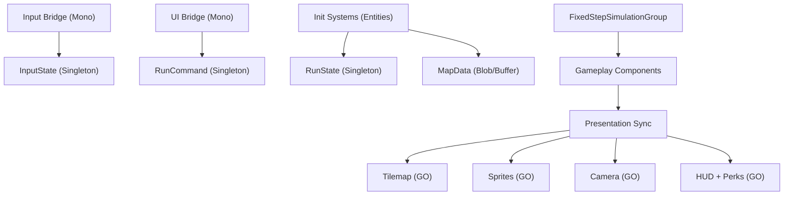

# План миграции на Unity DOTS (Entities) без изменения геймплея

Документ описывает полный и последовательный план замены текущего кастомного ECS на Unity DOTS. Цель — сохранить геймплей 1:1, переписав системы и компоненты «с нуля» как это принято в DOTS, cоблюдая все его Best Practice даже если они полностью противоречат текущей логике.

## 1) Цели и ограничения

- Полная замена текущего ECS (вся логика геймплея — DOTS).
- Геймплейная логика не меняется.
- Визуал и UI остаются на GameObject/URP 2D (гибридный подход).
- DOTS Graphics/Entities Graphics не используется и не подключается.
- Данные сущностей задаются через authoring+baking (SubScene/authoring компоненты).
- Код пишется заново под DOTS, без адаптации существующего ECS-фреймворка.

## 2) Инварианты геймплея (должны сохраниться)

Источник механик: `Docs/RuntimeRoguelike_CurrentMechanics.md`.

- Карта 200x200, комнаты + коридоры, стены по периметру.
- Детеминизм по seed.
- Safe radius вокруг старта (без лута/врагов/ловушек).
- Движение по сетке, 4 направления, плавная визуальная интерполяция.
- Occupancy: одна клетка занята одним блокирующим существом (player/enemy).
- Атака игрока по направлению последнего движения, с кулдауном.
- Враги: aggro по радиусу, путь обновляется с интервалом, idle-бродилки.
- Атака врагов по кулдауну при дистанции <= range.
- Spike: урон при входе + периодический тик.
- Poison: DoT на время с интервалами тика.
- Лут после смерти врага с шансом (gold/xp/heal).
- XP/Level-up, выдача перков (по умолчанию 3).
- Difficulty растет со временем + бонус по уровню.
- Restart без перезагрузки сцены (новый seed).
- DevTools: gizmos, teleport, restart.

## 3) Архитектура DOTS (что и где живет)

### 3.1 Слои

- Simulation (DOTS, Burst-friendly): только unmanaged данные, ECB для структурных изменений.
- Presentation (Hybrid, GameObject-only): Tilemap, SpriteRenderer, UI, камера, Gizmos. Все на main thread, без DOTS Graphics.

### 3.2 Поток данных



## 4) Структура кода (новая)

Рекомендуемая структура:

```
Assets/_Project/Dots/
  Runtime/
    Components/
    Systems/
      Initialization/
      Simulation/
      Fixed/
      Presentation/
    Map/
    Navigation/
  Hybrid/
    Input/
    Rendering/
    UI/
    Debug/
  Authoring/
    Components/
    Bakers/
  Baking/
    Systems/
```

Asmdef:

- `Assets/_Project/Dots/Runtime/RuntimeRoguelike.Dots.Runtime.asmdef`
- `Assets/_Project/Dots/Hybrid/RuntimeRoguelike.Dots.Hybrid.asmdef`
- `Assets/_Project/Dots/Authoring/RuntimeRoguelike.Dots.Authoring.asmdef`
- `Assets/_Project/Dots/Baking/RuntimeRoguelike.Dots.Baking.asmdef`

### 4.1 Authoring & Baking

- Authoring-компоненты для `Player/Enemy/Loot/Perk/MapConfig` хранят дизайн-данные.
- Bakers переводят данные в unmanaged `IComponentData` и/или `BlobAssetReference`.
- Entity-prefab-ы запекаются и хранятся в конфиге/синглтоне как `EntityPrefabReference`.
- SubScene используется для authoring-контента; runtime лишь инстанцирует сущности.
- В bakers фиксируем зависимости через `DependsOn(...)` для корректного ребейка.

## 5) Компоненты DOTS (основные)

### 5.1 Компоненты сущностей

Позиции и движение:

- `GridPosition : IComponentData` (int2)
- `PreviousGridPosition : IComponentData` (int2)
- `RenderPosition : IComponentData` (float2)
- `MoveIntent : IComponentData, IEnableableComponent` (int2)
- `MoveSpeed : IComponentData` (float)
- `MoveCooldown : IComponentData` (float)
- `LastMoveDirection : IComponentData` (int2)
- `SpriteKeyComponent : IComponentData` (DotsSpriteKey enum)

Комбат:

- `Health : IComponentData` (current, max)
- `Damage : IComponentData` (int)
- `AttackCooldown : IComponentData` (remaining, interval)
- `AttackRange : IComponentData` (float)
- `AttackRequest : IComponentData, IEnableableComponent` (tag)

AI:

- `AggroRange : IComponentData` (float)
- `Target : IComponentData` (Entity, hasTarget)
- `PathRefreshCooldown : IComponentData`
- `IdleMoveCooldown : IComponentData`
- `PathIndex : IComponentData`
- `PathStep : IBufferElementData` (int2)

Hazards:

- `HazardState : IComponentData` (currentHazard, spikeTickRemaining)
- `PoisonEffect : IComponentData` (remaining, dps, tickInterval, nextTick)

Loot/Progress:

- `LootPickup : IComponentData` (PickupType, amount)
- `PlayerStats : IComponentData` (gold, xp, level, xpToNext, moveSpeedMult, bonusDamage)

Теги:

- `PlayerTag`, `EnemyTag`, `LootTag`, `RunTag`

### 5.2 Singleton-компоненты

- `RunState` (seed, mapSize, startCell, safeRadius, runId, isInitialized, fixedStepApplied)
- `RunSpawnState` (playerSpawned, initialEnemiesSpawned)
- `EnemySpawnState` (timer)
- `DifficultyState` (elapsedTime, enemyMultiplier, spawnRateMultiplier)
- `PerkOfferState` (isVisible, optionsBuffer)
- `RngState` (Unity.Mathematics.Random, isInitialized)
- `InputState` (moveDir, attackPressed, restartPressed, toggleGizmos, teleportRequested, teleportTarget)
- `RunCommand` (restart, perkChosen, chosenPerkIndex)
- `FixedStepSettings` (timestep, isSet)

### 5.3 Карта и occupancy

Рекомендуется:

- `MapBlob` (BlobAssetReference) с 3 слоями: base, obstacle, hazard.
- `MapBlob` создается через `BlobBuilder`; при рестарте старый `BlobAssetReference` обязательно `Dispose()`.
- `DynamicBuffer<CellOccupant>` на singleton entity для occupancy, `InternalBufferCapacity(0)`, `Entity.Null` если свободно.
- Loot не записываем в occupancy (как сейчас).

### 5.4 DOTS Best Practices

- `ISystem` + `[BurstCompile]` по умолчанию для симуляции.
- Доступ к данным через `SystemAPI`/`RefRO`/`RefRW`, `BufferLookup`, `ComponentLookup` с `[ReadOnly]` где возможно.
- Структурные изменения только через `EntityCommandBuffer` (Begin/End Simulation ECB).
- Requests/flags хранить как `IEnableableComponent`, чтобы избегать add/remove.
- `RunTag` или `RunId` на всех run-entities для безопасного рестарта/очистки.
- Native-коллекции создаются в `OnCreate`, освобождаются в `OnDestroy`, managed-данных в runtime-компонентах нет.

## 6) Порядок систем (для паритета)

### Update (SimulationSystemGroup)

- `InputReadSystem` (main thread) — читает input в `InputState`.
- `TeleportSystem` — телепорт игрока (DevTool), после InputReadSystem.
- `RestartRequestSystem` — инициирует reset.
- `RestartSystem` — выполняет рестарт (очистка entities, сброс состояния).
- `PerkApplySystem` — применяет выбранный перк.

### FixedStep (FixedStepSimulationSystemGroup)

Фиксированный timestep задается явно и соответствует текущему FixedUpdate проекта.

Строго повторяем порядок текущего проекта:

1. `CooldownTickSystem`
2. `DifficultyTickSystem`
3. `EnemySpawnerSystem`
4. `EnemyTargetAcquireSystem`
5. `EnemyPathfindSystem`
6. `EnemyMoveIntentSystem`
7. `MovementResolveSystem`
8. `PlayerAttackSystem`
9. `EnemyAttackSystem`
10. `HazardSystem`
11. `PoisonTickSystem`
12. `LootPickupSystem`
13. `DeathSystem`
14. `LevelProgressSystem`

Важно: сохраняем поведение где враг может атаковать в том же тике, что умер (как сейчас).

### Presentation

- `RenderInterpolationSystem` (PresentationSystemGroup): RenderPosition -> LocalTransform.
- `TilemapRenderBridge` (Mono): перестройка карты по `MapRenderRequest`.
- `SpriteRenderBridge` (Mono): пул, создание и позиционирование спрайтов.
- `PresentationCleanupSystem` (PresentationSystemGroup): освобождение GO/пула для уничтоженных entities.
- `CameraFollowBridge` (Mono).
- `HudBridge` (Mono).
- `PerkUiBridge` (Mono).
- `GizmosBridge` (Mono).

## 7) Подробные шаги реализации

> **Статус**: Шаги 1–7 завершены. Проект полностью мигрирован на DOTS.
> Шаг 8 (проверка паритета) — аудит завершён. Результаты:
> - Все вызовы `EntityManager` в OnUpdate заменены на `SystemAPI`-эквиваленты (кроме spawn-систем с `Instantiate`)
> - `[BurstCompile]` добавлен на методы OnUpdate/OnCreate/OnDestroy во всех системах где возможно (19 из 22)
> - 3 системы обоснованно без Burst на OnUpdate: SpawnPlayerSystem, SpawnInitialEnemiesSystem, EnemySpawnerSystem (используют EntityManager.Instantiate)
> - Все отклонения задокументированы в разделе 11 (пункты 1-10)

### Шаг 1 — Подключение DOTS пакетов [ЗАВЕРШЁН]

Через Package Manager:

- `com.unity.entities` (1.4.x для 2022.3)
- `com.unity.burst`, `com.unity.collections`, `com.unity.mathematics` (если не подтянулись)
- `com.unity.entities.graphics` не устанавливаем (DOTS Graphics не используется)

Дополнительно:

- Убедиться, что `com.unity.entities.graphics` отсутствует в `Packages/manifest.json`.
- Включить Burst (Project Settings > Jobs > Burst) и не отключать Burst в Editor.
- Зафиксировать версии пакетов в VCS (manifest + packages-lock).

### Шаг 2 — Новый каркас DOTS [ЗАВЕРШЁН]

- Создать директории `Assets/_Project/Dots/...`.
- Создать asmdef’ы для Runtime/Hybrid/Authoring/Baking.
  - Runtime: `Unity.Entities`, `Unity.Burst`, `Unity.Collections`, `Unity.Mathematics` (без `UnityEngine`).
  - Hybrid: `UnityEngine`, `Unity.Entities` (мосты и доступ к `EntityManager`).
  - Authoring: `UnityEngine`, `Unity.Entities` (Baker-ы).
  - Baking: `Unity.Entities` (BakingSystem-ы, если нужны).
- Подготовить authoring-компоненты и bakers (SubScene, entity-prefab-ы, конфиги).
- В Runtime создать базовые компоненты/синглтоны: `RunState`, `DifficultyState`, `InputState`, `PerkOfferState`, `RngState`, `RunCommand`.
- Написать базовый `RunBootstrapSystem` (InitializationSystemGroup), который:
  - создает singleton entity
  - инициализирует все нужные singleton-компоненты
  - задает `RunState.isInitialized=false`, `runId` и `seed`
  - выставляет фиксированный timestep `FixedStepSimulationSystemGroup` под текущий `FixedUpdate`

Подробно:

- Структура каталогов:
  - `Runtime/Components` — только данные, без ссылок на `UnityEngine`.
  - `Runtime/Systems` — `Initialization/Simulation/Fixed/Presentation`.
  - `Authoring/Components` — MonoBehaviour для данных дизайна.
  - `Authoring/Bakers` — `Baker<T>` с конвертацией в DOTS.
  - `Baking/Systems` — опциональные `BakingSystem` для пост-обработки.
- asmdef-границы:
  - Runtime не зависит от `UnityEngine` и не содержит managed-полей.
  - Hybrid содержит мосты (input/render/ui/debug) и доступ к `EntityManager`.
  - Authoring/Baking не используются в runtime-логике.
- Authoring входные данные:
  - `MapConfigAuthoring` (размеры, seed, safe radius, комнаты/коридоры).
  - `PlayerConfigAuthoring`, `EnemyConfigAuthoring`, `LootConfigAuthoring`, `PerkConfigAuthoring`.
  - Baking конвертирует конфиги в `BlobAssetReference` и singleton-поля.
- SubScene:
  - В SubScene лежат авторинг-префабы, bakers превращают их в entity-prefab.
  - Runtime только инстанцирует entity-prefab-ы и читает blob-конфиги.
- Bootstrap:
  - Все singleton-компоненты создаются/обновляются один раз.
  - `RunState.isInitialized` используется как gate для генерации карты и спавна.
  - `FixedStepSimulationSystemGroup.Timestep` берется из `Time.fixedDeltaTime` (Mono/Bridge) и один раз устанавливается.

### Шаг 3 — Map + Hazards [ЗАВЕРШЁН]

- Переписать генерацию карты в DOTS (Initialization/Simulation, до начала FixedStep).
- Использовать `Unity.Mathematics.Random` из `RngState` для детерминизма по seed.
- Записать карту в `MapBlob` через `BlobBuilder` (base/obstacle/hazard слои + размеры).
- Применить hazards в DOTS (spike/poison) и сохранить в `MapBlob`.
- При рестарте обязательно `Dispose()` старого `BlobAssetReference`.
- Инициализировать `CellOccupant` буфер по размерам карты (`InternalBufferCapacity(0)`), заполнить `Entity.Null`.
- Сгенерировать `MapRenderRequest` (tag/enableable) для гибридного рендера.

Подробно:

- Генерация карты повторяет текущий алгоритм 1:1 (комнаты/коридоры/периметр).
- Конфиг карты берется из baked `MapConfig` (blob или singleton).
- Safe radius фиксируется до спавна и влияет на:
  - размещение hazards
  - начальные спавны врагов/лут
- `MapBlob` хранит:
  - размеры, стартовую клетку
  - base/obstacle/hazard слои
  - любые дополнительные маркеры (например, safe radius mask)
- `MapRenderRequest` имеет версию/`runId`, чтобы Tilemap перерисовывался 1 раз.

### Шаг 4 — Спавн сущностей [ЗАВЕРШЁН]

- Спавн использует baked entity-prefab-ы и конфиги из singleton/Blob.
- `SpawnPlayerSystem`:
  - инстанцирует prefab игрока через ECB
  - выставляет `GridPosition`, `RenderPosition`, `LastMoveDirection`, `MoveCooldown`
  - отмечает `RunTag` и пишет в occupancy
- `SpawnInitialEnemiesSystem`:
  - спавнит стартовый пул врагов за пределами safe radius
  - гарантирует свободную клетку и запись в occupancy
- `EnemySpawnerSystem`:
  - тикает таймер спавна, учитывает `DifficultyState`
  - выбирает клетку по `MapBlob` + occupancy
  - инстанцирует entity через ECB

Подробно:

- Все спавны помечаются `RunTag` и получают `RenderPosition = GridPosition`.
- Для спавна подбирается валидная клетка:
  - `MapBlob` не obstacle
  - нет occupancy
  - не в safe radius
- `SpawnPlayerSystem` берет стартовую клетку из `RunState`/`MapBlob`.
- `SpawnInitialEnemiesSystem`:
  - лимит по количеству из конфига
  - безопасный отступ от игрока
- `EnemySpawnerSystem`:
  - имеет `SpawnCooldown` + `MaxEnemies` из конфига
  - учитывает `DifficultyState` (частота/лимиты)
  - спавнит через `EntityCommandBuffer` в конце FixedStep

### Шаг 5 — Симуляция [ЗАВЕРШЁН]

- Реализовать все FixedStep системы в нужном порядке (см. раздел 6).
- `CooldownTickSystem`: уменьшает все кулдауны (move/attack/path/idle/poison).
- `DifficultyTickSystem`: увеличивает `elapsedTime`, пересчитывает множители спавна/сложности.
- `EnemySpawnerSystem`: регулярный спавн по таймеру и множителям сложности.
- `EnemyTargetAcquireSystem`: назначает/сбрасывает `Target` по aggro-радиусу.
- `EnemyPathfindSystem`:
  - пересчитывает путь по `PathRefreshCooldown`
  - использует `NativeArray`/`TempJob`, пишет шаги в `DynamicBuffer<PathStep>`
  - occupancy учитывает (кроме клетки цели)
- `EnemyMoveIntentSystem`: ставит `MoveIntent` по пути или idle-бродилке.
- `MovementResolveSystem`: детерминированно применяет `MoveIntent`, обновляет occupancy и `GridPosition`.
- `PlayerAttackSystem`: атака по `LastMoveDirection`, кулдаун, урон цели в соседней клетке.
- `EnemyAttackSystem`: атака по range и кулдауну, урон игроку.
- `HazardSystem`: применяет входной урон spike + стартует poison.
- `PoisonTickSystem`: периодический урон и завершение эффекта.
- `LootPickupSystem`: подбор лута, апдейт `PlayerStats`, удаление лута.
- `DeathSystem`: обработка смерти, drop, очистка occupancy, destroy через ECB.
- `LevelProgressSystem`: XP, уровень, предложение/применение перков.

Подробно:

- Все системы — `ISystem` + `[BurstCompile]`, доступ к данным через `SystemAPI`.
- В `CooldownTickSystem` кулдауны не уходят в минус, используются `math.max`.
- В `EnemyTargetAcquireSystem`:
  - target выбирается по grid-дистанции (как в текущей логике)
  - если target потерян — `Target.hasTarget=false`
- В `EnemyPathfindSystem`:
  - пересчет пути только по таймеру
  - путь в `DynamicBuffer<PathStep>`; если нет пути — idle
  - `NativeArray`/`TempJob` создаются внутри системы и освобождаются
- В `MovementResolveSystem`:
  - сначала собираем intent-ы, затем применяем детерминированно
  - конфликтные намерения решаем по фиксированному правилу (приоритет игрока/индекс сущности)
  - после движения синхронизируем occupancy + `LastMoveDirection`
- В `PlayerAttackSystem`/`EnemyAttackSystem`:
  - атака только если кулдаун <= 0
  - цель ищется по соседней клетке/радиусу и occupancy
  - урон записывается в `Health`
- В `HazardSystem`:
  - spike наносит входной урон, poison ставит `PoisonEffect`
- В `PoisonTickSystem`:
  - тики по `tickInterval`, после истечения `remaining` — disable/clear
- В `DeathSystem`:
  - drop лута по таблице из конфига
  - cleanup occupancy, destroy через ECB
- В `LevelProgressSystem`:
  - XP -> LevelUp, формирование `PerkOfferState` (buffer опций)

### Шаг 6 — Гибридная визуализация [ЗАВЕРШЁН]

- Tilemap читает `MapBlob`, создает layers (ground/walls/hazards) по `MapRenderRequest`.
- Entity views: пул `SpriteRenderer` и маппинг `Entity -> GO` (Dictionary).
- Cleanup: при уничтожении entity — возврат спрайтов в пул и удаление связей.
- RenderPosition -> Transform с плавной интерполяцией (`RenderInterpolationSystem`).
- HUD/Perks: UI на Mono, данные из `PlayerStats`, `RunState`, `PerkOfferState`.
- Bridges читают `EntityManager` только на main thread (`World.DefaultGameObjectInjectionWorld`).

Подробно:

- `TilemapRenderBridge`:
  - слушает `MapRenderRequest` и `runId`
  - пересоздает Tilemap слоями, затем сбрасывает запрос
- `SpriteRenderBridge`:
  - пул GO по типу (player/enemy/loot)
  - маппинг `Entity -> GO` хранится и обновляется каждый кадр
  - удаление entity => возврат GO в пул
- `RenderInterpolationSystem`:
  - интерполирует от предыдущего grid-положения к текущему по кулдауну
  - пишет `RenderPosition` для мостов
- `HudBridge`:
  - читает `PlayerStats`, `DifficultyState`, `RunState`
- `PerkUiBridge`:
  - читает `PerkOfferState` и пишет в `RunCommand`
- `GizmosBridge`:
  - отображает occupancy/радиусы/пути по debug-флагам

### Шаг 7 — Restart [ЗАВЕРШЁН]

В `RestartSystem`:

- инкрементировать `RunState.runId` и сбросить `isInitialized`
- уничтожить все run-entities по `RunTag`/`RunId` через ECB
- dispose старого `MapBlob`, пересоздать map/occupancy/singletons
- пересоздать/сбросить `RngState`, `DifficultyState`, `PerkOfferState`
- установить `MapRenderRequest`
- очистить presentation-пулы/GO по `runId` (bridge-side)

Подробно:

- `RestartSystem` срабатывает по `RunCommand.restart` или input-флагу.
- Перед рестартом `state.Dependency.Complete()` чтобы не было активных джобов.
- `RunCommand` и `InputState` сбрасываются, чтобы не получить повторный рестарт.
- `PerkOfferState` и связанные UI-буферы очищаются.
- `RunState.isInitialized=false` служит точкой входа для повторной инициализации.

### Шаг 8 — Проверка паритета [АУДИТ ЗАВЕРШЁН]

- ✅ Проверить все инварианты из раздела 2.
- ✅ Аудит DOTS best practices: SystemAPI вместо EntityManager, [BurstCompile] на методах ISystem.
- Сравнить поведение на нескольких seed (карта, спавн, позиции, атаки, лут).
- Зафиксировать тестовый набор seed и чеклист действий игрока.
- Добавить временные debug-маркеры (лог/гизмосы) для сравнения порядка тиков.

Подробно:

- Тестовый набор seed фиксируется в документе (например, 3-5 ключевых).
- Для каждого seed — одинаковый сценарий действий (движение/атаки/перки).
- Сравниваем:
  - карту и стартовую позицию
  - траектории врагов и порядок атак
  - дроп и подбор лута
  - уровень/XP и перки
- Тестовые seed:
  - Seed A: 42
  - Seed B: 12345
  - Seed C: 999999
- Временный режим "детерминированной записи":
  - лог шагов FixedStep (tick index, input, ключевые компоненты)
  - сравнение со старой реализацией

## 8) Изменения сцены [ЗАВЕРШЁН]

Сцена `Assets/_Project/Scenes/Main.unity` полностью настроена для DOTS:

- ✅ `DotsBootstrap` — 9 hybrid bridge MonoBehaviours (Input, Rendering, UI, Debug)
  - Дочерние: WorldRoot, EntitiesRoot, PoolRoot
- ✅ `DotsConfig` — 13 authoring MonoBehaviours (все конфиги бейкятся в ECS-сущности)
- ✅ `Canvas` — UI (HUD panel + Perk selection panel с привязками к bridge'ам)
- ✅ `EventSystem` — обработка UI-ввода
- ✅ `Main Camera` + `Global Light 2D`
- ✅ SceneContext и MainInstaller (Zenject) удалены вместе с ProjectContext.prefab

## 9) Удаление старого кода [ЗАВЕРШЁН]

Старый код полностью удалён после подтверждения, что DOTS-код не зависит от старого namespace `RuntimeRoguelike`:

- ✅ Удалён: `Assets/_Project/Scripts/` (20 .cs файлов — все ScriptableObject конфиги, дублирующиеся enum'ы, неиспользуемые утилиты)
- ✅ Удалён: `Assets/_Project/Configs/` (14 .asset файлов — orphaned ScriptableObject assets)
- ✅ Удалён: `Assets/_Project/Resources/ProjectContext.prefab` (Zenject IoC контейнер — не используется DOTS-кодом)
- ✅ Удалены пустые директории: Dots/Authoring/Bakers/, Dots/Baking/Systems/, Dots/Runtime/Navigation/
- ✅ Создан UI Canvas: HUD (HP, XP, Level, Gold, Seed) + Perk Selection Panel (3 кнопки) с привязками к HudBridge и PerkUiBridge
- ✅ Все ссылки на сцене проверены: CameraFollowBridge → Main Camera, SpriteRenderBridge → EntitiesRoot/PoolRoot, TilemapRenderBridge → WorldRoot
- Zenject плагин (`Assets/Plugins/Zenject/`) оставлен — может использоваться другими частями проекта. При необходимости удалить отдельно.

## 10) Чеклист паритета (кратко)

- seed детерминирует карту и спавн
- safe radius без врагов/лут/ловушек
- движение по сетке 4 направления
- occupancy работает
- атака игрока/врагов по кулдауну
- spike и poison работают (tick + duration)
- loot drop и pickup
- level up + perk offer + apply
- difficulty рост во времени
- restart без reload сцены

## 11) Известные отклонения от плана

1. **EnemyPathfindSystem**: A*-массивы аллоцируются как `Allocator.Persistent` в `OnCreate` и переиспользуются, а не создаются как `Temp`/`TempJob` каждый тик. Причина: снижение GC-нагрузки (~48MB/тик при 50 врагах).
2. **Спавн сущностей**: используется прямой `EntityManager.Instantiate`/`CreateEntity` + `EnsureComponent` вместо `EntityCommandBuffer`, т.к. все спавн-системы работают на main thread и не внутри Entities.ForEach/IJobEntity. Обоснование: ECB не даёт выигрыша при single-threaded спавне; `EntityManager.Instantiate` проще и не менее эффективен. Следствие: `[BurstCompile]` на `OnUpdate` этих систем невозможен (EntityManager несовместим с Burst).
3. **MapGenerationSystem**: система НЕ помечена `[BurstCompile]` — OnUpdate использует `EntityManager` напрямую (BlobBuilder, AddComponent, SetComponent), что несовместимо с Burst. Все внутренние статические методы (CarveRoom, CarveCorridor, PopulateHazards и т.д.) Burst-совместимы. Система находится в InitializationSystemGroup и выполняется один раз за забег.
4. **EnemySpawnerSystem/SpawnInitialEnemiesSystem**: общая логика инициализации врага вынесена в `EnemySpawnUtilities.InitializeEnemy()`. `EntityUtilities.EnsureComponent()` — общий хелпер для безопасного add/set.
5. **ColliderSize** удалён из `EnemyConfigData` и `PlayerConfigData` — в DOTS-реализации не используется (рендеринг через гибридные GO).
6. **TeleportSystem** добавлен в SimulationSystemGroup (DevTool) — телепорт игрока по клавише T на случайную свободную клетку.
7. **InputState.Teleport** заменён на `TeleportRequested` (bool) + `TeleportTarget` (int2) для передачи целевой клетки.
8. **[BurstCompile] на методах ISystem**: Добавлен атрибут `[BurstCompile]` на методы `OnUpdate`/`OnCreate`/`OnDestroy` всех систем, где это возможно (ранее был только на struct). Исключения: спавн-системы (SpawnPlayerSystem, SpawnInitialEnemiesSystem, EnemySpawnerSystem) — их `OnUpdate` использует `EntityManager.Instantiate`, несовместимый с Burst. MapGenerationSystem — использует `EntityManager` напрямую (BlobBuilder).
9. **EntityManager.GetBuffer → SystemAPI.GetSingletonBuffer**: Во всех системах, обращающихся к `DynamicBuffer<CellOccupant>` через `state.EntityManager.GetBuffer<CellOccupant>(singletonEntity)`, вызов заменён на Burst-совместимый `SystemAPI.GetSingletonBuffer<CellOccupant>()`. Затронуты: DeathSystem, PlayerAttackSystem, EnemyPathfindSystem, MovementResolveSystem, EnemySpawnerSystem, TeleportSystem, SpawnPlayerSystem, SpawnInitialEnemiesSystem. Аналогично заменены `EntityManager.HasBuffer`, `EntityManager.GetBuffer<PerkOption>`, `EntityManager.SetComponentEnabled` в RestartSystem.
10. **EntityManager.Exists → SystemAPI.HasComponent**: В EnemyAttackSystem проверка `state.EntityManager.Exists(entity)` заменена на `SystemAPI.HasComponent<Health>(entity)` — Burst-совместимый аналог, который также покрывает случай несуществующей сущности.
11. **Старый код полностью удалён**: `Assets/_Project/Scripts/` (20 файлов), `Assets/_Project/Configs/` (14 .asset), `Assets/_Project/Resources/ProjectContext.prefab` (Zenject). DOTS-код не зависит от старого namespace `RuntimeRoguelike`. Authoring-компоненты имеют собственные внутренние структуры (LootEntryAuthoring, PerkDefinitionAuthoring).
12. **UI Canvas добавлен в сцену**: HUD panel (HP, XP, Level, Gold, Seed) + Perk Selection Panel (3 кнопки) с привязками к HudBridge и PerkUiBridge. Ранее UI ссылки были `{fileID: 0}`.

