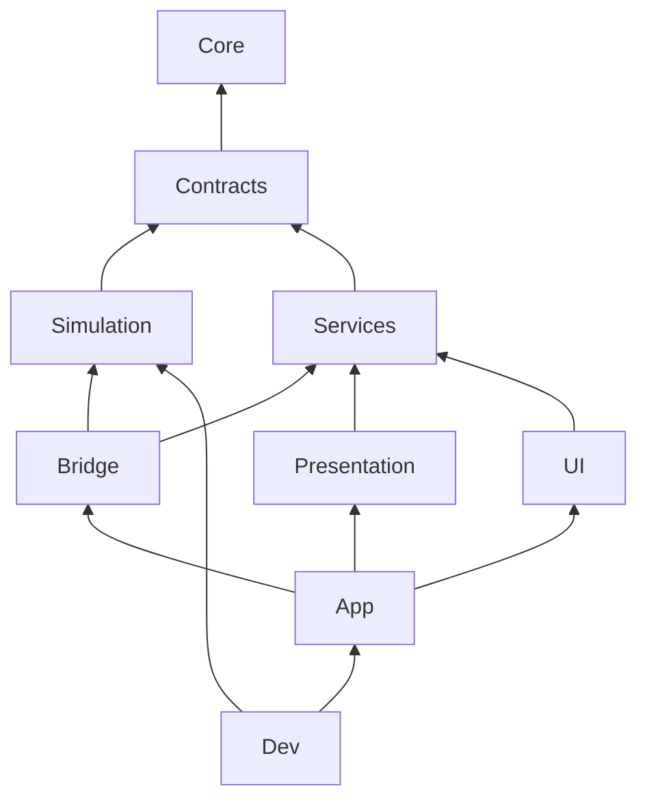

# Структура кода Rise to Panteon

> Где лежит каждый файл, в какую сборку он попадает, как называется и как новая фича входит в проект.
> Агент читает этот документ **перед созданием любого файла**. Имена сборок, контуров, сцен и ключевых типов
> взяты из `README.md` без изменений. При расхождении прав `README.md` (приоритет — README §1).

## 1. Назначение

Документ отвечает на вопросы «куда положить» и «как назвать»: папки, сборки, неймспейсы, именование, срез фичи
и шаблон, числовые id, регистрация, тесты, git, порядок добавления фичи, чеклист, правила `CODE-xx`. Тик, операции
и экспорт описывает `Simulation.md`; вьюхи — `Presentation.md`; экраны — `UI.md`; конфиги и ассеты — `Content.md`;
VContainer и сервисы — `Services.md`.

Термины: **инфраструктура** — код в `Assets/_Project/Code/`, общий для всех фич; **срез** — папка
`Assets/_Project/Features/<Фича>/` (README §5); **контурная папка** — подпапка, названная по сборке (`Simulation/`,
`UI/`, `Tests/EditMode/`); **блок id** — байт, закреплённый за срезом, из которого выводятся его числовые id (§7).

## 2. Дерево папок

### 2.1. Репозиторий

```
Rise to Panteon/
├── Assets/             проект Unity (§2.2)
├── Configs/            submodule rise-to-panteon-configs (A-20): схемы, данные, комнаты, строки и свои tools/ (Content.md)
├── Tools/              Node.js-инструменты репозитория игры (проверки кода и документов); node_modules/ не в git
├── Docs/               GDD/, Tech/ (Architecture/, ArchitectureDecisions.md, Reference/)
├── Packages/  ProjectSettings/  CLAUDE.md  .gitmodules
```

### 2.2. Assets

```
Assets/
├── _Project/
│   ├── Code/                         инфраструктура: папка = сборка; подпапки по областям (Services/Saves/) допустимы
│   │   ├── Core/                     RiseToPanteon.Core.asmdef
│   │   ├── Contracts/                RiseToPanteon.Contracts.asmdef
│   │   ├── Simulation/               RiseToPanteon.Simulation.asmdef
│   │   ├── Bridge/                   RiseToPanteon.Bridge.asmdef
│   │   ├── Services/                 RiseToPanteon.Services.asmdef
│   │   ├── Presentation/             RiseToPanteon.Presentation.asmdef
│   │   ├── UI/                       RiseToPanteon.UI.asmdef (+ Theme/: тема .tss, токены и общие USS — UI.md)
│   │   ├── App/                      RiseToPanteon.App.asmdef
│   │   ├── Dev/                      RiseToPanteon.Dev.asmdef
│   │   ├── Editor/                   RiseToPanteon.Editor.asmdef (+ Configs/Generated/: DTO из gen:cs — Content.md)
│   │   └── Tests/EditMode/, Tests/PlayMode/     RiseToPanteon.Tests.EditMode / .PlayMode.asmdef
│   ├── Features/
│   │   ├── _Template~/               шаблон среза; Unity не импортирует папки с «~» (§6.3)
│   │   └── <Фича>/                   срез (§6.2)
│   ├── Art/                          весь контент, включая Art/Audio/; раскладка — Content.md §9
│   ├── Localization/Tables/          таблицы строк, создаются импортом из Configs/strings/ (Content.md §8)
│   ├── Settings/Presets/             пресеты импорта (Content.md)
│   ├── Scenes/                       Boot.unity, Game.unity, Dev.unity (README §4.2)
│   └── Dots/ Framework/ Main/ Dev/ Editor/ Data/ Art/Tiles/     прототип (§2.4)
├── Settings/                         URP, Renderer2D, InputSystem_Actions, PanelSettings, AudioMixer, профили сборки
├── StreamingAssets/Configs/          встроенный пак конфигов; генерируется, не в git (Content.md)
├── AddressableAssetsData/            настройки Addressables (путь Unity по умолчанию)
└── Plugins/                          плагины прототипа; новое использование — через журнал решений
```

### 2.3. Что куда класть

| Что | Где | Почему |
|---|---|---|
| C#-код инфраструктуры / фичи | `Code/<Сборка>/` / `Features/<Фича>/<Сборка>/` | Срезы фич (A-52) |
| UXML и USS экрана или виджета фичи | Рядом с контроллером в `Features/<Фича>/UI/` | Меняются вместе с кодом экрана |
| Тема, токены, общие USS и компоненты `rtp-*` | `Code/UI/Theme/` | Инфраструктура UI (`UI.md` §8) |
| PanelSettings | `Assets/Settings/` | Корневые настройки (исключение ARCH-13) |
| Графика, префабы вьюх, VFX, шейдеры, иконки, шрифты, звук | `Art/**` по `Content.md` §9 | Контент общий для фич и грузится по адресу = visual id (A-56), а не по папке |
| Числа баланса, шаблоны комнат, строки | `Configs/` | A-20, ARCH-12, ARCH-17. `ScriptableObject` с балансом запрещён |
| Сгенерированное (DTO, пак, таблицы строк) | `Code/Editor/Configs/Generated/`, `StreamingAssets/Configs/`, `Localization/Tables/` | Руками не правится (`Content.md`) |
| Тестовые данные фичи | `Features/<Фича>/Tests/EditMode/Data/` | Рядом с тестами |

### 2.4. Прототип

`Assets/_Project/{Dots, Framework, Main, Dev, Editor, Data}` и `Art/Tiles` — прототип старой концепции
(сборки `RuntimeRoguelike.*`, `Framework`, `Dev`; неймспейсы `RuntimeRoguelike.*`, `Framework.*`). Новый код
на них не ссылается, новые файлы туда не кладутся, правки — только на этапе приведения (A-05). Системы
прототипа не должны попасть в мир `WorldHost`; как хост их отсекает, определяет `Simulation.md`.

## 3. Сборки и .asmref

### 3.1. Сборки

Состав и направления ссылок — README §4.1. Колонка «Наши ссылки» — полный разрешённый список.

| Сборка | Наши ссылки | Пакеты | Платформы · define | unsafe |
|---|---|---|---|---|
| `RiseToPanteon.Core` | — | Unity.Mathematics, Unity.Collections, VContainer, UniTask | все | нет |
| `RiseToPanteon.Contracts` | Core | Unity.Mathematics, Unity.Collections | все | нет |
| `RiseToPanteon.Simulation` | Core, Contracts | Unity.Entities, Unity.Collections, Unity.Burst, Unity.Mathematics | все | да |
| `RiseToPanteon.Bridge` | Core, Contracts, Simulation, Services | Unity.Entities, Unity.Entities.Hybrid, Unity.Collections, Unity.Burst, Unity.Mathematics, VContainer, UniTask | все | да |
| `RiseToPanteon.Services` | Core, Contracts | VContainer, UniTask, Unity.Addressables, Unity.ResourceManager, Unity.InputSystem, Unity.Collections, Unity.Mathematics | все | нет |
| `RiseToPanteon.Presentation` | Core, Contracts, Services | Unity.RenderPipelines.Universal.Runtime, Unity.RenderPipelines.Core.Runtime, Unity.2D.Animation.Runtime, Unity.2D.Tilemap (прототип пола, A-31), Unity.Burst, Unity.Collections, Unity.Mathematics, VContainer, UniTask | все | нет |
| `RiseToPanteon.UI` | Core, Contracts, Services | Unity.Localization (после установки пакета), Unity.Mathematics, VContainer, UniTask | все | нет |
| `RiseToPanteon.App` | Core, Contracts, Bridge, Services, Presentation, UI | VContainer, UniTask | все | нет |
| `RiseToPanteon.Dev` | Core, Contracts, Simulation, Bridge, Services, Presentation, UI, App | Unity.Entities, Unity.Collections, Unity.Burst, Unity.Mathematics, VContainer, UniTask | все · `RTP_DEV` | да |
| `RiseToPanteon.Editor` | все выше, кроме Dev | те же + `*.Editor`-сборки пакетов | Editor | да |
| `RiseToPanteon.Tests.EditMode` | все выше, кроме Dev | те же + UnityEngine.TestRunner, UnityEditor.TestRunner, `nunit.framework.dll` | Editor · `UNITY_INCLUDE_TESTS` | да |
| `RiseToPanteon.Tests.PlayMode` | все рантайм-сборки, кроме Dev | те же + UnityEngine.TestRunner, `nunit.framework.dll` | все · `UNITY_INCLUDE_TESTS` | да |

Запреты (README §4.1, ARCH-02): `Simulation` не ссылается на `Services`, `Bridge`, `Presentation`, `UI`, `App`;
`Services`, `Presentation`, `UI`, `App` — на `Simulation`, Unity.Entities и Unity.Entities.Hybrid; `Presentation` и
`UI` — друг на друга. `Dev` ссылается на `Simulation` только ради dev-обработчиков операций `<Фича>DevOpSystem`
(`Simulation.md` §5.4); остальной dev-код ECS не трогает и меняет игру только dev-операциями (ARCH-18).

Извне симуляции к ECS обращается только `Bridge` (и dev-обработчики). Публичный API моста для `App` без типов Entities: иначе
`App` не скомпилируется без ссылки на Entities, и это правильная ошибка. На графе стрелка — «ссылается на»;
транзитивные ссылки из таблицы разрешены, но прописываются в asmdef явно.



### 3.2. Настройки asmdef

- `name` = имя файла = `RiseToPanteon.<X>`, `rootNamespace` = `name`. `references` — по имени сборки, не по GUID
  (флажок «Use GUIDs» выключен). `autoReferenced: false`: прототип и `Assembly-CSharp` наши сборки не видят.
- `noEngineReferences: false` везде. Entities, Collections и VContainer сами ссылаются на UnityEngine, поэтому флаг
  ничего не гарантирует и ломает компиляцию. Запрет UnityEngine в симуляции проверяет тест (§3.4).
- `allowUnsafeCode` — по §3.1 (блобы, `UnsafeUtility`, буферы снимка). `overrideReferences: false`; у тестовых
  сборок — `true` + `precompiledReferences: ["nunit.framework.dll"]`.
- `defineConstraints`: `RTP_DEV` у Dev, `UNITY_INCLUDE_TESTS` у тестов. `includePlatforms: ["Editor"]` у Editor и
  Tests.EditMode. `versionDefines` не используются (только для опционального пакета, через журнал решений). Burst
  флага не требует: он компилирует `ISystem` и джобы в любой сборке со ссылкой на Unity.Burst.
- В каждой `Code/<X>/` лежит `AssemblyInfo.cs`: `[assembly: InternalsVisibleTo("RiseToPanteon.Tests.EditMode")]`
  (и `.PlayMode`/`.Editor` по необходимости); в рантайм-сборках — `[assembly: AlwaysLinkAssembly]` (`Services.md`
  §2.2); в Bridge — `[assembly: DisableAutoCreation]`, страховка к README §4.4 (мостовые системы создаёт VContainer).

```json
{ "name": "RiseToPanteon.Simulation", "rootNamespace": "RiseToPanteon.Simulation",
  "references": ["RiseToPanteon.Core", "RiseToPanteon.Contracts",
                 "Unity.Entities", "Unity.Collections", "Unity.Burst", "Unity.Mathematics"],
  "includePlatforms": [], "excludePlatforms": [], "allowUnsafeCode": true, "overrideReferences": false,
  "precompiledReferences": [], "autoReferenced": false, "defineConstraints": [], "versionDefines": [],
  "noEngineReferences": false }
```

Defines проекта: `UNITY_DISABLE_AUTOMATIC_SYSTEM_BOOTSTRAP_RUNTIME_WORLD` — во всех профилях сборки (README §4.4);
`RTP_DEV` — в редакторе и dev-профиле, в релизном его нет; `UNITY_INCLUDE_TESTS` ставит Unity.

### 3.3. .asmref в срезах

- В каждой контурной папке среза лежит ровно один `.asmref` на одноимённую сборку. Он действует на папку и все
  подпапки. Имя файла — `<Фича>.<Контур>.asmref` (`Absorption.Simulation.asmref`,
  `Absorption.Tests.EditMode.asmref`). Содержимое — ссылка по имени: `{ "reference": "RiseToPanteon.Simulation" }`.
- В `Features/` запрещены `.asmdef`. `.cs` вне контурной папки (например, в корне среза) попал бы в
  `Assembly-CSharp`, поэтому он тоже запрещён. В `Code/` `.asmref` не используются.

### 3.4. Как проверяются запреты

Первый уровень — компилятор: ссылки asmdef физически не дают `UI` увидеть `Simulation`. Второй — архитектурные
тесты (EditMode, `[Category("Arch")]`, `Code/Tests/EditMode/Architecture/`). Они сканируют только
`Assets/_Project/Code/` и `Assets/_Project/Features/`, запускаются агентом перед каждым коммитом и в CI, когда он
появится. Красный архитектурный тест — коммит запрещён.

| Тест | Проверяет |
|---|---|
| `AsmdefRulesTests` | Ссылки каждого `RiseToPanteon.*.asmdef` совпадают с §3.1; нет ссылок на сборки прототипа и `GUID:`; настройки §3.2 |
| `AsmrefRulesTests` | Каждая контурная папка среза содержит ровно один `.asmref` на свою сборку; в `Features/` нет `.asmdef` и `.cs` вне контурных папок |
| `SourceRulesTests` | Запрещённые `using` и API (таблица ниже); комментарии и строки перед проверкой вырезаются |
| `NamespaceRulesTests` / `FileLayoutTests` | Неймспейс по пути (§4); один тип верхнего уровня на файл, имя файла = имя типа |
| `FeatureGraphTests` | Зависимости срезов по `using` ацикличны и объявлены в README среза (§6.5) |
| `IdBlockTests` | Диапазоны и уникальность id, соответствие таблице §7.4 |
| `InstallerCatalogTests` | У инсталлеров есть `[FeatureInstaller]` и `[Preserve]`, скоуп допустим для контура (§8, `Services.md` §2.2) |
| `StaticStateTests` | Изменяемые `static`-поля есть только в типах со сбросом `SubsystemRegistration` (CODE-11) |

| Где | Запрещено в исходниках |
|---|---|
| Везде | `RuntimeRoguelike`, `using Framework` (прототип); `DefaultGameObjectInjectionWorld`; `UnityEngine.Input`, `Input.Get*`; `Debug.Log*` вне логгера в `Code/Services/`; `Resources.Load`; `GameObject.Find*`, `FindObject*`, `FindAnyObjectByType`; `async void` |
| `Simulation` | Любой `UnityEngine`; `System.IO`; `System.Random`; `DateTime`; `VContainer`; `Cysharp`; `SystemBase`; `class …: IComponentData`; `ISystem` без `[BurstCompile]` и без `// NOT-BURST:` / `// MAIN-THREAD:` (ARCH-06) |
| `Services`, `Presentation`, `UI`, `App`; `Dev`, кроме `*DevOpSystem` | `Unity.Entities`, `Unity.Transforms`, `EntityManager`, `SystemAPI` |
| Всё, кроме `Services` | `UnityEngine.InputSystem` (ввод — через `IInputService`, CODE-12) |

## 4. Неймспейсы

Схема одна: **неймспейс = `RiseToPanteon.` + путь от `Code/` или `Features/` до контурной папки включительно**.
Подпапки внутри контурной папки неймспейс не меняют.

| Путь файла | Неймспейс |
|---|---|
| `Code/<Сборка>/**` | `RiseToPanteon.<Сборка>` (`RiseToPanteon.Simulation`) |
| `Code/Tests/EditMode/**` | `RiseToPanteon.Tests.EditMode` |
| `Features/<Фича>/<Сборка>/**` | `RiseToPanteon.<Фича>.<Сборка>` (`RiseToPanteon.Absorption.Simulation`) |
| `Features/<Фича>/Tests/EditMode/**` | `RiseToPanteon.<Фича>.Tests.EditMode` |

- По неймспейсу видны срез и сборка (`RiseToPanteon.Combat.UI` — срез Combat, сборка `RiseToPanteon.UI`). Поэтому
  имя среза не совпадает с именем сборки или служебной папки (`Core`, `Contracts`, `Simulation`, `Bridge`,
  `Services`, `Presentation`, `UI`, `App`, `Dev`, `Editor`, `Tests`, `Code`, `Features`, `Infra`).
- Ни один тип не называется так же, как срез: `RiseToPanteon.Combat` — неймспейс, типа `Combat` нет.
- В неймспейсе `*.Editor` базовый класс инспектора пишется полностью — `UnityEditor.Editor`: короткое `Editor`
  разрешится в неймспейс, и компиляция упадёт.
- Неймспейс — блоком `namespace X { … }`; `using` над ним: `System.*`, `Unity*`, сторонние, `RiseToPanteon.*`.

## 5. Именование

### 5.1. Общие правила

- Идентификаторы — на английском. Комментарии и XML-doc (`///`) — на русском. У публичных типов и членов
  контракта есть однострочное `///`-описание.
- PascalCase — типы, методы, свойства, константы, публичные поля (включая поля компонентов). `_camelCase` —
  приватные поля. `camelCase` — локальные переменные и параметры.
- Аббревиатуры: из двух букв — заглавные (`UI`, `AI`, `IO`); из трёх и больше — как слово (`Hud`, `Npc`, `Vfx`).
- Один тип верхнего уровня на файл, имя файла = имя типа (для MonoBehaviour этого требует Unity). Вложенные типы
  разрешены. Partial-тип можно разрезать: `FooSystem.cs` + `FooSystem.Jobs.cs`.
- Интерфейсы — `I*`. Булевы — `Is*`, `Has*`, `Can*`. Асинхронные методы — `*Async`, возвращают `UniTask`.
  Перечисления — в единственном числе (`DamageType`), `[Flags]` — во множественном (`ViewFlags`).
- Технические константы — в `*Constants` (`SimConstants` из README); числа баланса в коде запрещены (ARCH-12).
  Тип с ролью из §5.2 обязан иметь её суффикс; тип без роли — существительное без суффикса.

### 5.2. Суффиксы по контурам

| Контур | Роль | Шаблон | Пример |
|---|---|---|---|
| Contracts | Константы операций / кодов отказа / payload операции (unmanaged) | `<Фича>OpTypes` / `<Фича>RejectReasons` / `<Константа>Op` | `AbsorptionOpTypes.AbsorbBody`, `AbsorbBodyOp` |
| Contracts | Константы событий (глагол в прошедшем времени) | `<Фича>EventTypes` | `CombatEventTypes.HitLanded` |
| Contracts | Read-модель (blittable) | `*ReadModel` | `PlayerStatsReadModel` |
| Simulation | Компоненты: данные / тег и enableable-флаг / одноразовый запрос / синглтон / элемент буфера (`Simulation.md` §4.1) | существительное / `*Tag` / `*Request` / существительное / имя элемента | `Position2D`, `DeadTag`, `PathRequest`, `WorldMeta`, `SpeciesPopulation` |
| Simulation | Таблица конфигов: синглтон / корень блоба / строка (`Content.md` §10) | `<Таблица>Config` / `<Таблица>TableBlob` / `<Таблица>Row` | `SpeciesConfig`, `SpeciesTableBlob`, `SpeciesRow` |
| Simulation | Система / обработчик операций фичи / экспорт / подгруппа / джоб | `*System` / `<Фича>OpSystem` / `*ExportSystem` / `*Group` / `*Job` | `AbsorbSystem`, `AbsorptionOpSystem` |
| Simulation, Bridge | Данные сохранения / цель read-модели в мосту | `*SaveData` / `*ReadModelTarget` | `DeathSaveData` |
| Bridge | Мостовая `SystemBase` (`RegisterBridgeSystem<T>()`) | `*IntakeSystem` (приём команд) / `*BridgeSystem` (прочее) | `PlayerInputIntakeSystem` |
| Bridge | Биндер таблицы / секция сохранения | `<Таблица>ConfigBinder : ConfigTableBinder<…>` / `<Фича>SaveSection : ISaveSection` | `SpeciesConfigBinder`, `DeathSaveSection` |
| Services | Сервис / поставщик | `I*Service`, `*Service` / `I*Provider`, `*Provider` | `ISettingsService` |
| Presentation | Вьюха (наследник `WorldView`) / логика над вьюхами / обработчик событий / пул | `*View` / `*Presenter` / `<Имя>EventHandler : ISimEventHandler` / `*Pool` | `SkeletalView`, `CocoonEventHandler` |
| UI | Экран / вкладка / виджет HUD / триггер открытия (`UI.md` §11) | `<Имя>Screen.uxml`, `.uss` + `<Имя>ScreenController` / `<Имя>Tab` / `<Имя>Widget` / `<Имя>ScreenTrigger` | `CocoonScreenController`, `MinimapWidget` |
| UI | View-модель / свой `VisualElement` | `<Имя>ViewModel` / существительное | `CocoonViewModel`, `ValueBar` |
| Dev | Константы и payload dev-операций / их обработчик | `<Фича>DevOpTypes`, `*Op` / `<Фича>DevOpSystem` | `AbsorptionDevOpTypes.GrantEssence` |
| Любой | Инсталлер VContainer | `<Фича><Контур>Installer` | `AbsorptionBridgeInstaller`, `CocoonUIInstaller` |
| App или контур фичи | Узел графа загрузки / старта игры (интерфейсы — Core) | `*BootNode : IBootNode`, `*StartNode : IGameStartNode` | `ConfigPackBootNode` |
| Editor | Окно / инспектор / валидатор / конвертер таблицы (DTO `<Таблица>File` генерирует `gen:cs`) | `*Window` / `*Inspector` / `*Validator` / `<Таблица>ConfigConverter : IConfigTableConverter` | `RoomEditorWindow`, `SpeciesConfigConverter` |
| Tests | Класс / метод | `<Тестируемое>Tests` / `Действие_Условие_Результат` | `Absorb_TargetDenser_ExpIsCapped` |

## 6. Срез фичи и шаблон `_Template~`

### 6.1. Связь с GDD

1. У каждого id из `Docs/GDD/Features.md` ровно один **владелец** — срез или инфраструктура; он реализует правила
   R1…Rn спецификации. Владельцы записаны в §7.4.
2. Срез объединяет несколько id, если у них общие данные (компоненты, синглтоны, таблицы конфигов) и одна группа
   систем. Независимые данные — разные срезы.
3. Имя среза — домен на английском в PascalCase, одно-два слова, без номера GDD (`Absorption`, `WorldStep`,
   `CreatureAI`). После создания среза имя не меняется.
4. Если фича меняет чужой срез (E09 учит `CreatureAI` возвращаться к гнезду), правка делается в папке того среза,
   а id записывается в строку «Участвует» README обоих срезов.
5. Данные фичи на HUD показывает виджет в `Features/<Фича>/UI/`; `Hud` — компоновка и общие элементы (`UI.md`).
6. Срез делится, когда в нём больше ~60 файлов или появились независимые данные. Новый срез получает новый блок;
   выданные id не меняются, и новый срез указывает унаследованный блок в `[FeatureIdBlock]` (§7.3).
7. Инфраструктура владеет M01 (сохранения), M04 (локализация), U01 (управление), U04 (экраны и пауза), U09 (звук)
   и C10 (камера): код — в `Code/`, id — в блоке `0x00`.

### 6.2. Структура среза

```
Features/Absorption/
├── README.md               паспорт среза (§6.4)
├── Contracts/              → RiseToPanteon.Contracts: Absorption.Contracts.asmref, *OpTypes, *EventTypes, *Op, *ReadModel
├── Simulation/             → RiseToPanteon.Simulation: Components/, Config/, Systems/ (при ≤ 8 файлах — без подпапок)
├── Bridge/                 → RiseToPanteon.Bridge: биндеры, секции сохранения, мостовые системы
├── Services/               → RiseToPanteon.Services: сервисы фичи (редко)
├── Presentation/           → RiseToPanteon.Presentation: вьюхи, презентеры, обработчики событий
├── UI/                     → RiseToPanteon.UI: экраны, вкладки и виджеты вместе с UXML/USS
├── Dev/                    → RiseToPanteon.Dev: dev-операции (*DevOpTypes, *Op, *DevOpSystem), dev-панели
├── Editor/                 → RiseToPanteon.Editor: конвертеры таблиц, окна, валидаторы
└── Tests/EditMode/         → RiseToPanteon.Tests.EditMode (+ Data/); Tests/PlayMode/ — только при необходимости
```

Создаются только нужные контурные папки. Пустые папки и папки, где лежит только `.asmref`, удаляются.

### 6.3. Шаблон `Features/_Template~`

Unity не импортирует папки с `~` на конце: код шаблона не компилируется и не получает `.meta`. Шаблон — эталон API
контуров; создаётся вместе с инфраструктурой и обновляется тем же коммитом, что и API в `Simulation.md`,
`Services.md` или `UI.md`.

```
_Template~/                 (у каждой контурной папки — свой Template.<Контур>.asmref)
├── README.md               паспорт с плейсхолдерами
├── Contracts/              TemplateOpTypes, TemplateEventTypes, ExampleOp, TemplateReadModel
├── Simulation/             Components/ (пример данных и тега), Config/TemplateConfig, Config/TemplateTableBlob,
│                           Config/TemplateRow, Systems/TemplateOpSystem, Systems/TemplateReadModelExportSystem
├── Bridge/                 TemplateBridgeInstaller, TemplateConfigBinder, TemplateSaveSection, TemplateSaveData
├── Services/               TemplateServicesInstaller
├── Presentation/           TemplatePresentationInstaller, TemplatePresenter, TemplateEventHandler
├── UI/                     TemplateUIInstaller, TemplateScreen.uxml/.uss, TemplateScreenController, TemplateViewModel
├── Dev/                    TemplateDevInstaller, TemplateDevOpTypes, TemplateDevOpSystem
├── Editor/                 TemplateConfigConverter
└── Tests/EditMode/         TemplateOpSystemTests
```

Плейсхолдеры: `Template` (файлы, типы, неймспейсы) → имя среза, `Example` → первая операция, `0x00` в
`[FeatureIdBlock]` → блок среза. Забытый `0x00` роняет `IdBlockTests`: блок `0x00` принадлежит инфраструктуре.

### 6.4. README среза

Шапка — таблица полей: «Владелец GDD» (`E01`), «Участвует» (`E02 — опыт, L01 — мировое время`), «Блок id» (`0x20`),
«Зависит от срезов» (`Creatures, Progression`), «Этап» (`Прототип`). Разделы: «Контракты» (по строке на тип: имя —
назначение — правило GDD, например `E01 R3`), «Симуляция» (системы и группы, синглтоны, таблицы конфигов), «Мост»,
«Представление и UI», «Тесты» (что покрыто, что проверяется вручную). Обновляется тем же коммитом, что и код.

### 6.5. Зависимости между срезами

- Типы чужого `Contracts` (публичная поверхность среза) можно использовать всегда; зависимость указывается в README.
- Публичные типы чужого среза в той же сборке (компонент `Health` среза `Combat` в системе среза `Death`) можно
  использовать, если зависимость объявлена в README и граф срезов остаётся ацикличным.
- Ссылка на чужой срез — только через `using RiseToPanteon.<Срез>.<Контур>;`: полные имена не видит `FeatureGraphTests`.
- Если нужен цикл, общие данные переносятся в нижележащий срез; данные, нужные почти всем (`StableId`, позиция), —
  в инфраструктуру с записью в журнал решений.
- По умолчанию типы среза `internal`, для чужих срезов — `public`. Срезы одной сборки `internal` не изолирует —
  изоляцию проверяет `FeatureGraphTests`.

## 7. Диапазоны id

### 7.1. Схема

`OpType`, `SimEvent.Type` и `OpRequest.Reason` — `ushort`. Срез получает **блок** `B` — байт от `0x10` до `0xEF`.
Блок `0x00` принадлежит инфраструктуре (`InfraOpTypes`, `InfraEventTypes` в `Code/Contracts/`, `InfraDevOpTypes` в
`Code/Dev/`; там же причины `Unhandled`, `NeedsRunningTick` из `Simulation.md` §5), `0x01–0x0F` — её резерв.

| Пространство | Диапазон для блока `B` | Пример, `B = 0x20` |
|---|---|---|
| Операции | `B·0x100 + 0x01 … + 0xFF` | `0x2001–0x20FF` |
| События (отдельное пространство) | `B·0x100 + 0x01 … + 0xFF` | `0x2001–0x20FF` |
| Коды отказа `OpRequest.Reason` (`Simulation.md` §5.2) | `B·0x100 + 0x01 … + 0xFF` | `0x2001–0x20FF` |
| Dev-операции | `0xF000 + B·0x10 + 0x1 … + 0xF` | `0xF201–0xF20F` |

- `0x0000` — «нет типа»; нулевое смещение в блоке (`0x2000`, `0xF200`) не используется. `0xF000–0xFEFF` — только
  dev-операции и dev-события, `0xFF00–0xFFFF` — резерв.
- Блоков не требуют: `ViewKey` и `StableId` (выдаются автоматически), строковый `ISaveSection.Id` (`Services.md`).
  Биты `ViewState.Flags` — общий ресурс `Code/Contracts`: бит добавляется правкой инфраструктуры, в комментарии —
  срез-владелец.

### 7.2. Правила

1. Срез берёт блок из §7.4 в том же коммите, в котором создаётся, и меняет статус с «план» на «создан».
   Новый срез занимает первый свободный блок в диапазоне своей буквы GDD, при исчерпании — из `0xC0–0xEF`.
2. Выданный id не меняется и не переиспользуется. Устаревшая константа остаётся с `[Obsolete]`.
3. Id — только `public const ushort` в классах `*OpTypes`, `*EventTypes`, `*RejectReasons`, `*DevOpTypes`; литерал id
   вне них запрещён. `*DevOpTypes`, их payload и `<Фича>DevOpSystem` лежат в `Features/<Фича>/Dev/`: сборка Dev
   компилируется только с `RTP_DEV`, поэтому `#if` не нужен.
4. Если у операции `X` есть данные, её payload называется `XOp`. Каждому `*Op` соответствует константа, а размер
   `*Op` не больше ёмкости `Operation.Payload`.

### 7.3. Код

```csharp
// Файл Features/Absorption/Contracts/AbsorptionOpTypes.cs, неймспейс RiseToPanteon.Absorption.Contracts.
/// <summary>Типы операций среза «Поглощение». Блок 0x20, см. CodeStructure.md §7.4.</summary>
[FeatureIdBlock("Absorption", 0x20)]
public static class AbsorptionOpTypes
{
    /// <summary>Поглотить тело действием игрока (GDD E01).</summary>
    public const ushort AbsorbBody = 0x2001;
}
```

`FeatureIdBlockAttribute(string feature, params byte[] blocks)` лежит в `RiseToPanteon.Core`. Несколько блоков
указываются только после деления среза (§6.1, п. 6).

### 7.4. Таблица блоков

Строки между маркерами читает `IdBlockTests`, поэтому формат строки фиксирован: `| 0xNN | Срез | GDD | статус |`.
Статус — `план` (имя можно поменять до создания среза) или `создан`. Диапазоны букв: W `0x10–0x1F`,
E `0x20–0x2F`, C `0x30–0x3F`, B `0x40–0x4F`, L `0x50–0x5F`, D `0x60–0x6F`, K `0x70–0x7F`, I `0x80–0x8F`,
N `0x90–0x9F`, U `0xA0–0xAF`, M `0xB0–0xBF`; `0xC0–0xEF` — резерв.

<!-- id-blocks:begin -->
| Блок | Срез | GDD (владелец) | Статус |
|---|---|---|---|
| 0x00 | Infra | M01, M04, U01, U04, U09, C10 | план |
| 0x10 | WorldStructure | W01, W03 | план |
| 0x11 | LayoutGeneration | W02, W04 | план |
| 0x12 | Locations | W10, W16 | план |
| 0x13 | Density | W05, W06, W08 | план |
| 0x14 | Pressure | W07 | план |
| 0x15 | LocksAndGates | W09, W12 | план |
| 0x16 | Traps | W13 | план |
| 0x17 | WorldLoot | W14 | план |
| 0x18 | Secrets | W15 | план |
| 0x19 | EnvironmentEffects | W17 | план |
| 0x1A | Biomes | W11 | план |
| 0x1B | Frontier | W18, B06 | план |
| 0x1C | UnstableDimensions | W19 | план |
| 0x20 | Absorption | E01 | план |
| 0x21 | Progression | E02, E03 | план |
| 0x22 | Essences | E04, E10 | план |
| 0x23 | Traits | E05, E11 | план |
| 0x24 | Molt | E06 | план |
| 0x25 | Metamorphosis | E07 | план |
| 0x26 | Cocoon | E08, E09 | план |
| 0x27 | EvolutionServices | E12 | план |
| 0x30 | Combat | C01, C02, C03, C06 | план |
| 0x31 | Movement | C04 | план |
| 0x32 | Abilities | C05 | план |
| 0x33 | Healing | C07 | план |
| 0x34 | Stealth | C08 | план |
| 0x35 | Summoning | C09 | план |
| 0x40 | Creatures | B01 | план |
| 0x41 | CreatureAI | B02 | план |
| 0x42 | MiniBosses | B03 | план |
| 0x43 | Guardians | B04, B05 | план |
| 0x50 | WorldClock | L01 | план |
| 0x51 | WorldStep | L02, L03, L04, L12 | план |
| 0x52 | Traces | L05 | план |
| 0x53 | Rumors | L06 | план |
| 0x54 | Npcs | L07, L08 | план |
| 0x55 | Rivals | L09 | план |
| 0x56 | Factions | L10, L11 | план |
| 0x57 | PlayerLevers | L13 | план |
| 0x60 | Death | D01, D02 | план |
| 0x61 | Legacy | D03 | план |
| 0x70 | Anchors | K02 | план |
| 0x71 | Camp | K01, K03, K04, K06, K07 | план |
| 0x72 | Storage | K05 | план |
| 0x80 | Items | I01, I03, I04, I05, I06, I07 | план |
| 0x81 | Relics | I02 | план |
| 0x82 | Economy | I08, I09, I10 | план |
| 0x83 | Crafting | I11 | план |
| 0x90 | Reactions | N05 | план |
| 0x91 | LoreFragments | N01 | план |
| 0x92 | Dialogues | N02, N03 | план |
| 0x93 | Cutscenes | N04 | план |
| 0x94 | Revelations | N06 | план |
| 0x95 | Endings | N07 | план |
| 0xA0 | Hud | U03 | план |
| 0xA1 | Aiming | U02 | план |
| 0xA2 | Map | U05 | план |
| 0xA3 | Journal | U06 | план |
| 0xA4 | Onboarding | U07 | план |
| 0xA5 | GameSettings | U08 | план |
| 0xB0 | WorldCreation | M02 | план |
| 0xB1 | Chapters | M03 | план |
| 0xB2 | BetweenWorlds | M05 | план |
<!-- id-blocks:end -->

### 7.5. Проверка

`IdBlockTests` (EditMode, `[Category("Arch")]`) через рефлексию по `RiseToPanteon.Contracts` и `RiseToPanteon.Dev`
(если загружена) проверяет: каждое значение `*OpTypes`, `*EventTypes`, `*RejectReasons`, `*DevOpTypes` лежит в блоке
своего `[FeatureIdBlock]`; значения уникальны в своём пространстве; блок не заявлен двумя срезами; каждый
`[FeatureIdBlock]` есть в §7.4 с тем же именем, а каждой строке «создан» соответствует код; пары `X` ↔ `XOp` выполняют §7.2, п. 4.

## 8. Регистрация без центральных файлов

Фича входит в проект только через файлы своего среза. Правка `App`, скоупов, сцен и общих списков ради фичи
запрещена (A-52, ARCH-15).

| Что | Как находится | Где объявляется |
|---|---|---|
| ECS-система | `[UpdateInGroup(typeof(<группа README §4.4>))]`; `WorldHost` собирает системы через `GetAllSystems` | Сама система |
| Подгруппа систем | `*Group` с `[UpdateInGroup]` внутри группы README. Группа верхнего уровня — только через README | `Simulation/` среза |
| Мостовая `SystemBase` | `builder.RegisterBridgeSystem<T>()` (`Services.md` §2.4) | `<Фича>BridgeInstaller` |
| Биндер таблицы / секция сохранения | `Register<IConfigTableBinder, …>` / `Register<ISaveSection, …>` | `<Фича>BridgeInstaller` |
| Обработчик событий представления | `Register<ISimEventHandler, …>` (`Presentation.md` §10) | `<Фича>PresentationInstaller` |
| Экран, вкладка, виджет HUD | `ScreenDefinition` по `UI.md` §11 | `<Фича>UIInstaller` |
| Сервис, dev-панель | Регистрация в инсталлере своего контура | `<Фича>{Services,Dev}Installer` |

```csharp
using RiseToPanteon.Bridge;
using RiseToPanteon.Core;
using RiseToPanteon.Services;
using UnityEngine.Scripting;
using VContainer;

namespace RiseToPanteon.Absorption.Bridge
{
    /// <summary>Регистрирует мост среза «Поглощение» в игровом скоупе.</summary>
    [Preserve, FeatureInstaller(InstallScope.Game)]
    public sealed class AbsorptionBridgeInstaller : IFeatureInstaller
    {
        public void Install(IContainerBuilder builder)
        {
            builder.RegisterBridgeSystem<AbsorptionIntakeSystem>();
            builder.Register<IConfigTableBinder, AbsorptionConfigBinder>(Lifetime.Singleton);
            builder.Register<ISaveSection, AbsorptionSaveSection>(Lifetime.Singleton);
        }
    }
}
```

- `IFeatureInstaller`, `FeatureInstallerAttribute(InstallScope scope)` со свойством `Order` и `InstallScope { Project,
  Game, Dev }` лежат в `RiseToPanteon.Core` (`Services.md` §2.2). Допустимые скоупы (проверяет
  `InstallerCatalogTests`): Services и UI — `Project` или `Game`; Bridge и Presentation — `Game`; Dev — `Dev`.
  В Simulation, Contracts и Editor инсталлеров нет. `Order` фич — 0 (диапазоны инфраструктуры — `Services.md`).
- `FeatureInstallerCatalog` (App) один раз отражением собирает неабстрактные `IFeatureInstaller` из сборок
  `RiseToPanteon.*`, сортирует по `(Order, FullName)` и ставит их в свои скоупы. На `Dev` `App` не ссылается:
  dev-инсталлеры находятся, только когда Dev скомпилирована (`RTP_DEV`).
- `[Preserve]` обязателен: на IL2CPP на инсталлер никто не ссылается напрямую, и стриппинг его вырежет.

## 9. Тесты: где и какие

| Вид | Сборка · категория | Где лежит | Что проверяет |
|---|---|---|---|
| Архитектурные | EditMode · `Arch` | `Code/Tests/EditMode/Architecture/` | §3.4, §7.5, §8 |
| Системы симуляции | EditMode · `Sim` | `Features/<Фича>/Tests/EditMode/` | Система в тестовом `World`: вход → результат; Validate/Apply операций; события в `SimEventBuffer`; экспорт read-моделей |
| Детерминизм | EditMode · `Sim` | Срез `WorldStep`, инфраструктура | Один сид и одни операции дают одинаковый хеш состояния; шаг мира не зависит от разбиения времени (L03) |
| Конфиги | EditMode · `Config` | `Code/Tests/EditMode/Configs/`; биндер — в срезе | Пак собирается из `Configs/`; у каждой таблицы есть конвертер и биндер; `ConfigBlobLayoutTests` (`Content.md`); биндер строит блоб из тестовой таблицы |
| Схемы JSON | Node | `Configs/tools/` | `npm --prefix Configs run validate` (ajv и семантика, `Content.md`) |
| Сохранения, view-модели UI | EditMode · `Save`, `UI` | `Features/<Фича>/Tests/EditMode/` | Круговой прогон секции: ECS → `*SaveData` → байты → ECS. Read-модель → view-модель; действие → ожидаемая `Operation` |
| Производительность | EditMode · `Perf` | Рядом с кодом | Бюджеты ARCH-19 как ориентир в редакторе; `com.unity.test-framework.performance` добавляется в манифест явно при первом perf-тесте |
| Smoke | PlayMode · `Smoke` | `Code/Tests/PlayMode/Smoke/` | Boot → Game, скоупы собираются, N тиков без ошибок в логе |

- Тест симуляции наследует `EcsTestFixture` (`Code/Tests/EditMode/Fixtures/`, паттерн — `Reference/Unity/Entities.md`
  §8.3): свой `World`, время через `SetTime`, `CompleteAllTrackedJobs()` перед проверками, освобождение мира в
  `TearDown`. `DefaultGameObjectInjectionWorld` тесты не трогают.
- Тесты среза не зависят от содержимого `Configs/` (таблицы — в коде теста или в `Tests/EditMode/Data/`), не грузят
  Addressables, не ждут реального времени; сервисы — заглушки. Float — с допуском (Mono и Burst расходятся в битах).
- Запуск: Test Runner или `Unity -batchmode -nographics -projectPath . -runTests -testPlatform EditMode`.

## 10. Git и коммиты

- **Сейчас (A-04):** все коммиты идут в `main`.
- **Позже:** ветка `feature/<GDD-id>-<slug>` (`feature/E01-absorption`; при нескольких id — id первого реализуемого
  правила), `tech/<slug>` для инфраструктуры, `fix/<slug>` для исправлений. Ветка вливается в `preprod` после
  чеклиста §12, `preprod` в `main` — когда сборка играбельна.
- Правка `Configs/` сначала коммитится в репозиторий конфигов (ветка с тем же именем), затем указатель сабмодуля
  обновляется тем же логическим коммитом, что и код, который читает эти данные.

Формат сообщения (как в истории репозитория):

```
<тип>(<область>): <кратко, по-английски, в повелительном наклонении, со строчной буквы>

- что изменено, по-русски, по пункту на смысловую часть

Co-Authored-By: <строка агента>
```

- Типы: `feat`, `fix`, `refactor`, `perf`, `test`, `docs`, `chore`. Область: срез в kebab-case (`absorption`,
  `world-step`), сборка (`bridge`), `configs`, `arch`, `gdd`. Заголовок — до 72 символов, без точки.
- Коммит атомарный: одна логическая единица, компилируется, тесты зелёные. Новый файл или папка коммитятся с
  `.meta`; `.meta` не копируются между папками (дубли GUID). `Library/`, `Temp/`, `Logs/`, `*.csproj` — не в git.

## 11. Как добавить фичу

1. **Спецификация.** Прочитать `Docs/GDD/Features/<ID>-<Name>.md` целиком (правила, параметры, «Связи»), README
   архитектуры и документы затронутых контуров. Есть открытые вопросы по реализуемым правилам — остановиться и спросить.
2. **Владелец** — по §7.4. Срез создан — работа идёт в нём. Нет — взять имя и блок из строки «план» (или добавить
   строку с первым свободным блоком, §7.2) и поставить статус «создан».
3. **Срез.** Скопировать `Features/_Template~/` в `Features/<Фича>/` без `~`, заменить плейсхолдеры (§6.3), удалить
   ненужные контурные папки, заполнить `README.md` (§6.4). Дать Unity создать `.meta`, проверить компиляцию.
4. **Contracts.** Операции (`<Фича>OpTypes` + `*Op`), события (`<Фича>EventTypes`), read-модели (`*ReadModel`) —
   только то, что нужно другим контурам. Id — из блока среза. Контракт blittable и без `Entity` (ARCH-10).
5. **Simulation.** Компоненты по `Simulation.md` §4.1, системы `*System` в группах README §4.4 (`[BurstCompile]`,
   джобы). Операции фичи — одна `<Фича>OpSystem` в `CommandIntakeGroup`, события — в `SimEventBuffer`, read-модели —
   `*ExportSystem` в `ExportGroup`, структурные изменения — через `EndSimulationTickEcbSystem`.
6. **Конфиги** — по `Content.md` §10a: схема, манифест и данные в `Configs/` (коммит в сабмодуль), `gen:cs`. В срезе:
   `<Таблица>Config`, `<Таблица>TableBlob`, `<Таблица>Row` — `Simulation/Config/`; `<Таблица>ConfigConverter` —
   `Editor/`; `<Таблица>ConfigBinder` — `Bridge/`. Каждое число баланса из спецификации — из таблицы.
7. **Bridge.** Регистрация биндера; `*SaveSection` + `*SaveData`, если фича что-то сохраняет (раздел «Живой мир»
   спецификации); мостовые системы (`RegisterBridgeSystem<T>()`) — только если без них не обойтись.
8. **Presentation.** Вьюхи по `ViewKey`, `<Имя>EventHandler : ISimEventHandler` для событий (`Presentation.md`);
   ассеты — в `Art/` по `Content.md` §9, адрес = visual id из конфигов.
9. **UI** — по `UI.md` §11: UXML/USS и контроллер в `Features/<Фича>/UI/`, view-модель из read-моделей, действия —
   только `Operation` через `IOperationSink` (ARCH-14), строки — ключи из `Configs/strings/` (ARCH-17).
10. **Инсталлеры** `<Фича><Контур>Installer` с `[FeatureInstaller(scope)]` и `[Preserve]` — в каждом контуре с
    регистрациями (§8). **Dev:** читы — dev-операции в `Features/<Фича>/Dev/` из dev-диапазона блока (ARCH-18).
11. **Тесты** (§9) на каждую новую или изменённую систему, операцию (Validate и Apply), биндер, секцию сохранения,
    view-модель; правила из «Проверки в прототипе» спецификации, проверяемые без глаз, — тоже.
12. **Документы.** README среза. Изменилась механика — файл фичи в `Docs/GDD/Features/` и статус в
    `Docs/GDD/Features.md`. Изменилась архитектура — `ArchitectureDecisions.md`, документ контура, этот документ
    (ARCH-20). Выданный блок — в §7.4 тем же коммитом.
13. **Чеклист §12, коммит §10.**

## 12. Чеклист перед коммитом

- [ ] Проект компилируется без ошибок и без новых предупреждений в `RiseToPanteon.*`, Burst — без ошибок.
- [ ] Архитектурные тесты (`Arch`) и все EditMode-тесты зелёные; если затронуты загрузка, сцены или скоупы — ещё и PlayMode `Smoke`.
- [ ] Файлы лежат по §2 и §6, в папках прототипа новых нет, у новых файлов и папок есть `.meta`. Новые id — из блока
      среза, §7.4 обновлена. Регистрация — только в инсталлерах среза.
- [ ] Нет `Debug.Log*` вне логгера, `UnityEngine.Input`, `Resources.Load`, `Find*`.
- [ ] В коде нет чисел баланса (все в `Configs/`, `npm --prefix Configs run validate` проходит); текст для игрока — только ключи локализации.
- [ ] Изменяемые `static`-поля сбрасываются в `SubsystemRegistration` (Enter Play Mode без перезагрузки домена).
- [ ] Горячие пути (ИИ, движение, бой, шаг мира, генерация, отрисовка) в бюджетах ARCH-19; при сомнении — perf-тест или профайлер.
- [ ] README среза, GDD и архитектурные документы обновлены (шаг 12 §11); коммит атомарный и оформлен по §10.

## 13. Правила

| ID | Правило |
|---|---|
| CODE-01 | Новый код лежит только в `Code/<Сборка>/` (инфраструктура) или `Features/<Фича>/<Сборка>/` (фича). Папки прототипа не трогаются, код на них не ссылается. |
| CODE-02 | Сборки и их ссылки — только по §3.1 и §3.2, по имени сборки, не по GUID. Новая сборка появляется сначала в README, новая пакетная ссылка — отдельным обоснованным коммитом. |
| CODE-03 | В `Features/` нет `.asmdef`. Каждая контурная папка среза содержит ровно один `.asmref` на одноимённую сборку. `.cs` вне контурной папки запрещён. |
| CODE-04 | Неймспейс равен пути (§4); подпапки его не меняют. Один тип верхнего уровня на файл, имя файла = имя типа. |
| CODE-05 | Идентификаторы — на английском, комментарии и XML-doc — на русском. Роли из §5.2 называются по своим шаблонам, суффикс одной роли не используется для другой. |
| CODE-06 | У каждого id GDD один владелец (§6.1, §7.4). README среза перечисляет id, которыми срез владеет и в которых участвует. |
| CODE-07 | Зависимости между срезами объявлены в README, оформлены через `using` и образуют ациклический граф. |
| CODE-08 | Числовые id берутся только из блока среза и объявляются только в `*OpTypes`, `*EventTypes`, `*RejectReasons`, `*DevOpTypes`. Выданные id не меняются и не переиспользуются. |
| CODE-09 | Фича регистрируется только инсталлерами своего среза с `[FeatureInstaller]` и `[Preserve]`. Править `App`, скоупы, сцены и общие списки ради фичи запрещено. |
| CODE-10 | Системы находятся по `[UpdateInGroup]` в группах README §4.4. Срез может добавить подгруппу, но не группу верхнего уровня. |
| CODE-11 | Изменяемое `static`-состояние в `Simulation` запрещено. В остальных сборках оно сбрасывается методом с `[RuntimeInitializeOnLoadMethod(RuntimeInitializeLoadType.SubsystemRegistration)]` или в `OnDestroy`. |
| CODE-12 | Ввод читается только через `IInputService`. Input System (project-wide actions, `InputSystem.actions`) используется только в `Services`; `UnityEngine.Input` и `StandaloneInputModule` запрещены. |
| CODE-13 | Логирование — только через логгер из `Services`, `Debug.Log*` запрещён. Зависимости приходят через VContainer; `Find*`, `Resources.Load` и статические синглтоны-MonoBehaviour запрещены. |
| CODE-14 | Тесты среза лежат в `Features/<Фича>/Tests/`. Каждая новая или изменённая система, операция, биндер, секция сохранения и view-модель покрыты EditMode-тестом. Коммит с красным архитектурным тестом запрещён. |
| CODE-15 | Новый файл или папка коммитятся с `.meta`, `.meta` не копируются. `Features/_Template~` копируется без `~`, чтобы Unity его импортировал, и обновляется тем же коммитом, что и API контуров. |
| CODE-16 | Коммит атомарный, формат — §10. Сейчас работа идёт в `main`; после перехода на ветки — `feature/<GDD-id>-<slug>` → `preprod` → `main`. |
| CODE-17 | Изменение механики → GDD. Изменение архитектуры → журнал решений, документ контура и этот документ. Выдача блока → §7.4 тем же коммитом. |
