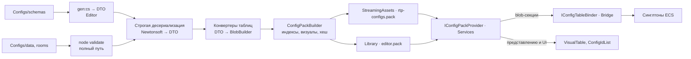
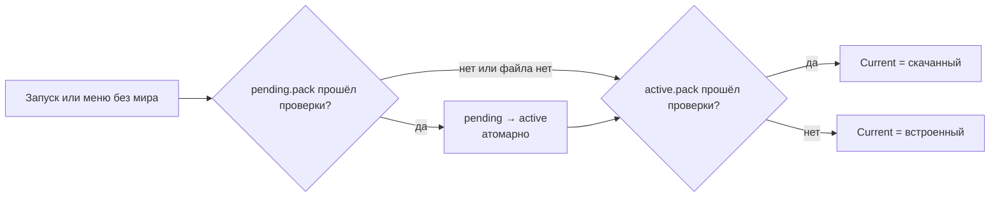

# Контент: конфиги, комнаты, строки, ассеты

> Конфиги, шаблоны комнат, строки и ассеты: как добавить таблицу, поле, шаблон, ассет или строку. Канонические имена — `README.md`; что игра должна делать — GDD (`Docs/GDD/`). Пошаговые инструкции — §10, правила — §11, типы — §12.
> «Проверить на спайке» — утверждение не проверено на Unity 6000.6.3f1 и уточняется первым спайком контура.

## 1. Назначение и границы

Контент — всё, что игра читает как данные, а не как код. Четыре вида:

| Вид | Источник истины | Кто правит | Как попадает в билд | Кто читает в рантайме |
|---|---|---|---|---|
| Конфиги баланса | `Configs/data/*.json` | агенты, дизайнер; позже админка (§3.3) | бинарный пак (§4) | симуляция, через мост (blob-синглтоны) |
| Авторские комнаты и лагерь | `Configs/rooms/**/*.json` | редактор комнат (§7) | тот же пак, таблица `rooms` | генератор локаций в симуляции |
| Строки | `Configs/strings/<locale>/*.json` | агенты, дизайнер | импорт в String Tables Unity Localization (§8) | UI, через пакет Localization |
| Ассеты | `Assets/_Project/Art/**` | художник, агенты | Addressables (§9) | представление и UI, через `IAssetProvider` |

Контур владеет репозиторием и форматом конфигов, схемами, сборщиком и форматом пака, источниками пака (`IConfigPackProvider`), контрактом привязки таблиц (`IConfigTableBinder`; реализации — в срезах фич), редактором комнат, импортом строк, раскладкой ассетов, пресетами импорта, группами Addressables и правилом адресов.

Не входит: какие таблицы нужны фиче и как системы их читают — GDD и `Simulation.md`; построение вьюхи из визуала, анимация, порядок предзагрузки — `Presentation.md`; привязка строк к UI Toolkit, шрифты, проверка вёрстки — `UI.md`; внутренности `IAssetProvider`, `ISaveService`, граф загрузки — `Services.md`; папки срезов и `.asmref` — `CodeStructure.md`.

JSON есть только в репозитории конфигов и в редакторе; в плеер данные попадают бинарным паком (CONT-04).

## 2. Репозиторий конфигов

### 2.1. Раскладка

Формат конфигов — JSON; отдельный репозиторий `rise-to-panteon-configs` подключён git submodule в `Configs/` в корне репозитория игры. Каталог вне `Assets/`: Unity не создаёт `.meta` и не импортирует JSON как ассеты.

```text
Configs/
├── manifest.json            версия схемы, список таблиц, каталоги rooms и strings
├── retired-ids.json         удалённые id по таблицам; повторно не выдаются
├── AGENTS.md                правила для агентов в этом репозитории
├── schemas/                 _common.schema.json ($defs), manifest, <table>, room, strings
├── data/                    таблицы баланса: species.json, families.json, items.json …
├── rooms/special/           заготовки особых комнат (GDD W02 R5)
├── rooms/insert/            ручные вставки (GDD W04, Срез)
├── rooms/camp/              лагерь: основа и зоны (GDD K01)
├── strings/ru/              ui.json, hints.json, barks.json, items.json, species.json, nicknames.json
├── migrations/              0001-<имя>.mjs … — только вперёд
└── tools/                   Node ≥ 20: fmt, validate, pack-check, gen-cs, migrate; rules/<table>.mjs
```

### 2.2. manifest.json

```json
{
  "$schema": "schemas/manifest.schema.json",
  "schemaVersion": "1.4",
  "tables": [
    { "id": "species", "file": "data/species.json", "schema": "schemas/species.schema.json", "kind": "rows", "localized": ["name"] },
    { "id": "world_step", "file": "data/world_step.json", "schema": "schemas/world_step.schema.json", "kind": "settings" }
  ],
  "rooms": { "dir": "rooms", "schema": "schemas/room.schema.json" },
  "strings": { "dir": "strings", "schema": "schemas/strings.schema.json", "source": "ru", "locales": ["ru"] }
}
```

- `id` таблицы — `^[a-z0-9_]+$`, до 24 символов (имя секции пака, §4.4). Порядок таблиц в манифесте не важен.
- `kind: rows` — список строк с `id`; `kind: settings` — ровно одна строка с `id: "default"` (глобальные параметры).
- `localized` — поля строки, чей текст лежит в `strings/` по соглашению `<table>.<rowId>.<field>` (§8.1).

### 2.3. Инструменты и CI

Один раз `npm --prefix Configs ci`, дальше:

| Команда | Что делает |
|---|---|
| `npm run fmt` / `fmt:check` | Канонический формат (`tools/fmt.mjs`): UTF-8 без BOM, LF, 2 пробела, порядок ключей — как в `properties` схемы, строки отсортированы по `id` (ordinal), массивы скаляров — в строку до 100 символов. Prettier не подходит: сохраняет исходные переносы объектов, формат перестаёт быть каноническим |
| `npm run validate` | ajv `--spec=draft2020 --strict` с зарегистрированными `x-ref`, `x-unit`; затем семантика: уникальность id, разрешение `x-ref`, `retired-ids.json`, строки для `localized`, межстрочные правила `tools/rules/*.mjs` |
| `npm run pack-check` | Без Unity: манифест ↔ файлы; изменены `schemas/` → поднята `schemaVersion`; major → есть миграция; visual id ≤ 65 535 (`ViewKey` — `ushort`); длины id |
| `npm run gen:cs -- --out <dir>` | Генерация C# DTO из схем (§4.2) |
| `npm run migrate` | Применяет к данным миграции новее текущих |

CI конфиг-репозитория (GitHub Actions): `npm ci` → `fmt:check` → `validate` → `pack-check`; коммит с красным CI в игру не подключается. Геометрия комнат и сверка визуалов с Addressables требуют Unity: их делает сборщик пака (§4.3), в CI игры — в batchmode при каждом изменении указателя `Configs`.

### 2.4. AGENTS.md конфиг-репозитория

Файл короткий и обязательный:

1. Правь только `data/`, `strings/`, `rooms/` (комнаты — через редактор, §7); `schemas/` — только вместе с версией (§3.4).
2. После правки — `npm run fmt && npm run validate`; коммитится только зелёное.
3. Id стабилен навсегда: не переименовывать, не переиспользовать; удалённый — в `retired-ids.json`.
4. В JSON только готовые числа, без выражений и формул (§3.3); единица — в имени поля.
5. Пояснения — в поле `note`; комментариев в JSON нет.
6. Ассеты — только visual id (§9.4); путей, GUID и имён файлов Unity в данных нет.
7. Текст для игрока — только в `strings/` (ARCH-17).
8. Один коммит — одно логическое изменение; сообщение `<таблица|область>: <что и зачем>`.

### 2.5. Работа с сабмодулем

- Клон: `git clone --recurse-submodules`, в существующем клоне — `git submodule update --init`; рекомендуется `git config submodule.recurse true`.
- После `update` сабмодуль в detached HEAD; перед правкой — `git -C Configs switch main`. Ветки — по `CodeStructure.md` §10.
- **Порядок коммитов:** сначала коммит и push в конфиг-репозиторий, затем в игре отдельный коммит указателя: `git add Configs && git commit -m "configs: bump to <sha7> — <что>"`. Код, которому нужны новые конфиги, — в том же коммите или после.
- **Варианты баланса** — ветки `balance/<имя>`: `git -C Configs switch balance/fast-molt`, редактор пересоберёт пак сам (§5); возврат — `git -C Configs switch main`. Указатель на коммит варианта в `main` игры не попадает.
- **Билд падает**, если сабмодуль грязный, его HEAD не запушен (`git -C Configs branch -r --contains HEAD` пусто) или не равен указателю в коммите игры. Dev-сборка обходит это флагом `RTP_ALLOW_DIRTY_CONFIGS`; пак получает флаг `Dirty`, релиз с ним не собирается.

## 3. Схемы и соглашения данных

### 3.1. Файл таблицы и схема

```json
{
  "$schema": "../schemas/species.schema.json",
  "rows": [
    { "id": "shurshun", "family": "chitin", "visual": "creature.shurshun.base", "hp": 40,
      "speedTilesPerSec": 2.5, "fleeChance": 0.6, "note": "Т0, пасётся у точек кормёжки (B01)" }
  ]
}
```

Строгий JSON: без комментариев, хвостовых запятых и `NaN`. `$schema` — относительный путь: Rider и VS Code дают автодополнение и подсветку ошибок при правке. Корень схемы таблицы — `title: "<Table>File"` со свойствами `$schema` и `rows`; строка — `$defs/<Table>Row` с `title`:

```json
{
  "$schema": "https://json-schema.org/draft/2020-12/schema",
  "$id": "https://configs.rtp/schemas/species.schema.json",
  "title": "SpeciesFile", "type": "object", "additionalProperties": false, "required": ["rows"],
  "properties": { "$schema": { "type": "string" }, "rows": { "type": "array", "items": { "$ref": "#/$defs/SpeciesRow" } } },
  "$defs": {
    "SpeciesRow": {
      "title": "SpeciesRow", "type": "object", "additionalProperties": false,
      "required": ["id", "family", "visual", "hp", "speedTilesPerSec", "fleeChance"],
      "properties": {
        "id": { "$ref": "_common.schema.json#/$defs/Id" },
        "family": { "$ref": "_common.schema.json#/$defs/Id", "x-ref": "families" },
        "visual": { "$ref": "_common.schema.json#/$defs/VisualId" },
        "hp": { "type": "integer", "minimum": 1, "x-unit": "hp" },
        "speedTilesPerSec": { "$ref": "_common.schema.json#/$defs/TilesPerSec" },
        "fleeChance": { "$ref": "_common.schema.json#/$defs/Chance01" },
        "note": { "$ref": "_common.schema.json#/$defs/Note" }
      }
    }
  }
}
```

### 3.2. Подмножество JSON Schema 2020-12

«Скучное» подмножество одинаково понимают ajv, генератор DTO и будущая админка: `type`, `properties`, `required`, `additionalProperties: false`, `enum`, `const`, `minimum`/`maximum`/`exclusiveMinimum`, `minLength`/`maxLength`, `pattern`, `items`, `minItems`/`maxItems`, `uniqueItems`, `$ref` в `$defs` (свои или `_common.schema.json`), `oneOf` с дискриминатором `kind: { "const": … }`, `title`, `description`. Не используются: `$dynamicRef`, `unevaluatedProperties`, `prefixItems`, `if/then/else`, `patternProperties`, `allOf`, `default`.

`_common.schema.json`:

| `$defs` | Определение | Для чего |
|---|---|---|
| `Id` | string, `^[a-z0-9_.]+$`, 1–48 символов | id строки и ссылки с `x-ref` |
| `VisualId` | string, `^[a-z0-9_]+(\.[a-z0-9_]+){1,3}$` | адрес Addressables (§9.4) |
| `Seconds` | number ≥ 0, `x-unit: sec` | длительности, откаты |
| `Tiles` / `TilesPerSec` | number ≥ 0, `x-unit: tiles` / `tiles_per_sec` | дистанции, радиусы, скорости; 1 клетка = 1 юнит |
| `Chance01` | number 0..1, `x-unit: chance` | вероятности и доли |
| `Weight` / `Count` | integer ≥ 0 | веса случайного выбора, количества |
| `Note` | string ≤ 500 | пояснение для людей и агентов; в пак не попадает |

### 3.3. Соглашения

- **Id** — `^[a-z0-9_.]+$`, уникален в своей таблице, стабилен, не переиспользуется. Точка — для пространств имён (`abyss.floor_1`).
- **Ссылка** на другую таблицу — строка-id с аннотацией `"x-ref": "<table>"`; сборщик заменяет её индексом.
- **Единица** — в имени поля и в `x-unit`: `cooldownSec`, `rangeTiles`, `speedTilesPerSec`, `fleeChance`. Вероятности — 0..1, не проценты. Время — в секундах; в тики переводит конвертер (§4.3).
- **Числа баланса обязательны** (`required`), `default` не используется: значение всегда видно в данных. Необязательны только `note` и ссылки, которые по смыслу могут отсутствовать.
- **Enum** — строки `lower_snake`. Варианты — `oneOf` из `$ref`, в каждом `kind: { "const": "…" }`.
- **Никаких выражений**: только готовые значения; кривые — явные массивы. Формулы GDD — только способ заполнить таблицы (позже — в админке); в игре формул нет.
- **Текст для игрока в `data/` запрещён**: имя вида — строка `species.shurshun.name` в `strings/` (§8).

### 3.4. Версия схемы и миграции

`schemaVersion` = `major.minor` в `manifest.json`, одна на весь репозиторий.

| Изменение | Версия | Что ещё |
|---|---|---|
| Новая таблица, новое необязательное поле, новое значение enum, ослабление ограничения | minor | старые данные валидны без правок |
| Новое обязательное поле, переименование или удаление поля или таблицы, смена типа, ужесточение ограничения, удаление значения enum | major | миграция `migrations/NNNN-<имя>.mjs` в том же коммите, уже применённая к данным |
| Правка чисел, новые строки таблиц | — | версия не меняется |

Миграция — функция над деревом JSON: только вперёд, идемпотентна, не удаляется. Новое обязательное поле баланса — major: миграция проставляет стартовое значение всем строкам.

## 4. От JSON до ECS

### 4.1. Конвейер



### 4.2. DTO: генерация из схем

Генератор — **quicktype** (npm), скрипт `gen:cs` в `Configs/tools`. Почему не NJsonSchema: тот же Node-инструментарий, что ajv и форматтер (один `npm ci` у агента и в CI), а NJsonSchema — это .NET SDK, второй тулчейн; `--csharp-version 6 --framework NewtonSoft --features just-types --check-required` дают простые классы с `Required.Always`, которые компилируются C# 9 в Unity; NJsonSchema лучше строит наследование из `oneOf`, но через OpenAPI-ключ `discriminator` с `mapping`, который ajv в strict не принимает. Цена: quicktype сливает варианты `oneOf` в один класс с nullable-полями всех вариантов — приемлемо, вариант уже проверил ajv, а конвертер делает `switch` по `Kind`. «Проверить на спайке»: `$ref` между файлами, `const`, точные имена флагов.

- Выход — `Assets/_Project/Code/Editor/Configs/Generated/<Table>File.g.cs`, неймспейс `RiseToPanteon.Editor.Configs.Generated`; файлы в git, заголовок `// <auto-generated>`, руками не правятся.
- Скрипт дописывает `ConfigSchemaVersion.g.cs` (`MAJOR`, `MINOR`); при расхождении с `manifest.json` редактор перегенерирует DTO.
- Newtonsoft (`com.unity.nuget.newtonsoft-json`) подключён к `RiseToPanteon.Editor` и `RiseToPanteon.Dev` (дамп сохранений, `Services.md` §5.8; Dev собирается только с `RTP_DEV`); отсутствие в релизном билде проверяется списком сборок IL2CPP — «проверить на спайке».
- Десериализация строгая: `MissingMemberHandling.Error`, `Required.Always`, `DateParseHandling.None`, `FloatParseHandling.Double`. Ошибка содержит файл, строку и JSON pointer (`data/species.json#/rows/3/hp`).

### 4.3. Сборщик пака

`ConfigPackBuilder` (Editor) — единственная точка сборки: меню `RiseToPanteon/Configs/Build Pack`, наблюдатель редактора (§5), `IPreprocessBuildWithReport`, batchmode (`-executeMethod RiseToPanteon.Editor.Configs.ConfigPackBuilder.BuildFromCommandLine -out <path>`), тесты (`BuildInMemory()`).

1. **Сабмодуль** (билд): чистый, запушен, равен указателю (§2.5).
2. **Полная валидация** (билд, меню): `node Configs/tools/validate.mjs`. Быстрый путь редактора её пропускает.
3. **Загрузка**: манифест → строгая десериализация таблиц и шаблонов комнат.
4. **Индексы**: id каждой таблицы сортируются ordinal, индекс строки = позиция (0…N−1). Visual id собираются из вызовов `ctx.Visual`, сортируются, `ViewKey` = позиция + 1; `ViewKey` 0 — «нет визуала».
5. **Конвертация**: `IConfigTableConverter` таблицы пишет blob: ссылки → индексы (`ctx.Ref`), секунды → тики (`ctx.Ticks`, `ctx.PerTick`), доли для шага мира → fixed-point (`ctx.Fixed`), визуалы → `ViewKey`. Баланс конвертер не считает.
6. **Проверки Unity-стороны**: геометрия комнат (`RoomTemplateValidator`, §7.4); каждый visual id — существующий адрес (в редакторе — предупреждение и флаг `MissingVisuals`, в релизе — ошибка); у каждой таблицы манифеста есть конвертер и наоборот.
7. **Запись** по §4.4 → билд: `Assets/StreamingAssets/Configs/rtp-configs.pack` (генерируется, в `.gitignore`); редактор: `Library/RiseToPanteon/Configs/editor.pack`.

Сборка выводит все ошибки, а не первую. Конвертер живёт в срезе фичи (`Features/<Фича>/Editor/`, `.asmref` в `RiseToPanteon.Editor`) и находится через `TypeCache` — центрального списка нет. Интерфейс: `IConfigTableConverter { string TableId; int BlobVersion; void Build(ConfigBuildContext ctx, BlobBuilder builder); }`.

Конвертер — сборка `RiseToPanteon.Editor`, папка `Features/Creatures/Editor/`:

```csharp
public sealed class SpeciesConfigConverter : IConfigTableConverter
{
    public string TableId => "species";
    public int BlobVersion => SpeciesTableBlob.VERSION;

    public void Build(ConfigBuildContext ctx, BlobBuilder builder)
    {
        var file = ctx.Load<SpeciesFile>(TableId);
        ref var root = ref builder.ConstructRoot<SpeciesTableBlob>();
        var rows = builder.Allocate(ref root.Rows, file.Rows.Count);
        for (int i = 0; i < file.Rows.Count; i++)
        {
            var src = file.Rows[i];
            rows[i] = new SpeciesRow
            {
                Family = ctx.Ref("families", src.Family, src.Id),
                View = ctx.Visual(src.Visual),
                Hp = (int)src.Hp,
                SpeedTilesPerTick = ctx.PerTick(src.SpeedTilesPerSec),
                FleeChance = (float)src.FleeChance
            };
        }
    }
}
```

- `TableId` совпадает с id таблицы в `manifest.json`.
- `BlobVersion` берётся из той же константы `SpeciesTableBlob.VERSION`, что и у биндера (§4.6).
- `ctx.Load` отдаёт строки, отсортированные по id.

Blob-структуры таблицы (README §4.1) — сборка `RiseToPanteon.Simulation`, папка `Features/Creatures/Simulation/`:

```csharp
public struct SpeciesTableBlob
{
    public const int VERSION = 1;

    public BlobArray<SpeciesRow> Rows;
}

public struct SpeciesRow
{
    public int Family;
    public ViewKey View;
    public int Hp;
    public float SpeedTilesPerTick;
    public float FleeChance;
}

public struct SpeciesConfig : IComponentData
{
    public BlobAssetReference<SpeciesTableBlob> Table;
}
```

EditMode-тест `ConfigBlobLayoutTests` считает отпечаток раскладки каждого `*TableBlob` (поля, типы, смещения — рекурсивно) и сверяет с `BlobLayouts.lock.txt`: раскладка изменилась, а `VERSION` нет — тест падает.

### 4.4. Формат пака

Один файл, little-endian; смещения — от начала файла; секции выровнены на 16 байт.

| Смещение | Байт | Поле |
|---|---|---|
| 0 | 4 | `Magic` = `RTPC` |
| 4 | 2 | `PackFormat` = 1 — версия контейнера |
| 6 | 2 | `SectionCount` |
| 8 / 10 | 2 + 2 | `SchemaMajor`, `SchemaMinor` |
| 12 | 4 | `Flags`: бит 0 `Dirty` (незакоммиченный `Configs/`), бит 1 `MissingVisuals` (есть заглушки) |
| 16 | 20 + 12 | `ConfigCommit` — SHA-1 коммита `Configs/`; резерв |
| 48 | 16 | `AppVersion` — `Application.version`, UTF-8, дополнено нулями |
| 64 | 16 | `ContentHash` — xxHash3-128 всего файла, кроме этого поля |
| 80 | 56 × N | каталог: `Name` (32 байта UTF-8), `Kind` (2), резерв (2), `BlobVersion` (4), `Offset` (8), `Length` (8) |

| `Kind` | Имя секции | Содержимое |
|---|---|---|
| 1 Blob | `<table>` | вывод `BlobAssetReference<T>.Write(writer, builder, BlobVersion)`: `int` версии, заголовок blob, данные |
| 2 IdList | `ids/<table>` | `uint32` count, затем count × (`uint16` длина + UTF-8): индекс → строковый id |
| 3 VisualList | `visuals` | тот же формат: `ViewKey − 1` → visual id |

Проверено по исходникам Entities 6.6 (`Unity.Entities/Blobs.cs`): есть `BlobAssetReference<T>.Write<U>(U writer, BlobBuilder, int version)` и `TryRead<U>(U reader, int version, out …)`; `Read<T>` копирует данные в свою память `Allocator.Persistent`, поэтому blob не зависит от байтов пака и освобождается отдельно (§4.6). Хеш считает утилита `Core` на `xxHash3` из Unity.Collections. «Проверить на спайке»: побайтовый детерминизм `BlobBuilder` (паддинг); без него два пака из одних данных дают разный `ContentHash`, но совместимость (§6) от хеша не зависит.

### 4.5. Рантайм: провайдер пака

Сборка `RiseToPanteon.Services`:

```csharp
public interface IConfigPackProvider
{
    event Action<ConfigPack> OnReplaced;

    ConfigPack Current { get; }

    UniTask LoadAsync(CancellationToken ct);
    UniTask<bool> TryApplyPendingAsync(CancellationToken ct);
}

public readonly struct ConfigTableData
{
    public readonly string TableId;
    public readonly int BlobVersion;
    public readonly NativeArray<byte>.ReadOnly Bytes;
}
```

- `Current` — пак сессии; не меняется, пока жив мир.
- `LoadAsync` — узел загрузки: цепочка источников (таблица ниже).
- `TryApplyPendingAsync` — только между сессиями (§6).
- `OnReplaced` — горячая перезагрузка (§5), только в редакторе.
- `ConfigPack : IDisposable` — `Info` (`ConfigPackInfo`), `Tables` (`IReadOnlyList<ConfigTableData>`), `Ids(tableId)` → `ConfigIdList`, `Visuals` → `VisualTable`.

| Источник (`IConfigPackSource`), по порядку | Файл | Когда |
|---|---|---|
| `EditorConfigPackSource` | `Library/RiseToPanteon/Configs/editor.pack` | только редактор; отключается флажком «Play With Embedded Pack» |
| `DownloadedConfigPackSource` | `persistentDataPath/configs/active.pack` | плеер; сейчас файл кладут dev-инструменты, позже загрузчик (§6) |
| `EmbeddedConfigPackSource` | `StreamingAssets/Configs/rtp-configs.pack` | всегда есть; последний в цепочке и эталон совместимости |

Встроенный пак — в StreamingAssets, а не TextAsset в Addressables: у встроенного и скачанного пака один путь «байты → проверка → секции», и пак не зависит от сборки контента Addressables. Цена: на Android файл внутри APK читается через `UnityWebRequest` — «проверить на спайке». Кандидат проходит `Magic`, `PackFormat`, `ContentHash`, скачанный — ещё проверки §6; первый прошедший становится `Current`, отвергнутый пишется в лог с причиной. Байты держит `ConfigPack`: следующий мир той же сессии приложения привязывается к ним заново.

### 4.6. Рантайм: привязка к ECS

Сборка `RiseToPanteon.Bridge`; `SpeciesConfigBinder` лежит в `Features/Creatures/Bridge/`:

```csharp
public interface IConfigTableBinder
{
    string TableId { get; }
    int BlobVersion { get; }

    void Bind(EntityManager em, in ConfigTableData table, ConfigBlobStore store);
}

public sealed class SpeciesConfigBinder : ConfigTableBinder<SpeciesTableBlob, SpeciesConfig>
{
    public override string TableId => "species";
    public override int BlobVersion => SpeciesTableBlob.VERSION;

    protected override SpeciesConfig Wrap(BlobAssetReference<SpeciesTableBlob> blob) => new() { Table = blob };
}
```

- `ConfigTableBinder<TBlob, TConfig>` читает секцию через `BlobAssetReference<TBlob>.TryRead(new MemoryBinaryReader(ptr, len), BlobVersion, out blob)`, отдаёт blob в `ConfigBlobStore` и создаёт синглтон `TConfig`. Сборке `Bridge` нужен `allowUnsafeCode`.
- Биндер регистрирует `IFeatureInstaller` фичи. `ConfigWorldBinder` получает все `IConfigTableBinder` из VContainer; `WorldHost` вызывает его сразу после создания мира, до первого тика. Он же ставит синглтон `ConfigVersion`.
- Blob-секция без биндера, биндер без секции или несовпавший `BlobVersion` — ошибка загрузки мира.
- **Владение.** Blob-ы сессии принадлежат `ConfigBlobStore`; он освобождает их при уничтожении мира (после `CompleteAllTrackedJobs()`) и при горячей замене (§5). Компоненты сущностей хранят индекс строки (`int`), не `BlobAssetReference`; blob система берёт из синглтона на своём тике.

### 4.7. ConfigVersion и сохранения

Сборка `RiseToPanteon.Simulation`:

```csharp
public struct ConfigVersion : IComponentData
{
    public ushort SchemaMajor;
    public ushort SchemaMinor;
    public FixedString64Bytes Commit;
    public uint4 ContentHash;
    public byte Flags;
    public int Generation;
}
```

- `Commit` — 40 hex-символов.
- `Flags` — `Dirty`, `MissingVisuals`.
- `Generation` растёт при горячей замене в редакторе (§5).

`ConfigVersion` пишется в заголовок сохранения, в начало лога сессии и лога операций, в отчёты о падениях и в dev-оверлей.

Плотный индекс верен только внутри одного пака: новая строка таблицы сдвигает индексы. Поэтому в сохранения, логи операций и всё, что переживает пак, ссылка на строку конфига попадает строковым id (через `ConfigIdList`); как именно — решает `Services.md` (`ISaveSection`). Сохранение с другим паком загружается, если совпадает `SchemaMajor` и все его id есть в текущем паке; иначе — отказ с понятным сообщением. В Прототипе сохранение другой сборки не загружается вообще (GDD M01 R9).

## 5. Итерация в редакторе

В редакторе конфиги читаются прямо из `Configs/`: JSON → тот же сборщик → `editor.pack` → тот же рантайм-путь. Отдельного «JSON-режима» у игры нет: что работает в редакторе, работает и в билде.

- `ConfigSourceWatcher` (`[InitializeOnLoad]`) следит за `Configs/` через `FileSystemWatcher` (задержка 300 мс) и сверяет время и размер файлов при возврате фокуса в Unity: на macOS наблюдатель бывает ненадёжен — «проверить на спайке». Запасной вариант — `AssetDatabase.RegisterCustomDependency` с хешем `Configs/` и `ScriptedImporter`-якорь в `Assets/` с `ctx.DependsOnCustomDependency` — тоже «проверить на спайке».
- `data/` или `rooms/` → быстрый путь без Node: десериализация, конвертация, запись `editor.pack`. Ориентир — меньше 200 мс на ~13 таблиц Прототипа (GDD Scope); если дольше — пересборка только изменённых таблиц.
- `schemas/` → `gen:cs`, `AssetDatabase.Refresh`, перекомпиляция, затем сборка. `strings/` → импорт строк (§8.2).
- Перед Play Mode устаревший пак пересобирается; при ошибках вход отменяется, ошибки в консоли — с путём, строкой и JSON pointer (открытие файла на строке по клику — «проверить на спайке»).
- Меню `RiseToPanteon/Configs`: `Build Pack`, `Validate (full)`, `Open Configs Folder`, флажок `Play With Embedded Pack`.

**Горячая перезагрузка в Play Mode** («проверить на спайке»): наблюдатель пересобрал пак → провайдер поднимает `OnReplaced` → `ConfigWorldBinder` между кадрами, не внутри тика, вызывает `CompleteAllTrackedJobs()`. Если список id таблицы не изменился — новый blob в синглтон, старый освобождается, `ConfigVersion.Generation` + 1; системы с кэшем, выведенным из конфигов, сверяют `Generation`. Если изменился список id таблицы или визуалов — таблица не меняется, в консоли «набор id изменился — перезапусти сессию»: индексы у живых сущностей и `ViewKey` в снимке стали бы неверными.

Шаблоны комнат влияют только на ещё не построенные локации (GDD W04 R12); комната проверяется кнопкой «Играть здесь» (§7.3).

## 6. Обновление конфигов без пересборки

Механизм работает без сервера: будущий сервер только кладёт файл туда, откуда провайдер уже умеет его брать. **Сессия** — время жизни одного загруженного мира: от «Продолжить» или «Новый мир» до возврата в меню или выхода. Пак выбирается при запуске или в меню, пока мира нет (`TryApplyPendingAsync`); посреди сессии `Current` не меняется.



- **Хранилище**: `persistentDataPath/configs/` — `active.pack`, `pending.pack`, `rejected/` (отвергнутые, причина — в логе); запись во временный файл и переименование.
- **Проверки скачанного пака**: `Magic`, `PackFormat`, `ContentHash`; `AppVersion` = `Application.version` (после обновления приложения старый пак отбрасывается); `SchemaMajor` и набор пар `{секция, BlobVersion}` совпадают со встроенным паком — эталоном, собранным тем же кодом, что и билд. Почему сверяется `BlobVersion`, а не только схема: бинарную совместимость определяет раскладка blob.
- **Сейчас, без сервера**: `pending.pack` кладут dev-инструменты (`RTP_DEV`: «Установить пак из файла» и «…по URL») и тесты. Так тестер получает вариант баланса без пересборки: `ConfigPackBuilder` в batchmode собирает пак из ветки `balance/<имя>` под ту же `AppVersion`.
- **Потом, с сервером**: фоновая задача после загрузки спрашивает эндпоинт `{appVersion} → {url, contentHash, size}`, качает в `pending.pack.tmp`, сверяет хеш и переименовывает в `pending.pack`; пак применится при следующем входе в меню. Пак для каждой поддерживаемой версии приложения собирается сборщиком этой же версии кода — раскладки blob должны совпасть. Подпись пака — только если понадобится защита от подмены.
- **Так не обновляются** строки (таблицы Localization — ассеты Addressables; удалённая группа — отдельное решение позже) и ассеты.

## 7. Авторский контент и редактор комнат

### 7.1. Что делается руками

| Вид | GDD | Каталог | В мире |
|---|---|---|---|
| Заготовка особой комнаты: якорь, логово, сокровищница (Прототип — 3 вида по 1–2 варианта) | W02 R5, §9; Scope | `rooms/special/` | сколько нужно |
| Ручная вставка: комплекс Врат, секретная комната, нарративная точка, стоянка NPC (Срез) | W04 R2–R4, R15–R20 | `rooms/insert/` | не больше раза |
| Лагерь: основа и зоны, открываемые по мере роста (Срез) | K01 R1, R14, §9 | `rooms/camp/` | один |

Игра читает только данные: шаблон хранит логическую сетку и объекты, визуал строится тем же рендером, что у процедурных комнат (GDD W02 R4). Префабов и сцен на комнату нет.

### 7.2. Формат шаблона

```json
{
  "$schema": "../../schemas/room.schema.json",
  "id": "abyss.lair.a", "kind": "special", "role": "lair", "biome": "abyss", "weight": 1,
  "cells": [
    "################",
    "#..............#",
    "#..............+",
    "#..............+",
    "################"
  ],
  "joints": [{ "id": "east", "side": "east", "from": 2, "width": 2 }],
  "objects": [{ "type": "feeding_point", "at": [7, 3] }],
  "spawns": [{ "kind": "lair_home", "at": [8, 2] }],
  "markers": [{ "id": "center", "at": [8, 2] }],
  "decor": [{ "visual": "decor.abyss.bones_01", "at": [3, 1] }],
  "note": "Сокращено для примера; у логова сторона ≥ 14 (W02 §5)"
}
```

- **`cells`**: `#` стена, `.` пол, `+` проём, `_` вне шаблона. Строка 0 — север; `x` растёт на восток, `y` — на юг. Лицевые грани не рисуются: генератор выводит их из стен по тем же правилам, что в процедурных комнатах (W02 R7, R8), редактор показывает их вычисленными. Новый символ легенды (например, клетки эффектов среды W17, Срез) — minor-изменение схемы.
- **`joints`** — проёмы-стыки на краю шаблона, через которые генератор соединяет его с планировкой (W04 R4). «Якорем» они не называются: якорь — игровой объект (K02) и ставится в `objects`.
- **`objects.type`** — `x-ref` на таблицу `objects`; параметры объекта (лут, ключ) — ссылки на свои таблицы.
- **`spawns`** — точки гнёзд, существ, мини-босса; **`markers`** — именованные точки: содержание вставки (разговор, надпись, находка — W04 R2), камера, катсцена; **`decor`** — уникальный декор (W04 R6): visual id на клетке.
- **Лагерь**: `camp.base` — основа; зона — шаблон `kind: "camp_zone"` с `placeAt` в координатах основы и `unlock` (`x-ref` на таблицу условий открытия, K07). Закрытая зона непроходима и под туманом (K01 §9).

Шаблон — не `rows`-файл: один файл — один шаблон, `id` = имя файла без `.json`. Сборщик собирает все шаблоны в таблицу `rooms` (сортировка по id) — blob `RoomTemplateTableBlob` для генератора (`Simulation.md`).

### 7.3. Редактор комнат

`RoomEditorWindow` (Editor, UI Toolkit), меню `RiseToPanteon/Room Editor`:

- **Холст** — сетка с зумом; кисти `#`, `.`, `+`, `_`; прямоугольник и заливка; грани — вычисленным слоем. **Слои** — клетки, стыки, объекты, точки появления, маркеры, декор; видимость и блокировка слоя.
- **Палитры** — типы объектов и виды из текущего пака; декор — visual id биома. **Метаданные** — `id`, `kind`, `role`, `biome`, `weight`, `tags`, `note`.
- **Проверка** — `RoomTemplateValidator` на каждое изменение, ошибки подсвечиваются на клетках. **Превью** — тайлсет биома по адресу Addressables в упрощённом рендере окна («проверить на спайке»).
- **Сохранение** — JSON по схеме, затем `node Configs/tools/fmt.mjs <файл>`: канонический формат один, на C# не дублируется. Открыть можно любой файл из `rooms/`, в том числе поправленный агентом вручную.
- **Играть здесь** (`RTP_DEV`) — dev-локация, собранная вокруг шаблона.

### 7.4. Проверки шаблона

`RoomTemplateValidator` (C#; вызывают редактор и сборщик пака):

- сетка прямоугольная, строки `cells` равной длины, символы — из легенды; все `x-ref` и visual id разрешаются;
- проходимая часть комнаты — 8–20 клеток по стороне (W02 R10), логово ≥ 14 (W02 §5);
- проходы и проёмы ≥ 2 клеток (W02 R11); стыки на краю, ширина ≥ 2; весь пол достижим с каждого стыка (W02 R13);
- объекты не в проёмах и не сужают путь ниже 2 клеток (W02 R14); под гранью ничего нет (W02 R21);
- гнёзд нет в комнате якоря и в комплексе Врат (W02 R19, W04 R10).

Пакетная проверка встраивания на 1000 seed (W04 §9) — инструмент генератора, `Simulation.md`.

## 8. Локализация

### 8.1. Источник

```json
{
  "$schema": "../../schemas/strings.schema.json",
  "rows": [
    { "key": "items.living_sap.name", "text": "Живица", "note": "Название расходника (I05)" },
    { "key": "ui.inventory.sap_count", "text": "{count} {count:plural:живица|живицы|живиц}", "note": "Счётчик живицы в инвентаре" }
  ]
}
```

- Файл = таблица строк Unity Localization: `ui`, `hints`, `barks`, `items`, `species`, `nicknames` (GDD M04 §5); Срез — `lore`, `dialogues`, `rumors`.
- Ключ — `<файл>.<объект>.<поле>` (M04 §9), `^[a-z0-9_]+(\.[a-z0-9_]+)+$`, первый сегмент = имя файла. Текст строк таблиц `data/` — по соглашению `<table>.<rowId>.<field>` для полей из `localized`: `species.shurshun.name`; поля с ключом в данных нет.
- `note` обязателен: контекст для переводчика и агента (M04 §9).
- Подстановки — только именованные (`{count}`, `{name}`), Smart Strings; склейка строк в коде запрещена (M04 R6). Строка с `{` импортируется как Smart.
- Множественное число — форматтер `plural`; для русского три формы: 1 / 2–4 / 5+ (M04 R7). Порядок форм для `ru` в SmartFormat — «проверить на спайке».
- Исходная локаль — `ru` (M04 R1). Другая локаль содержит подмножество ключей `ru` с тем же набором подстановок.

`npm run validate` для строк: ключ уникален в локали; префикс = имя файла; `text` не пуст; у каждой строки таблицы с `localized` есть ключ; ключ удалённой строки данных — предупреждение; подстановки совпадают между локалями; прозвище (`nicknames`) не длиннее лимита полосы здоровья (M04 §13, лимит — в `tools/rules/strings.mjs`).

### 8.2. Импорт в Unity Localization

`StringTableImporter` (Editor):

- На каждый файл — String Table Collection с тем же именем в `Assets/_Project/Localization/Tables/`; локали — из манифеста, плюс псевдолокаль для проверки вёрстки +30% (M04 §5; настройка — `UI.md`).
- Ключи Shared Table Data = ключи JSON; `text` → запись (флаг Smart — по правилу выше); `note` → метаданные `Comment`. Ключ, пропавший из JSON, удаляется с записью в лог.
- Запуск: наблюдатель редактора (§5), меню `RiseToPanteon/Localization/Import`, препроцесс билда (`IPreprocessBuildWithReport`) — до сборки контента Addressables (таблицы Localization — адресуемые ассеты). CI проверяет, что таблицы актуальны.
- Импортёр повторяет проверки ключей и подстановок из `validate` (§8.1).
- Сгенерированные таблицы коммитятся, чтобы чистый клон открывался рабочим, но правятся только через JSON.

## 9. Ассеты и Addressables

### 9.1. Раскладка

```text
Assets/_Project/Art/
├── Rigs/<Template>/            шаблоны скелетов с общими точками крепления
├── Creatures/<Family>/         Chitin, Discharge, Dust, Rot — общие части, Sprite Library, палитры; <Species>/ — своё у вида
├── Player/<Body>/              Spark, Clot … — тела стадий и полюсов (Scope → «Производство обликов»)
├── Weapons/<Archetype>/        6–8 архетипов оружия в руке
├── Environment/<Biome>/        Abyss, Catacombs …: Tileset/ (автотайлинг 3/4), Props/, Decor/, Traces/ (L05)
├── Camp/                       тайлсет и объекты лагеря (K01 §9)
├── Vfx/<Category>/  Shaders/   префабы Particle System, материалы; Shader Graph и HLSL
├── Ui/Icons/<Category>/  Ui/Screens/
├── Audio/Sfx/<Category>/  Audio/Music/  Audio/Ambience/<Biome>/
├── Fonts/
└── Placeholders/               заглушки Прототипа — цветные формы (Scope)
```

Папки — `PascalCase`; главный ассет назван своим visual id (§9.4). Папка прототипа `Art/Tiles/` к раскладке не относится (`CodeStructure.md` §2.4).

### 9.2. Пресеты импорта, атласы, скелеты

Масштаб: **1 клетка = 1 юнит = 128 px исходника (PPU 128).** Обзор по высоте — ~10–11 клеток (GDD C10); на телефоне в альбоме это 1080–1440 px, ~100–140 px на клетку, и 128 даёт почти 1:1 без лишней памяти. Графика рисованная, не пиксельная (Scope → «Производство обликов»). Окончательно — после выбора визуального стиля (`Docs/GDD/OpenQuestions.md` → «Визуальный стиль»).

Пресеты — `Assets/_Project/Settings/Presets/`, назначаются Preset Manager по фильтрам папок. Preset Manager действует только при первом импорте, поэтому EditMode-тест `ImportSettingsTests` сверяет ключевые поля ассетов с пресетом папки.

| Пресет | Папки | Основное |
|---|---|---|
| `Sprite_World` | Environment, Camp, Weapons, спрайты Vfx | Sprite, PPU 128, Bilinear, Clamp, без мипмапов, Mesh Tight, max 2048 |
| `Psb_Creature` | Rigs, Creatures, Player | PSD Importer: Character Rig, Use Layer Grouping, PPU 128, Main Skeleton — шаблон из `Rigs/` («проверить на спайке» общий скелет) |
| `Sprite_Ui` | Ui | Sprite, Bilinear, без мипмапов; текста в картинках нет (M04 R3) |
| `Texture_Floor` | текстуры смешивания пола (`Presentation.md` §6.2) | Default, Repeat, мипмапы вкл., ASTC 6×6 |
| `Audio_Sfx` / `Audio_Stream` | Audio/Sfx / Audio/Music, Audio/Ambience | Decompress On Load, Vorbis, моно / Streaming, Vorbis |

- **Атласы** — Sprite Atlas v2: один на биом (`atlas.env.abyss`), на семейство существ (виды семейства делят части и различаются цветом — Scope), на тело игрока, на иконки UI. До 2048², padding 4, без поворота; сжатие задаёт атлас: Android и iOS — ASTC 6×6, UI — ASTC 4×4. Атлас лежит в той же группе Addressables, что его спрайты; Addressables Analyze «Check Duplicate Bundle Dependencies» — без находок. «Проверить на спайке»: атлас v2 + Addressables и упаковка скиннованных спрайтов.
- **Скелеты** — шаблон с общими точками крепления в `Rigs/`; PSB семейства ссылается на него; сменные части — Sprite Library, перекраска — шейдером по палитре (`Presentation.md` §5). Прототип — 4 скелета семейств, 6 палитр, ~42 анимации (Scope).

### 9.3. Группы и метки

Сейчас все группы локальные (в билде, LZ4); удалённые группы и Content Directories (6.6) — после спайка.

| Группа | Что | Метки |
|---|---|---|
| `boot`, `ui` | шрифты, экран загрузки, заглушки; иконки и ресурсы экранов | `preload.boot` |
| `player`, `vfx.common`, `audio.sfx`, `audio.music` | тела игрока, оружие; общие эффекты; звуки, музыка | `preload.game` |
| `env.<biome>`, `vfx.<biome>` | тайлсет, объекты, декор, следы, эмбиент, эффекты биома | `biome.<biome>` |
| `creature.<family>` | скелет, части, палитры, клипы семейства | `family.<family>` |
| `camp` | лагерь | `camp` |
| Localization | таблицы строк — группы ведёт пакет | — |

Группа на семейство, а не на вид: виды семейства делят части. Если у вида появятся крупные собственные ассеты — своя группа `creature.<species>` с меткой семейства. Адрес, группу и метки ставит `AddressRules` (Editor, ScriptableObject «папка → группа, метки»; меню `RiseToPanteon/Addressables/Apply Rules`); в окне Groups руками не правится.

**Предзагрузка.** При загрузке — `preload.boot`, при входе в игру — `preload.game`. На переходе между локациями (≤ 1 с, ARCH-19) представление грузит метки из строки биома (`biomes.preloadLabels`, например `biome.abyss`) и `family.<family>` для семейств, живущих в локации (из read-модели раскладки). Порядок и освобождение — `Presentation.md`, API — `Services.md`.

### 9.4. Visual id = адрес

- Visual id — адрес Addressables: `<категория>.<объект>[.<вариант>]`, до четырёх сегментов: `creature.spark.base`, `creature.shurshun.base`, `tileset.abyss`, `decor.abyss.bones_01`, `vfx.absorb.burst`, `sfx.hit.chitin`, `icon.items.living_sap`.
- Категории: `creature`, `weapon`, `tileset`, `prop`, `decor`, `trace`, `vfx`, `sfx`, `music`, `amb`, `icon`, `ui`, `anim`, `palette`, `atlas`, `placeholder`. Новая категория — сначала правка этого списка.
- Имя файла главного ассета = visual id (`creature.shurshun.base.prefab`); `AddressRules` ставит адрес = имя файла без расширения. Подадреса `[sub]` не используются.
- Каталога «id → ассет» нет: секция `visuals` пака — только `ViewKey ↔ id` для компактного снимка.
- Ассет по адресу самоописывающийся: префаб существа несёт риг, Sprite Library и набор клипов; конфиг хранит только id. ARCH-13 запрещает ссылки на ассеты в коде и конфигах; ссылки ассет → ассет — норма.

Путь от конфига до картинки: `species.json` `visual: "creature.shurshun.base"` → сборщик: `SpeciesRow.View = ViewKey 17` → симуляция: `ViewState.ViewKey = 17` → `WorldPresenter`: `VisualTable.GetAddress(17)` = `"creature.shurshun.base"` → `IAssetProvider` грузит по адресу. UI идёт тем же путём: read-модель несёт `ViewKey` иконки; ключ имени UI строит из `ConfigIdList` (индекс → `shurshun` → `species.shurshun.name`). Таблиц конфигов UI и представление не читают: числа приходят в read-моделях.

Нет ассета по адресу: в редакторе и dev-сборке — `placeholder.<категория>` и предупреждение (Прототип идёт на заглушках, Scope); релизный пак с флагом `MissingVisuals` не собирается.

## 10. Пошаговые инструкции

### a) Новая таблица конфигов

1. `Configs/schemas/<table>.schema.json` по образцу §3.1: `title`, `$schema` и `rows` в корне, строка в `$defs/<Table>Row`, `additionalProperties: false`, типы из `_common`.
2. Запись в `manifest.json` → `tables`; `schemaVersion` — minor + 1.
3. `Configs/data/<table>.json`; при `localized` — строки в `strings/ru/<table>.json`; межстрочные правила — `tools/rules/<table>.mjs`.
4. `npm run fmt && npm run validate && npm run pack-check`; коммит и push в `Configs`.
5. В игре: `npm --prefix Configs run gen:cs -- --out Assets/_Project/Code/Editor/Configs/Generated` (или дождаться наблюдателя).
6. Код в срезе фичи: `Simulation/` — `<Table>TableBlob` с `const int VERSION = 1`, `<Table>Row`, `<Table>Config`; `Editor/` — `<Table>ConfigConverter : IConfigTableConverter`; `Bridge/` — `<Table>ConfigBinder : ConfigTableBinder<…>` и его регистрация в `IFeatureInstaller` фичи.
7. Отпечаток в `BlobLayouts.lock.txt` (тест подскажет строку); `Build Pack` без ошибок; EditMode-тесты зелёные.
8. Коммит игры: указатель `Configs` + код.

### b) Новое поле в существующей таблице

1. Определить minor или major (§3.4); обязательное поле баланса — major.
2. Правка схемы и `schemaVersion`; для major — `migrations/NNNN-<имя>.mjs` и `npm run migrate`.
3. `fmt`, `validate`, `pack-check`; коммит `Configs`.
4. `gen:cs`; поле в `<Table>Row`, `VERSION` + 1; конвертер переносит поле; обновить отпечаток.
5. Системы, которым нужно поле, — по `Simulation.md`. Коммит игры с указателем.

### c) Новый шаблон комнаты

1. `RiseToPanteon/Room Editor` → New: `kind`, `role`, `biome`, `id` вида `<biome>.<role>.<вариант>`.
2. Нарисовать клетки, стыки, объекты, точки появления, маркеры, декор; панель проверки пуста.
3. Save → `Configs/rooms/<kind>/<id>.json` (форматтер вызывается сам).
4. «Играть здесь», затем `npm run validate`; коммит `Configs`, указатель в игре.
5. Новая `role` или новый тип объекта — сначала таблица или поле (a, b) и правило генератора (`Simulation.md`).

### d) Новый визуальный ассет

1. Выбрать visual id по §9.4.
2. Положить файлы в папку по §9.1; главный ассет назвать `<visual id>.<ext>`; пресет применится по папке.
3. Спрайты — проверить, что их подхватил атлас папки; существо — PSB ссылается на скелет из `Rigs/`.
4. `RiseToPanteon/Addressables/Apply Rules` → адрес, группа, метки.
5. Прописать id в конфиге (`visual`, `icon` …) → `Build Pack`: нет предупреждения `MissingVisuals`; Addressables Analyze без дубликатов.

### e) Новая строка локализации

1. `Configs/strings/ru/<файл>.json`: ключ `<файл>.<объект>.<поле>`, `note` обязателен.
2. Числа — `{count:plural:…}`, подстановки именованные, без склейки.
3. `fmt`, `validate`; коммит `Configs`, указатель в игре.
4. Импорт запустится сам (или `RiseToPanteon/Localization/Import`); привязка к экрану — по `UI.md`.

## 11. Правила контура

| ID | Правило |
|---|---|
| CONT-01 | Данные баланса, шаблоны комнат и строки существуют только в `Configs/` и правятся только там (ARCH-12, ARCH-17). |
| CONT-02 | Любой JSON в `Configs/` проходит `fmt:check`, `validate`, `pack-check`; указатель на коммит с красным CI в игру не попадает. |
| CONT-03 | Id стабилен и не переиспользуется; удалённый id — в `retired-ids.json`. |
| CONT-04 | В релизном плеере нет JSON конфигов и JSON-парсера — только бинарный пак. DTO — только в `RiseToPanteon.Editor`, Newtonsoft — в Editor и Dev, в релизный плеер не попадает; DTO только генерируются (`gen:cs`), `Generated/` руками не правится. |
| CONT-05 | Схемы — подмножество §3.2; `additionalProperties: false` на каждом объекте; единица — в имени поля и `x-unit`; `default` не используется. |
| CONT-06 | Изменение схемы поднимает `schemaVersion`; major — только с миграцией в том же коммите. |
| CONT-07 | В JSON нет выражений; конвертер только переводит единицы и разрешает ссылки, баланс не считает. |
| CONT-08 | Сначала коммит и push в `Configs`, затем отдельный коммит указателя; билд с грязным или незапушенным сабмодулем падает. |
| CONT-09 | Изменение раскладки blob таблицы поднимает её `VERSION`; конвертер и биндер берут версию из одной константы. |
| CONT-10 | Сущности хранят индекс строки конфига, не `BlobAssetReference`; blob-ами владеет `ConfigBlobStore`. |
| CONT-11 | В сохранения, логи операций и всё, что переживает пак, ссылка на строку конфига попадает строковым id, не индексом. |
| CONT-12 | Пак меняется только между сессиями; скачанный принимается только при совпадении `AppVersion`, `SchemaMajor`, набора `{секция, BlobVersion}` и хеша. |
| CONT-13 | Релизный пак не несёт флагов `Dirty` и `MissingVisuals`. |
| CONT-14 | UI и представление не читают таблицы конфигов: числа — из read-моделей, визуал — `ViewKey` через `VisualTable`, id — через `ConfigIdList`. |
| CONT-15 | Шаблон комнаты хранит логическую сетку и объекты, визуал строится как у процедурной комнаты; префабов и сцен на комнату нет. Шаблон сохраняется в каноническом формате и проходит `RoomTemplateValidator`. |
| CONT-16 | Ключ строки — `<файл>.<объект>.<поле>`, `note` обязателен, подстановки именованные, склейка строк запрещена. |
| CONT-17 | Таблицы Unity Localization создаются только импортом из `Configs/strings/`; руками не правятся. |
| CONT-18 | Visual id = адрес Addressables = имя файла главного ассета; формат и категории — §9.4. |
| CONT-19 | Адрес, группу и метки ставит `AddressRules`, ассет импортируется пресетом своей папки; ручная правка в окне Groups запрещена, расхождение с пресетом ловит `ImportSettingsTests`. |

## 12. Типы контура

Канонические типы README §4.3 (`IConfigPackProvider`, `IConfigTableBinder`) здесь не повторяются.

| Тип | Сборка | Назначение |
|---|---|---|
| `ConfigPack`, `ConfigPackInfo` | Services | Разобранный пак (`Info`, blob-секции, `Ids(table)`, `Visuals`); схема, коммит, хеш, `AppVersion`, флаги, источник |
| `ConfigTableData` | Services | Сырая blob-секция: `TableId`, `BlobVersion`, байты |
| `IConfigPackSource` | Services | Источник пака: `EditorConfigPackSource`, `DownloadedConfigPackSource`, `EmbeddedConfigPackSource` |
| `VisualTable`, `ConfigIdList` | Services | `ViewKey ↔ visual id`; индекс строки ↔ строковый id таблицы |
| `ConfigTableBinder<TBlob, TConfig>` | Bridge | Базовый биндер: `TryRead`, передача в хранилище, синглтон |
| `ConfigWorldBinder`, `ConfigBlobStore` | Bridge | Привязка всех таблиц к миру, `ConfigVersion`, горячая замена; владение blob-ами сессии |
| `ConfigVersion` | Simulation | Синглтон: схема, коммит, хеш, флаги, `Generation` |
| `<Table>TableBlob`, `<Table>Row`, `<Table>Config` | Simulation | Шаблон таблицы: корень blob с `const int VERSION`, строка, синглтон; `RoomTemplateTableBlob` — шаблоны комнат |
| `ConfigPackBuilder`, `ConfigBuildContext` | Editor | Сборка пака (меню, наблюдатель, препроцесс, batchmode, тесты); `Load`, `Ref`, `Visual`, `Ticks`, `PerTick`, `Fixed` |
| `IConfigTableConverter` | Editor | DTO таблицы → blob; по одному на таблицу в срезе фичи |
| `ConfigSourceWatcher`, `ConfigSchemaVersion` | Editor | Слежение за `Configs/`; сгенерированные `MAJOR`, `MINOR` |
| `RoomEditorWindow`, `RoomTemplateValidator` | Editor | Редактор комнат; геометрия и ссылки шаблона |
| `StringTableImporter`, `AddressRules` | Editor | `Configs/strings/` → String Tables; «папка → группа, метки», адрес = имя файла |
| `ConfigBlobLayoutTests`, `ImportSettingsTests` | Tests.EditMode | Отпечатки раскладок blob; пресеты импорта |
