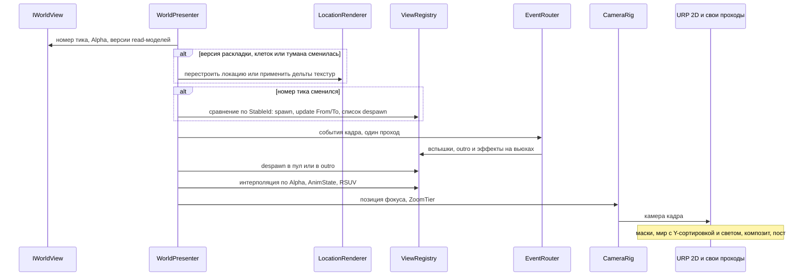
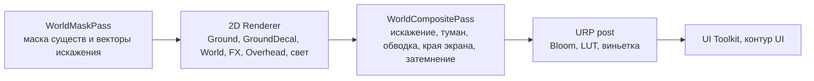

# Представление

> Всё, что видно и слышно в игровом мире (`RiseToPanteon.Presentation`). Каркас, канонические имена и правила
> ARCH — [README.md](README.md); поведение — GDD (ссылки вида `C10 R4`).
>
> Пометки: **«проверить на спайке»** — утверждение не подтверждено на целевой конфигурации (README §2).
> **«оценка»** — число уточняет спайк №2 (`Docs/GDD/Scope.md`).

## 1. Назначение и границы

Каждый кадр превращает снимок симуляции в картинку и звук: вьюхи, пол, стены, свет, VFX, камера, экранные эффекты.
URP 2D Renderer, обычные GameObject, 2D Animation 16, ассеты через `IAssetProvider`; ECS ничего не рисует.
Entities Graphics не используется. Почему: он не поддерживает 2D.

| Делает | Не делает |
|---|---|
| Читает `IWorldView`: снимок `ViewState`, события `SimEvent`, `*ReadModel` | Не обращается к ECS, `Simulation`, `Bridge` (ARCH-02) |
| Создаёт, обновляет и возвращает в пул вьюхи по `StableId` | Не меняет состояние игры, не шлёт `Operation` и `PlayerInputFrame` |
| Интерполирует между двумя последними тиками (§4) | Не решает игровых вопросов: ступень метки, триггер зума, лимит следов считает симуляция |
| Строит визуал локации из read-моделей (§6) | Не рисует интерфейс: HUD, экраны и текст реплик — контур UI (`N05` §9, `U03` R8) |
| Превращает события в VFX и звук (`IAudioService`) | Ничего не сохраняет |

Ссылки сборки — `CodeStructure.md` §3.1. Ядро регистрируется в `GameScope`, фичи — через `IFeatureInstaller`.

### 1.1. Координаты

- **1 мировая единица = 1 клетка.** Клетка `(x, y)` занимает `[x, x+1) × [y, y+1)`, центр — `(x+0.5, y+0.5)`.
- Развёрнута одна локация. Её клетка `(0, 0)` всегда лежит в мировой точке `(0, 0)`.
- `ViewState.Position` — точка опоры сущности на полу (центр коллизии). С ней совпадает pivot вьюхи.
- Все рендереры мира стоят в `z = 0`, глубину задаёт только сортировка (§7). Больший Y означает «дальше от зрителя» в 3/4.
- Направлений два, влево и вправо (`Scope.md` → производство обликов): берётся знак горизонтальной составляющей `Facing`.

Соглашения обязательны и для `Simulation.md`. Если документы расходятся, сначала исправляют документ, потом код.

### 1.2. Что представление требует от контракта

Имена — README §4.3 (базовые read-модели, `ViewFlags`, `AnimState`, `IWorldView.CurrentTick`, порты). Содержимое
read-моделей для представления и раскладку битов `ViewFlags` определяет этот документ.

| Потребность | Тип или поле | GDD |
|---|---|---|
| Раскладка локации, раз на развёртку | `LocationLayoutReadModel`: версия, id локации и биома, пресет этажа, размер, клетки (пол / стена / пустота, слой пола), статичный декор (`ViewKey`, клетка, вариант), источники света | `W01` R19, `W02` |
| Состояние клеток и следы | `CellStateReadModel`: версия, упакованное состояние клетки (трещины, сухость, гарь, индекс декали), дельты от прошлой версии, объектные следы (`ViewKey`, клетка, вариант) | `W07` R6, `L05` R10–R16 |
| Туман войны | `FogReadModel` (или часть read-модели карты): «раскрыто» по клеткам, дельты | `U05` R1, R12; `C10` R7 |
| Облик | `AppearanceReadModel`: версия; по `StableId` — тело, части по точкам крепления, оружие, строка палитры, цвет ауры, масштаб | `E05` R17–R18, `I06` R2–R6 |
| Камера | `CameraReadModel`: `FocusId` (игрок), `ZoomTier` (базовый / крупное существо / мегабосс) | `C10` R3–R4, R13 |
| Экранные стили | Поля read-модели игрока: ступень и сила распада, сила давления, доля здоровья | `U03` R2–R4, `C07` §7 |
| Флаги и анимация | `ViewFlags` (биты `ViewState.Flags`, ниже); `AnimStateId` и счётчик перезапуска в `AnimState` | см. ниже |
| Смена снимка | Номер тика текущего снимка в `IWorldView` | README §3 |
| Точка над сущностью для UI | `IWorldAnchorService` (Contracts), реализует представление | `N05` R16, `U03` R8 |
| Превью облика на экранах | `IAppearancePreviewService` (Contracts), реализует представление | `E06` §7, `I06` R10 |
| Экран → мир для прицела мышью | `IPointerProjector` (Contracts), реализует представление (камера); использует `IInputService` | `U02` |

| Биты `Flags` | Поле `ViewFlags` (не меньше 16 бит; раскладку задаёт этот документ) | GDD |
|---|---|---|
| 0–2 | `DangerTier`: 0 — метки нет, 1–5 — «намного слабее»…«намного сильнее». У переходов — ступень плотности соседней локации | `U03` R14, R17; `E02` R14; `W16` R15 |
| 3 | `ShowHealthBar`: короткая полоса над раненой целью в бою | `U03` R13 |
| 4–8 | `Health`: доля здоровья, 0–31 | `U03` R13 |
| 9 | `Decaying`: существо «размывается» распадом | `B02` R27, `W16` R12 |
| 10 | `HaloFlicker`: ореол мерцает у входа в более плотную локацию | `W05` R6, `W16` R4 |
| 11–12 | `Growth`: молодая особь / обычная / мини-босс | `L05` строка 3, `B01` R17, `B03` R2 |
| 13 | `EchoCarrier` [Срез]: свечение цвета игрока | `D02` R3 |

`AnimState = { Id, Restart }` (README §4.3): `Id` — `AnimStateId` (Idle, Move, Attack, Ability, Eat, Flee, Death, Dash, Hurt, Absorb,
Rest, CocoonIn, CocoonOut…), `Restart` — счётчик перезапуска: повтор той же атаки меняет его, и клип стартует заново.

## 2. Поток кадра

`WorldPresenter` раз за кадр читает `IWorldView` и проводит данные через
подсистемы в фиксированном порядке (код — §3.1); каждый шаг обёрнут в `ProfilerMarker` `RTP.Pres.<Шаг>` (§12).



События обрабатываются после появления новых вьюх и до удаления исчезнувших. Поэтому эффект гибели или
поглощения ещё находит вьюху сущности, которая пропала в этом тике.

## 3. WorldPresenter и жизненный цикл вьюх

### 3.1. WorldPresenter

`WorldPresenter` — точка входа VContainer в `GameScope` (`RegisterEntryPoint`, `ILateTickable`: к `PreLateUpdate`
тики кадра уже прошли). Только он читает `IWorldView`; остальные классы контура получают данные от него.
Эскиз ниже — иллюстрация: имена членов `IWorldView` и `IAppLifecycle` задают Contracts и Services.

```csharp
public sealed class WorldPresenter : IStartable, ILateTickable, IDisposable
{
    public void LateTick()
    {
        if (_lifecycle.IsPaused)
        {
            _pause.Enter();
            return;
        }
        _pause.Exit();
        _clock.Advance(Time.deltaTime);
        _location.Sync(_world);
        _appearance.Sync(_world, _registry);
        if (_world.SnapshotTick != _appliedTick) ApplySnapshot();
        _events.Route(_world.Events, _registry);
        _registry.FlushDespawns();
        _registry.Interpolate(math.saturate(_world.Alpha));
        _camera.Tick(_registry, _world);
        _anchors.Publish(_camera);
    }
}
```

- `_pause` — пауза (§4); `_clock` двигает `_RtpWorldTime`.
- `_location.Sync` — раскладка, клетки, туман (§6); `_appearance.Sync` — облик по версии (§5.4).
- `ApplySnapshot` — сравнение снимков (§3.2).
- `_events.Route` — события (§10), ровно один раз.
- `FlushDespawns` — исчезнувшие вьюхи уходят в пул или в outro; `Interpolate` — интерполяция (§4).
- `_camera.Tick` — камера (§11); `_anchors.Publish` — `IWorldAnchorService` (Contracts).

### 3.2. Сравнение снимков по StableId

`ViewRegistry` хранит единственную карту `StableId → WorldView` с заранее заданной ёмкостью (без аллокаций в бою).

1. Строка `Current`: вьюха есть — обновляются `To`, `Facing`, `AnimState`, `Flags`. Вьюхи нет — `ViewFactory`
   выдаёт её из пула по `ViewKey`, `From = To = Position`.
2. Строка `Previous`, чья вьюха не создана в этом кадре: `From = Position`.
3. Вьюха, которой нет в `Current`, попадает в список despawn.
4. Сменился `ViewKey` у того же `StableId` (метаморфоза, `E07`): старая вьюха — в despawn, новая — под тем же id.
5. Пул `ViewKey` не загружен: вьюха отложена до загрузки, dev-лог `PRES late load <address>` — баг предзагрузки (§3.5).

Outro: если событие назначило исчезающей вьюхе доигрыш (растворение тела, `B02` §9), она уходит в набор outro
и в пул — не позже `OutroMaxSeconds` (оценка — 1 с). `StableId` не переиспользуются, столкновений нет.

### 3.3. Префаб вьюхи

```text
<Visual id> (WorldView: корень, pivot = точка опоры)
├── Visual        SortingGroup (слой World), Animator без контроллера, отражение по X (§5.6)
│   ├── Rig       кости шаблона; точки крепления AP_Head, AP_Back, AP_Tail, AP_Hand (AP_Hand2 — Гл1)
│   ├── Body      SpriteRenderer + SpriteSkin, порядок 0
│   ├── Parts     SpriteRenderer + SpriteResolver на костях крепления, порядок 10–19 (за телом — отрицательный)
│   ├── Weapon    SpriteRenderer + SpriteResolver на AP_Hand, порядок 20
│   └── FxAnchor  ореол, аура мини-босса или реликвии, порядок 30
├── Shadow        blob-тень, слой GroundDecal, вне SortingGroup
└── Overhead      форма метки опасности, полоса здоровья, слой Overhead, вне SortingGroup
```

Порядок «тело → части → оружие → эффекты» — `I06` §10. Тень и значки вне `SortingGroup`, иначе не попадут на свои слои.

### 3.4. Пулы и Addressables

- Строковый id визуала = адрес Addressables (CONT-18). `ViewKeyRegistry` строит массив `ViewKey → address`
  и параметры визуала по таблице визуалов пака (`IConfigPackProvider`, имя таблицы задаёт `Content.md`).
- `ViewPool` одного адреса держит один handle префаба из `IAssetProvider` и создаёт копии через
  `Object.Instantiate`, копии ссылок не добавляют. При уничтожении пула сначала удаляются копии, потом
  освобождается handle.
- `PoolScope`: **Session** — облик игрока, части, оружие, общие VFX (удар, поглощение, рывок); **Location** —
  виды, декор и VFX биома.
- Пулы видов прогреваются до численности первого снимка; рост в бою логируется в dev. VFX — `FxPool` (§9.1).

### 3.5. Переход между локациями: предзагрузка и выгрузка

Переход прячется за затемнением в бюджете ARCH-19 (`W16` §5, §7).

1. Событие начала перехода (тип `SimEvent` из блока фичи переходов, §10) запускает `TransitionFader.FadeOut`.
2. Экран чёрный, раскладка сменила версию; вьюхи старой локации уходят сами — их `StableId` пропали из снимка.
3. Предзагрузка: метка Addressables биома (имя — в конфиге биома), все `ViewKey` первого снимка, VFX их видов.
4. Смена пулов **Location**: в том же биоме сначала захват нового набора, потом освобождение старого (общее удержит
   счётчик ссылок); при смене биома — наоборот, чтобы не держать два биома (проверить на спайке памяти).
5. `LocationRenderer` строит локацию (§6). Свет и Volume получают пресет этажа.
6. `FadeIn` начинается, когда всё из шага 3 загружено и прошла минимальная длительность затемнения.

Вьюха игрока (**Session**) переживает переход, прыжок позиции гасит правило телепорта (§4). Загрузка сохранения
(`M01`) идёт тем же путём.

## 4. Интерполяция и пауза

```text
pos = |To − From| > SnapDistance ? To : lerp(From, To, saturate(Alpha))
```

- `Alpha` не экстраполируется. `SnapDistance` — техконстанта больше смещения за тик у рывка (`C04`), оценка — 3 клетки.
- `Facing`, `AnimState`, `Flags` применяются в момент смены снимка. Задержка до 1 тика (33 мс) — цена тика
  30 Гц (README §3).
- Событие играется в кадре чтения в точке `SimEvent.Position`; события нескольких тиков кадра звучат вместе.
- Корень вьюхи двигает только `WorldPresenter`; локальные смещения внутри `Visual` (отдача) разрешены.
  `IJobParallelForTransform` — только если профиль покажет превышение бюджета.

**Пауза** (`U04` R1, R3; `M01`; README §3): сигнал — `IAppLifecycle`, применяет `PauseApplier`. Read-модели,
пришедшие «тиком без времени» (облик после экипировки, клетки), представление применяет, но не продвигает
интерполяцию и время анимаций (PRES-10). На `Time.timeScale` представление не опирается.

| Что | В паузе |
|---|---|
| `WorldPresenter` | Позиции и интерполяция стоят; изменения read-моделей, пришедшие «тиком без времени», применяются |
| `AnimationPlayer` | Скорость корневого playable = 0 (проверить на спайке) |
| Частицы | `Pause()` у активных систем `FxPool` и вьюх, при выходе — `Play()` |
| Шейдеры, мерцание света, ореол, искажение краёв | Стоят: `_RtpWorldTime` и `PresentationClock` не идут. Шейдеры мира не используют `_Time` |
| Камера; звук мира | Стоит, тряска сбрасывается; звук ставит на паузу `IAudioService` (Services) |
| UI, превью облика | Не затронуты; превью идёт по своему часу (§5.8) |

## 5. Анимация существ и облики

### 5.1. Виды вьюх

| Вид (задаётся данными визуала) | Кто | Как анимируется |
|---|---|---|
| `SkeletalView` | Тела стадий игрока, существа семейств (`B01` R16) | 2D Animation: `SpriteSkin`, кости, клипы через `AnimationPlayer` |
| `FlipbookView` | Мелкие существа и рои | `FlipbookPlayer`: смена спрайтов |
| `ParticleBodyView` | Искра — «частицы и свечение» (`E07` §9), Эхо (`D02` R3) | Пресеты эмиттеров и света по `AnimStateId` |
| `StaticView` | Двери, сундуки, шипы, переходы (`W12`–`W16`) | Спрайт состояния по `AnimState`, вариант через RSUV |

### 5.2. Шаблон скелета и AnimationPlayer

Один шаблон скелета с общими точками крепления (голова, спина, хвост, «рука» — `E07` §9) на все тела:
базовое тело на семейство существ (`B01` R16) и на стадию или полюс у игрока (~11 тел на главу 1, `Scope.md`).
В Прототипе у каждого семейства своя точка (`E05` R18). Деформация — CPU + Burst на всех платформах (GPU на GLES3
не работает); вне экрана `SpriteSkin` не обновляется, `Animator.cullingMode = CullCompletely` (проверить на спайке).
Скелетная анимация подтверждается спайком №2 (§12). Spine не используется. Почему: его рантайм требует платной
лицензии редактора.

Animator Controller не используется; у скелетной вьюхи один `PlayableGraph` на время жизни экземпляра в пуле.
Почему: анимация из кода избавляет агентов от ручной правки YAML Animator Controller. Где лежит `AnimSet` — §5.3.

```csharp
public sealed class AnimationPlayer : IDisposable
{
    public void Init(Animator animator, AnimSet set);
    public void SetState(byte stateId, byte restart);
    public void Tick(float dt);
    public void SetPaused(bool paused);
    public void Dispose();
}
```

- Граф: `AnimationPlayableOutput(Animator)` ← `AnimationMixerPlayable` (2 входа) ← `AnimationClipPlayable` из кэша.
- `Init` строит граф, выход, микшер и кэш клипов по `AnimStateId`; `SetState` переподключает входы и делает
  кроссфейд из `AnimSet`; `Tick` меняет только веса кроссфейда; `SetPaused` ставит скорость корня 0 или 1;
  `Dispose` вызывает `graph.Destroy()`.
- Режим графа — `DirectorUpdateMode.GameTime` (пакетная оценка); ручной `Evaluate` — запасной, выбор по замеру.
- Переходы состояний решает симуляция; проигрыватель только играет `AnimState` с кроссфейдом, без аллокаций.
- Клипы могут ключевать метки `SpriteResolver` (смена кадра части) — штатная возможность 2D Animation.

### 5.3. Набор анимаций в ассете вида

`AnimSet` лежит в ассете вида по адресу визуала (`Content.md` §9.4): `AnimStateId → клип`, цикл, кроссфейд,
скорость. Набор базового тела задаёт всё, набор вида ссылается на него и переопределяет отличия. Существо —
7 состояний (`B01` §9), Сгусток — ~9 (`E07` §9). Нет клипа — Idle и dev-лог; валидатор ассетов в редакторе ловит
пропуски и сверяет длительность клипа атаки с таймингом приёма в конфиге симуляции. Почему не в конфигах: конфиги
хранят только id визуала (ARCH-13), а длительность клипа видна только в Unity — сверка всё равно идёт в редакторе.

### 5.4. Сменные части и оружие

- Категория Sprite Library — точка крепления, метка — id части. Библиотека одна на семейство эссенций: виды
  семейства делят части и различаются цветом (`Scope.md`, `E05` §9).
- Части меняются только через `SpriteResolver.SetCategoryAndLabel`. Части игрока из разных семейств
  `AppearanceApplier` добавляет в библиотеку вьюхи через overrides (проверить на спайке).
- Части и оружие по возможности жёсткие: `SpriteRenderer` на кости без `SpriteSkin`. Деформируется только тело.
- Оружие — 6–8 архетипов в точке «рука», масштаб с телом (`I06` R3–R6); надетое не рисуется (`I06` R1); ауры
  реликвий [Срез] — VFX в `FxAnchor` (`I06` R11).
- У Искры части видны как форма и цвет ореола (`E05` R17). Ореол — спрайт и `Light2D` в `FxAnchor`. Мерцание
  (`HaloFlicker`) и сжатие в фазе ослабления распада (`W06` §7) — параметры ореола.
- `AppearanceApplier` срабатывает только при смене версии `AppearanceReadModel`.

### 5.5. Перекраска и данные экземпляра

Перекраска — шейдером по строке палитры в общей текстуре `_RtpPaletteTex`. Всё, что отличает экземпляр,
передаётся одним 32-битным Renderer Shader User Value (RSUV). `ViewShaderData` пишет его во все рендереры вьюхи.

| Биты | Поле | Кто пишет |
|---|---|---|
| 0–7 | Строка палитры | `AppearanceApplier`, параметры вида |
| 8–10 | `DangerTier` для обводки (§9.2) | `WorldView` из `Flags` |
| 11 | Фокус (игрок) — цвет силуэта | `WorldView` |
| 12–15 | Вариант: стены, пропсы, следы | `LocationRenderer` |
| 16–23 | Растворение: размытие распадом (`B02` R27, §9), уход тела | `WorldView` |
| 24–31 | Вспышка попадания | `EventRouter` → `WorldView` |

RSUV у `SpriteRenderer` и у спрайтов с `SpriteSkin` в 6000.6 — проверить на спайке. Запасной путь — те же 32 бита
в цвете вершин (`SpriteRenderer.color`, батчинг не ломается); код пишет только через `ViewShaderData`, так что смена
пути контур не затронет. Метод перекраски (градиентная карта или маски зон) — после выбора визуального стиля (`Docs/GDD/OpenQuestions.md` → «Визуальный стиль»).

### 5.6. Направление и размеры

- Направление — `Visual.localScale.x = ±1`, скелет отражается с оружием; смена руки — условность (`I06` R5, §10).
  `flipX` на деформируемых спрайтах не используется. Отражение с `SpriteSkin` проверяет спайк №2.
- Масштаб = масштаб вида × `Growth` × масштаб облика. Молодые особи — то же тело, уменьшенное (`L05` строка 3).
  Мини-босс — то же тело крупнее, до 3–4 клеток, с аурой цвета семейства (`B03` R2, §9).
- Видимый размер может быть больше коллизии (≤ 1,5–1,6 клетки, `C02` R4, R7). Валидатор проверяет, что видимое
  тело не меньше площади попадания (`C02` R9).
- Пока стоит `Decaying`, биты растворения плавно растут (`B02` §9: общий шейдер).

### 5.7. Покадровые анимации мелких существ

`FlipbookView` — `SpriteRenderer` + `FlipbookPlayer`; `FlipbookSet` (по адресу) — спрайты на `AnimStateId`, 8–12
кадров/с (оценка), время — `PresentationClock`. Без костей и графа — первый рычаг, если спайк №2 не пройдёт (§12).

### 5.8. Превью облика

Экраны кокона и экипировки показывают будущий облик с оружием (`E06` §7, `I06` R10, `C02` §7). UI не ссылается
на представление, поэтому — порт `IAppearancePreviewService` в Contracts. `AppearancePreviewRenderer` собирает вьюху
через `AppearanceApplier` на изолированном слое и рисует отдельной камерой в `RenderTexture` для UI. Экран кокона
открыт на паузе, поэтому превью идёт по своему часу, не по `PresentationClock`.

## 6. Рендер локации

### 6.1. Источник данных

Сцены на локацию нет (README §4.2): `LocationRenderer` строит визуал из `LocationLayoutReadModel` (раз на
развёртку; процедурные и авторские комнаты — одинаково, `Content.md` §7). Изменения — дельтами `CellStateReadModel` и `FogReadModel`:
базовая версия дельты = применённой → применить, иначе полная пересинхронизация. «Мир помнит» без лишних объектов.

### 6.2. Пол: чанки, шейдер смешивания, состояние клеток

- Меши-чанки 16×16 клеток (оценка) из клеток пола, слой `Ground`, раз на развёртку; UV — от мировой позиции.
- Шейдер пола — Shader Graph 2D Lit, совместим с SRP Batcher:
  - `Texture2DArray` слоёв пола биома: до 4 слоёв плюс детали трещин и гари;
  - `_RtpSplatTex` — веса слоёв, 1 тексель на клетку, билинейно, край разбит шумом;
  - `_RtpCellStateTex` — RGBA8, 1 тексель на клетку. R — трещины давления (`W07` R6), G — сухость [Срез, `L04`],
    B — гарь [Срез, `W17`], A — индекс декали (когти, волочение, подпись соперника), читается через `Load`;
  - вариация плитки — хеш клетки; `_RtpLocationRect` переводит мировую позицию в UV клетки.
- `CellStateTexture` пишет тексели в `GetPixelData`, `Apply(false)` — не чаще раза за кадр (128×128 — 64 КБ, оценка).
  2D-свет на `MeshRenderer` с шейдером 2D Lit — проверить на спайке.
- Вариации света и декора этажей одного тайлсета (`W01` R19) задаёт пресет этажа: глобальный свет, LUT, декор.

### 6.3. Стены и пропсы: автотайл 3/4

- Стена — блок. Лицевая грань высотой в клетку стоит в клетке стены, верх — на клетку выше, pivot — нижний край
  клетки стены. То, что за стеной (выше по Y), сортируется позади и перекрыто гранью (`C10` R6).
- `WallAutotiler` выбирает спрайт по маске 8 соседей и правилам биома (~30–35 тайлов Бездны, `Scope.md`). Вариант
  детерминирован хешем клетки и попадает в биты RSUV. Стена без пола снизу получает только тайл верха.
- Стены и декор (`Props`) — `SpriteRenderer` из пулов **Location**, Y-сортировка на слое `World`. Двери, сундуки
  и шипы меняют состояние в игре, поэтому это сущности снимка (`StaticView`), а не декор.
- Если отсечка тысяч спрайтов стен дорога — участки одной строки сливаются в меш (Y общий, сортировка цела).

### 6.4. Следы (`L05`) и туман (`U05`)

- Плоские следы клеток (трещины, гарь, когти, волочение) хранятся только в `_RtpCellStateTex`, объектов нет.
- Объектные следы (кости трёх размеров, оболочки, логово мини-босса — `L05` §9) приходят записями
  `CellStateReadModel`. `TraceRenderer` рисует их спрайтами из пула: плоские на `GroundDecal`, объёмные на
  `World`. Вид по семейству (`L05` R16) — `ViewKey` набора семейства плюс строка палитры. Лимит 3–5 фоновых
  следов на комнату (`L05` R14, §5) держит симуляция; превышение dev-сборка только логирует.
- `FogTexture` (R8, 1 тексель на клетку, билинейно) — дельтами `FogReadModel`; рисует композит (§9.2). Радиус
  и линию видимости считает симуляция, зум не влияет (`C10` R7, `U05` R12). «Вне обзора» не затемняется (GDD молчит).

### 6.5. Путь прототипа: Tilemap

Прототипу Tilemap разрешён: пол — режим Chunk с тем же шейдером (читает `_RtpCellStateTex` по мировой позиции),
стены — режим Individual или спрайты; выбор скрыт за `IFloorBuilder`. Сортировку Individual проверить на спайке.

## 7. Сортировка и слои

`Renderer2DData`: Transparency Sort Mode = Custom Axis, ось `(0, 1, 0)`; объект с большим Y рисуется раньше.
Pixel Perfect Camera не используется: графика рисованная, со скелетной анимацией, не пиксель-арт (`Scope.md`).

| Порядок | Слой сортировки | Что | Внутри слоя |
|---|---|---|---|
| 0 | `Background` | Фон за пределами локации | `sortingOrder` |
| 1 | `Ground` | Чанки или Tilemap пола | `sortingOrder` |
| 2 | `GroundDecal` | Плоские следы, blob-тени, зоны и телеграфы на полу | `sortingOrder` |
| 3 | `World` | Существа, стены, пропсы, двери, объёмные следы, снаряды | Y по pivot |
| 4 | `FX` | Частицы и вспышки поверх мира | `sortingOrder` |
| 5 | `Overhead` | Формы меток опасности, полосы здоровья | `sortingOrder` |

- На `World` pivot — точка опоры (ноги, основание пропса, низ клетки стены); высота снаряда — смещение в `Visual`.
  Многочастная вьюха — один `SortingGroup` на `Visual` (§3.3).
- Крупные тела (мини-босс, 3–4 клетки) перекрывают стены; верная сортировка в 3/4 — критерий спайка №2.
  Новый слой сортировки добавляется только правкой этого документа.

## 8. Свет и тени

Бюджет света: Global Light 2D (цвет и яркость — пресет этажа, `W01` R19) и 8–12 небольших источников (Spot,
Freeform), одна blend style (Multiply), light texture ≤ 0.5, тени у 1–3 источников, blob-тени, уровни качества.

- `Light2D` работает только вместе с `BudgetedLight` (приоритет из данных). Каждые несколько кадров
  `LightBudgetController` выбирает N видимых источников по приоритету и близости к центру камеры, остальные
  гаснут за 0,2 с. Приоритет: ореол игрока → аура мини-босса → Эхо → источники комнаты.
- Свет — на `Ground`, `GroundDecal`, `World`; `FX` и `Overhead` не освещаются. Нормали выключены; включение решается вместе с визуальным стилем (`Docs/GDD/OpenQuestions.md` → «Визуальный стиль»).
- Тени от стен: `ShadowCaster2D` на чанк из контуров стен раскладки, только у источников с флагом тени, в пределах
  уровня. Построение формы без коллайдеров проверить на спайке. В Прототипе тени выключены.
- Blob-тень — неосвещаемый спрайт на `GroundDecal` по видимому размеру. Батчинг света — отладчик 2D Light Batching.

**Уровни качества** меняют только визуальное (`U08` R7). Частота кадров — 30 или 60 (`U08` §5).

| Параметр | Low | Medium | High |
|---|---|---|---|
| Целевая частота кадров | 30 | 60 | 60 |
| Render scale (оценка) | 0.75 | 0.9 | 1.0 |
| Видимых `Light2D`, кроме Global / из них с тенью | 4 / 0 | 8 / 1 | 12 / 3 |
| Light texture scale | 0.25 | 0.5 | 0.5 |
| Bloom | выкл | Dual, ¼ разрешения | Dual или Kawase, ½ |
| Разрешение масок и искажения (§9.2) | ¼ | ½ | ½ |
| Лимит живых частиц (оценка) | 300 | 600 | 1000 |
| HDR | выкл | по замеру | по замеру |
| LUT, виньетка, обводка опасности, туман, искажение краёв | вкл | вкл | вкл |

Уровень = уровень `QualitySettings` со своим URP Asset и `Renderer2DData` + `QualityTierProfile`; применяет
`QualityTierController`. Первый выбор — по классу устройства (`Services.md`), ручной — со Среза (`U08`).

## 9. VFX, пост-обработка и спец-проходы

### 9.1. VFX

- Только Particle System (Shuriken) и материалы Shader Graph. VFX Graph не используется.
- Эффекты — из `FxPool`, возврат по длительности из данных; без `Destroy`, модулей Collision и Lights; Culling Automatic.
- Перекраска — через `main.startColor` или custom vertex streams, без экземпляров материалов. Так красятся аура
  цвета семейства (`B03` §9), свечение Эха цвета ауры игрока (`D02` §9) и цвет атаки по семейству (`E05` R10).
- Лимит частиц уровня (§8) распределяет `FxPool`: при переполнении гасятся фоновые эффекты, не эффекты читаемости.

### 9.2. Свои проходы Render Graph

Только `RecordRenderGraph`; точку вставки в 2D-рендерер (`RenderPassEvent2D` или аналог в 6000.6) проверить на спайке.



- **`WorldMaskPass`** работает до основного прохода и пишет две текстуры пониженного разрешения:
  `_RtpSilhouetteMask` — существа по проходу шейдера `LightMode = RtpSilhouetteMask` (R — покрытие, у игрока
  своё значение; G — `DangerTier` из RSUV); `_RtpDistortionTex` — по проходу `LightMode = RtpDistortion`: вход
  в локацию другой плотности (`W05` R6, `W16` R4, R15), эффекты боссов. Основной проход эти теги не рисует.
- **Силуэты за стенами** (`C10` R6): шейдер лицевой грани читает `_RtpSilhouetteMask` по экранной позиции и
  подмешивает тон силуэта; стоящий перед стеной рисуется поверх и закрывает его сам (ореолы краёв — спайк).
- **`WorldCompositePass`** — один полноэкранный проход после мира:
  1. Искажение: смещения из `_RtpDistortionTex` и процедурные края экрана трёх стилей — распад (три ступени,
     `U03` R2–R4, `W06` R10), давление (`W07` R10), пульсация низкого здоровья (`C07` §7). Стили различимы
     (`U03` R3, §10). Сила берётся из read-модели игрока с учётом настройки, не ниже 50% (`U08` R6).
  2. Туман войны из `_RtpFogTex` (§6.4).
  3. Обводка метки опасности: поиск краёв по каналу G маски, цвет ступени. Обводка идёт по всему силуэту,
     без внутренних линий (`E02` §9).
  4. Затемнение перехода (`W16` §7) — множитель от `TransitionFader`.
- Силуэты, туман, искажение, обводка и затемнение сведены в одну маску пониженного разрешения и один композит.
  Почему: так экономится пропускная способность памяти на мобильных.

**Метка опасности** (`U03` R14, R17) — цвет и форма, 5 ступеней: форма — спрайт на `Overhead`, цвет —
обводка композита. У переходов (`W16` R15) цвет и сила искажения у проёма берутся по той же шкале.

### 9.3. Пост-обработка и инварианты читаемости

Один глобальный Volume на пресет этажа: Bloom (фильтр Dual или Kawase — по замеру на устройстве; его наличие
в URP 6000.6 проверить на спайке), Color Lookup (LUT этажа, `W01` R19), Vignette. DoF, motion blur,
хроматическая аберрация и film grain не используются без правки этого документа.
Метки опасности, стили распада и давления, следы и силуэты работают на любом уровне (`U08` R5); искажение краёв
ослабляется не ниже 50% (`U08` R6). Low экономит на разрешении, свете, bloom и частицах, но не на них.

## 10. События → VFX, звук, реплики (EventRouter)

`EventRouter` проходит события кадра ровно один раз; другие классы контура их не читают. Чтение не изменяет набор,
очищает его мост на границе кадра (README §5).

1. `EventCueTable` — данные пака: тип события (+ `ViewKey` субъекта для видовых переопределений: голос, атака,
   гибель — `B01` §9) → `EventCue` (адрес VFX, id звука, вспышка цели, тряска).
2. Подсказку исполняют `FxPool` (в `SimEvent.Position` или на вьюхе `Subject`/`Target`), `IAudioService` (звук
   в точке) и `WorldView` (вспышка, outro).
3. Затем — обработчики фич `ISimEventHandler` (регистрация через `IFeatureInstaller`, таблица строится при старте).

| Событие (тип в Contracts; id — блоки фич, `CodeStructure.md` §7) | GDD | Реакция представления |
|---|---|---|
| Удар | `C01`, `C03`, `C06` | VFX цвета семейства, звук, вспышка цели. Если цель — фокус, тряска (`C10` §5), в `U08` её можно выключить |
| Гибель | `B02`, `E01` | VFX, видовой звук. Тело остаётся сущностью снимка; когда оно исчезнет — outro-растворение |
| Поглощение | `E01` | Поток VFX от `Target` к `Subject`, звук |
| Звук | `U09`, `B02` §7, `C10` R10 | `IAudioService` в точке: например, рык хищника из-за края экрана |
| Фаза кокона | `E08`, `E07` §9 | 5 VFX кокона: формирование, пульсация, повреждение, разрушение, выход |
| Эхо: появление, поглощение | `D02` | Свечение цвета ауры игрока, VFX поглощения |
| Начало перехода | `W16` | `TransitionFader.FadeOut` (§3.5) |
| Реплика | `N05`, `U03` R8 | Представление её не рисует. Строку над персонажем рисует UI (`N05` §9, R16) по якорю `IWorldAnchorService` |

Трещины, следы и туман приходят дельтами read-моделей (§6), а не событиями. Состояние объекта (дверь выбита,
сундук вскрыт) приходит в `AnimState` его вьюхи; событие добавляет только эффект и звук.

## 11. Камера (`C10`)

`CameraRig` ведёт единственную ортографическую камеру `Game.unity` без поворота, после интерполяции (§3.1).

| Параметр (конфиг камеры; ориентиры `C10` §5) | Значение |
|---|---|
| Высота обзора | ~10–11 клеток: `orthographicSize = высота / 2 × зум` |
| Зум при крупном существе / на мегабоссе [Гл1] | ×1,3–1,4 / ×1,5–1,6 |
| Смена масштаба | 0,6 с, плавно |
| Опережение / мёртвая зона | 1–1,5 клетки / ~0,5 клетки |
| Тряска | ≤ 0,1 клетки, ≤ 0,15 с, отключаемая |

- Цель — интерполированная позиция вьюхи `CameraReadModel.FocusId` плюс опережение по направлению `To − From`.
  Внутри мёртвой зоны камера стоит, вне её догоняет цель через `SmoothDamp` по `PresentationClock`.
- Фиксирована высота обзора, ширина зависит от соотношения сторон: 16:9 → ~18,7 клетки, 20:9 → ~23,3,
  4:3 → 14 (полуширина 7 равна потолку дальности атак, `C10` R9–R10). Проверяются все три соотношения (`C10` §9).
- Зум задаёт только `CameraReadModel.ZoomTier`. Правило «отъехать при входе в комнату, не больше одной смены за
  бой» исполняет симуляция (`C10` R4). После загрузки масштаб выбирается заново (`C10` §6).
- Щипка нет (`C10` R11), свободной камеры нет (R8), ориентация альбомная (R2). Если фокус прыгнул (переход,
  возрождение), камера сразу ставится в цель без сглаживания.
- Затем `WorldAnchorService` пересчитывает экранные точки для UI (задержку в кадр оценить на глаз).

## 12. Производительность

Бюджет ARCH-19 (40 существ в комнате) и риск №2 прототипа — со стенами, отражением и палитрами. Эталонные
устройства — ARCH-19.

| Метрика: уровень Low, 40 существ в кадре | Бюджет (оценка) |
|---|---|
| Время кадра p95 на эталонном телефоне | ≤ 33,3 мс (30 кадров/с). На Medium и High — 16,7 мс |
| `WorldPresenter` без анимации, главный поток | ≤ 1 мс |
| Оценка графов и деформация `SpriteSkin` | ≤ 4 мс в сумме по потокам |
| Кости и вершины деформации на существо | ≤ 20 и ≤ 400 |
| Батчи / SetPass | ≤ 120 / ≤ 25 |
| Средний overdraw экрана | ≤ 2,5× |
| Аллокации в бою (`WorldPresenter`, `EventRouter`, `AnimationPlayer`) | 0 байт за кадр |
| Построение локации / предзагрузка | ≤ 150 мс / ≤ 300 мс из бюджета перехода ARCH-19 |

- SRP Batcher включён. Шейдеры мира держат свойства в `CBUFFER UnityPerMaterial`, материалы общие.
  `MaterialPropertyBlock` и `renderer.material` запрещены; данные экземпляра передаются через RSUV
  или цвет вершин (§5.5).
- Sprite Atlas v2: атлас на биом и на семейство или вид. Атлас и его спрайты лежат в одной группе Addressables,
  иначе текстура дублируется; это проверяют правила Analyze.
- Спрайты мира импортируются с Mesh Type = Tight, чтобы не рисовать прозрачные пиксели. Full Rect допустим для
  частиц и мелких спрайтов. Вместо крупных полупрозрачных оверлеев используется композит (§9.2).

**Рычаги, если спайк не проходит** (по порядку): меньше костей и вершин → больше жёстких частей → покадровая
анимация для части видов → реже обновлять анимацию дальних от фокуса существ → настройки Low → пересмотр
скелетной анимации (§5.2).

**Профилирование — только на устройстве** (цифры редактора не принимаются): Development-сборка, Profiler по USB
с маркерами `RTP.Pres.*`; Frame Debugger, Rendering Debugger (overdraw), отладчик 2D Light Batching; Xcode GPU
Capture, Android GPU Inspector или Arm Mobile Studio — отдельно Vulkan и GLES3. Memory Profiler: после трёх переходов
туда-обратно ассеты и экземпляры пулов возвращаются к исходным, иначе утечка handle. Сцена спайка №2 (`RTP_DEV`):
комната, 40 существ четырёх семейств, стены с гранями, отражение, палитры, 60 с записи → p95 и метрики таблицы.

## 13. Правила контура

Дополняют правила ARCH (README §6). Каждое проверяется ревью или автотестом.

| ID | Правило |
|---|---|
| PRES-01 | Данные игры берутся только из `IWorldView`; ссылки сборки — README §4.1 (ARCH-02). |
| PRES-02 | Представление MUST NOT менять состояние игры и отправлять `Operation`/`PlayerInputFrame`. Игровые решения (ступень метки, зум, лимит следов) MUST приходить из read-моделей или `Flags`. |
| PRES-03 | `IWorldView` MUST читать только `WorldPresenter`, один раз за кадр, в `LateTick`. |
| PRES-04 | События кадра MUST обрабатываться ровно один раз и только через `EventRouter`. Обработчики MUST NOT хранить события дольше кадра. |
| PRES-05 | Вьюха адресуется только `StableId`. Единственная карта `StableId → вьюха` — `ViewRegistry`. |
| PRES-06 | Вьюхи и VFX MUST браться из `ViewPool`/`FxPool`. `Instantiate` и `Destroy` в игровом кадре MUST NOT, кроме прогрева и уничтожения пула. |
| PRES-07 | Сверх ARCH-13 и CONT-18: на каждый захват ассета — ровно одно освобождение; handle принадлежит пулу. |
| PRES-08 | До `FadeIn` MUST быть загружены метка биома, все `ViewKey` первого снимка и VFX их видов. Отложенная вьюха в бою — баг. |
| PRES-09 | Позицию корня вьюхи MUST ставить только `WorldPresenter` по `lerp(From, To, saturate(Alpha))` с правилом телепорта. Экстраполяция MUST NOT. |
| PRES-10 | В паузе позиции, анимации, частицы и `_RtpWorldTime` MUST стоять. Представление MUST NOT менять `Time.timeScale`. |
| PRES-11 | Шейдеры мира MUST брать время из `_RtpWorldTime`, а не из `_Time`. |
| PRES-12 | Анимация MUST идти только через `AnimationPlayer` (Playables) или `FlipbookPlayer`, клипы — из `AnimSet` в ассете вида (§5.3). Animator Controller MUST NOT. |
| PRES-13 | Направление MUST задаваться через `Visual.localScale.x = ±1`. Отдельный арт на стороны и `flipX` на деформируемых спрайтах MUST NOT. |
| PRES-14 | Сменные части и оружие MUST меняться только через `SpriteResolver` (категория = точка крепления). |
| PRES-15 | Данные экземпляра для шейдера MUST писаться только через `ViewShaderData`. `MaterialPropertyBlock` и `renderer.material` MUST NOT. |
| PRES-16 | Шейдеры мира MUST быть совместимы с SRP Batcher. SRP Batcher MUST быть включён во всех URP Asset. |
| PRES-17 | Рендерер мира MUST стоять на слое из §7 в `z = 0`. Y-сортируемое — на `World`, pivot в точке опоры. Тень и значки MUST лежать вне `SortingGroup`. |
| PRES-18 | Визуал локации MUST строиться только из read-моделей. Сцены и ручная расстановка под локацию MUST NOT. |
| PRES-19 | Изменения клеток (трещины, сухость, гарь, плоские декали) MUST идти в `_RtpCellStateTex`, а не в GameObject. |
| PRES-20 | У каждого `Light2D` MUST быть `BudgetedLight`, и им MUST управлять `LightBudgetController`. Blend style одна. Число источников и теней — не выше уровня §8. |
| PRES-21 | VFX — только Shuriken и Shader Graph, VFX Graph MUST NOT. Эффект перекрашивается цветом частиц, не материалом. |
| PRES-22 | Свои полноэкранные проходы — только `WorldMaskPass` и `WorldCompositePass`, только через `RecordRenderGraph`. Новый проход — только правкой этого документа. |
| PRES-23 | Метки опасности, стили распада и давления, следы и силуэты MUST работать на всех уровнях качества. Искажение краёв MUST NOT опускаться ниже 50% (`U08` R5–R6). |
| PRES-24 | Фокус и зум камеры MUST браться только из `CameraReadModel`. Щипок и свободная камера MUST NOT (`C10` R8, R11). |
| PRES-25 | Параметры из §5 фич GDD (камера, искажение, тряска, частота flipbook) MUST лежать в `Configs/`, не в коде (ARCH-12). |
| PRES-26 | Каждый шаг кадра MUST быть обёрнут в `ProfilerMarker` `RTP.Pres.*`. В бою — 0 байт аллокаций за кадр в `WorldPresenter`, `EventRouter`, `AnimationPlayer`. |
| PRES-27 | Сцена спайка №2 MUST укладываться в бюджет §12 на эталонном телефоне на уровне Low. Регресс — баг (ARCH-19). |

## 14. Типы контура

Канонические имена README (`IWorldView`, `ViewState`, `ViewKey`, `SimEvent`, `*ReadModel`, `WorldPresenter`,
`IAssetProvider`, `IAudioService`, `IAppLifecycle`, `IConfigPackProvider`, порты `IWorldAnchorService`,
`IAppearancePreviewService`, `IPointerProjector`) здесь не повторяются; содержимое контракта — §1.2. Ниже — новые публичные типы `RiseToPanteon.Presentation`.

| Тип | Вид | Назначение |
|---|---|---|
| `PresentationClock` / `PauseApplier` | class | Время мира и `_RtpWorldTime` / вход и выход из паузы (§4) |
| `ViewRegistry` | class | Карта `StableId → WorldView`, сравнение снимков, интерполяция, despawn, outro |
| `ViewFactory` | class | Выдача вьюх по `ViewKey`, пулы, отложенное создание |
| `ViewPool` / `PoolScope` | class / enum | Пул одного адреса, владеет handle / область жизни `Session`, `Location` |
| `ViewKeyRegistry` | class | `ViewKey → address` и параметры визуала из пака |
| `WorldView` | MonoBehaviour, abstract | Корень префаба: `From`/`To`, привязка к `ViewState`, рендереры для RSUV |
| `SkeletalView` / `FlipbookView` / `ParticleBodyView` / `StaticView` | MonoBehaviour | Виды вьюх (§5.1) |
| `AnimationPlayer` / `AnimSet` | class | Проигрыватель на Playables (§5.2) / клипы вида по `AnimStateId` |
| `FlipbookPlayer` / `FlipbookSet` | class / ScriptableObject | Покадровая анимация / кадры по `AnimStateId` и частота, грузится по адресу |
| `AppearanceApplier` | class | Применяет облик: части, оружие, ореол, палитра, масштаб |
| `ViewShaderData` | struct | Упаковка 32 бит данных экземпляра (§5.5), запись в RSUV или цвет вершин |
| `LocationRenderer` | class | Построение и синхронизация визуала локации |
| `IFloorBuilder`; `ChunkFloorBuilder` / `TilemapFloorBuilder` | interface; class | Построение пола: чанки / Tilemap (прототип) |
| `WallAutotiler` / `TraceRenderer` | class | Автотайл стен 3/4 / объектные следы из `CellStateReadModel` |
| `CellStateTexture` / `FogTexture` | class | `_RtpCellStateTex` / `_RtpFogTex` и применение дельт |
| `BudgetedLight` / `LightBudgetController` | MonoBehaviour / class | Приоритет и флаг тени у `Light2D` / выбор источников по уровню |
| `QualityTier` / `QualityTierProfile` | enum / ScriptableObject | `Low`, `Medium`, `High` / параметры уровня (§8), корневые настройки сцены |
| `QualityTierController` | class | Применение уровня: `QualitySettings`, свет, частицы, разрешение проходов |
| `WorldMaskFeature` / `WorldCompositeFeature` | ScriptableRendererFeature | Проходы `WorldMaskPass` / `WorldCompositePass` (§9.2) |
| `ScreenFxState` | struct | Параметры композита на кадр: стили краёв, сила, затемнение |
| `TransitionFader` | class | Затемнение перехода и условие его окончания (§3.5) |
| `EventRouter` / `ISimEventHandler` | class / interface | Однократная маршрутизация событий / точка расширения фич |
| `EventCueTable` / `EventCue` | class / struct | «Событие (+ вид) → VFX, звук, вспышка, тряска» |
| `FxPool` | class | Пулы эффектов Shuriken с лимитом частиц уровня |
| `CameraRig` | class | Следящая камера `C10` |
| `WorldAnchorService` / `AppearancePreviewRenderer` | class | Реализации портов Contracts `IWorldAnchorService` / `IAppearancePreviewService` |
| `PointerProjector` | class | Реализация `IPointerProjector`: экран → мир через `CameraRig` |

Глобалы шейдеров: `_RtpWorldTime`, `_RtpPaletteTex`, `_RtpLocationRect`, `_RtpSplatTex`, `_RtpCellStateTex`,
`_RtpFogTex`, `_RtpSilhouetteMask`, `_RtpDistortionTex`. Свои теги `LightMode`: `RtpSilhouetteMask`, `RtpDistortion`.
