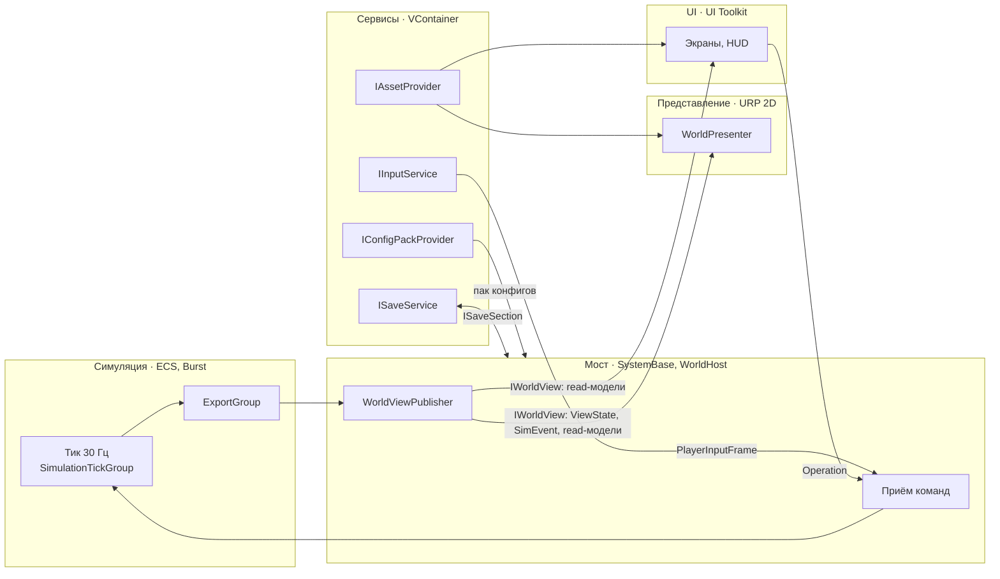
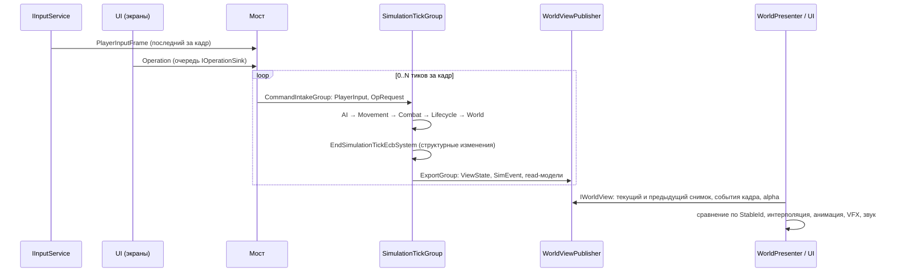

# Архитектура Rise to Panteon

> Как устроен код и по каким правилам его писать. Причина неочевидного решения записана рядом с ним
> строкой «Почему: …». Что игра должна делать — GDD (`Docs/GDD/`).
>
> Имена, введённые в этом файле (сборки, типы, группы, сервисы), — канонические. Документы контуров
> используют их без изменений. Новое имя верхнего уровня появляется сначала здесь.

## 1. Карта документов

| Документ | О чём | Читать, когда |
|---|---|---|
| `README.md` (этот) | Контуры, каркас, глоссарий, правила верхнего уровня | Всегда, первым |
| `Simulation.md` | ECS: хост мира, тик, группы систем, данные мира, команды и операции, события, экспорт, детерминизм | Фича меняет правила игры |
| `Presentation.md` | Отрисовка мира: вьюхи, анимация, пол, свет, VFX, камера | Фича что-то показывает в мире |
| `UI.md` | UI Toolkit: экраны, HUD, привязка к read-моделям, сенсорное управление, локализация | Фича добавляет или меняет интерфейс |
| `Content.md` | Конфиги, редактор комнат, ассеты и Addressables | Фича вводит данные баланса или новые ассеты |
| `Services.md` | VContainer, загрузка, сохранения, аудио, ввод, жизненный цикл, dev-инструменты | Фича затрагивает инфраструктуру |
| `CodeStructure.md` | Папки, сборки, неймспейсы, именование, пошаговое «как добавить фичу» | Перед созданием любого файла |

Справочники по API: `Docs/Tech/Reference/Unity/Entities.md`, `Docs/Tech/Reference/Unity/JobsAndBurst.md`.
GDD: `Docs/GDD/README.md`, реестр фич `Docs/GDD/Features.md`, спецификации `Docs/GDD/Features/`.
Как агенты находят знание, заметки к коду, правила документов — `Docs/Tech/Harness.md`. Статус реализации —
`Docs/Roadmap.md`.
`Docs/Tech/Reference/WO_ProductionArchitecture.md` — чужой проект, только референс.

Приоритет при расхождении: этот документ → документ контура → справочники.

## 2. Картина целиком

Игра одиночная: сервера и мультиплеера нет, архитектура не несёт затрат «под сервер»; если они понадобятся,
решение принимается тогда. Платформы — iOS и Android (только ARM64, Vulkan с запасным GLES3); минимальные
версии ОС — минимум Unity 6.6 для этой конфигурации, уточняется при настройке сборки. Движок — Unity
6000.6.3f1, Entities 6.6 и Burst 2.0 встроены в движок.

Код разделён на **контуры** — области с собственной ответственностью и технологией. Контуры обмениваются
только данными из сборки `Contracts`.



| Контур | Отвечает за | Технология | Запрещено |
|---|---|---|---|
| **Симуляция** | Все правила игры: существа, бой, поглощение, эволюция, шаг мира, генерация | Entities 6.6, `ISystem` + Burst, джобы | Ассеты, GameObject, `UnityEngine.Time/Input/Random`, файлы, сервисы |
| **Мост** | Хост ECS-мира; приём команд в ECS; публикация снимка; конфиги и сохранения ↔ ECS | `SystemBase`, VContainer | Игровые правила |
| **Представление** | Всё, что видно в мире: существа, пол, стены, свет, VFX, камера, звук событий | URP 2D Renderer, GameObject, 2D Animation, Addressables | Доступ к ECS; изменение состояния игры не командами |
| **UI** | Экраны, HUD, сенсорное управление | UI Toolkit (PanelRenderer), Localization | Доступ к ECS; хранение состояния игры |
| **Сервисы** | Инфраструктура: загрузка, конфиги, ассеты, сохранения, ввод, аудио, жизненный цикл, логирование | C#, VContainer, UniTask | Игровые правила; доступ к ECS |

## 3. Кадр и тик

Симуляция идёт фиксированным тиком 30 Гц внутри `FixedStepSimulationSystemGroup`, поэтому
за один кадр бывает 0, 1 или несколько тиков. Представление рисует каждый кадр, интерполируя между
двумя последними снимками. Почему 30 Гц: этого достаточно, чтобы мир выглядел живым, и это бережёт батарею;
ИИ может думать реже (`Simulation.md` §3.4).



**Пауза.** Единственный источник паузы — `IAppLifecycle.AcquirePause(PauseReason)` (ARCH-21): игра стоит,
пока жива хотя бы одна причина (`Services.md` §8). Меню берёт `PauseReason.Menu` через `IScreenService`,
сворачивание — `Background` (GDD U04, M01).

На паузе мировое время не идёт, но операции меню (экипировка, выбор при эволюции) применяются сразу:
`WorldHost` выполняет **тик без времени** (§5; состав — `Simulation.md` §5.3). Почему: GDD ставит игру на
паузу в любом меню, а действия в меню — операции, и их результат должен сразу отображаться. Представление
замирает на последнем снимке. После снятия паузы догоняющих тиков нет (GDD E08, U04 §13; механизм —
`Simulation.md` §2.3).

## 4. Каркас

### 4.1. Сборки

Корневой неймспейс — `RiseToPanteon`. Сборка = контур. Инфраструктура контура лежит в
`Assets/_Project/Code/<Контур>/`, код фич — в `Assets/_Project/Features/<Фича>/<Контур>/` и
вливается в сборку контура через `.asmref` (подробно — `CodeStructure.md`).

| Сборка | Содержит |
|---|---|
| `RiseToPanteon.Core` | Общие примитивы: `StableId`, fixed-point, хеши, утилиты; `IFeatureInstaller`, `FeatureInstallerAttribute`, `InstallScope`; `IBootNode`, `IGameStartNode` |
| `RiseToPanteon.Contracts` | Типы контракта контуров: `PlayerInputFrame`, `PlayerButton`, `Operation`, `SimEvent`, `ViewState`, `ViewKey`, `AnimState`, `ViewFlags`, read-модели, `IWorldView`, `IOperationSink`; порты представления для других контуров: `IWorldAnchorService`, `IAppearancePreviewService`, `IPointerProjector` |
| `RiseToPanteon.Simulation` | Компоненты, системы, джобы, blob-структуры конфигов, генерация мира |
| `RiseToPanteon.Bridge` | `WorldHost`, мостовые системы, `WorldViewPublisher`, привязка конфигов и секций сохранения к ECS |
| `RiseToPanteon.Services` | Сервисы инфраструктуры и их интерфейсы, в т. ч. `ISceneFlow`, `GameStartRequest`, `ILoadingProgress`, `ITouchControlsSink`, `ILocalizationService`, `ISettingsService`, `ILog` |
| `RiseToPanteon.Presentation` | Вьюхи, пулы, анимация, рендер мира, камера, маршрутизация событий в VFX и звук; реализации портов `IWorldAnchorService`, `IAppearancePreviewService`, `IPointerProjector` |
| `RiseToPanteon.UI` | Экраны, HUD, view-модели, сенсорное управление; реализация `ILocalizationService` |
| `RiseToPanteon.App` | Корень композиции: скоупы VContainer, `BootGraph`, `SceneFlow`, каталог инсталлеров |
| `RiseToPanteon.Dev` | Dev-инструменты, читы, оверлеи, системы dev-операций (только с define `RTP_DEV`) |
| `RiseToPanteon.Editor` | Редактор комнат, сборщик пака конфигов, DTO конфигов, валидаторы, импорт локализации |
| `RiseToPanteon.Tests.EditMode` / `.PlayMode` | Тесты, в т. ч. архитектурные (проверка ссылок сборок, неймспейсов, диапазонов id) |

Ссылки и пакеты каждой сборки, настройки asmdef — `CodeStructure.md` §3.1, §3.2.

Запрещённые направления (ARCH-02): `Simulation` → `Services`/`Bridge`/`Presentation`/`UI`/`App`;
`Services`/`Presentation`/`UI`/`App` → `Simulation`/Unity.Entities/Unity.Entities.Hybrid;
`Presentation`/`UI` → `Bridge`; `Presentation` ↔ `UI` (связь только через порты в `Contracts` и сервисы).
Проверяются компилятором и архитектурными тестами (`CodeStructure.md` §3.4).

Код прототипа к архитектуре не относится — `CodeStructure.md` §2.4.

### 4.2. Сцены и скоупы VContainer

| Сцена | Скоуп | Живёт |
|---|---|---|
| `Scenes/Boot.unity` | `ProjectScope` | Всю сессию приложения: корень VContainer, загрузка конфигов, главное меню (экран UI) |
| `Scenes/Game.unity` | `GameScope` (дочерний `ProjectScope`) | От входа в игру до выхода в меню; грузится аддитивно, выгружается вместе с `GameScope` и ECS-миром |
| `Scenes/Dev.unity` | `DevScope` (дочерний `GameScope`) | Только в dev-сборках (`RTP_DEV`); грузится аддитивно, выгружается при выходе в меню |

Что регистрирует каждый скоуп — `Services.md` §2.1. Отдельной сцены Unity на локацию нет: локации строятся
из данных (`Simulation.md` §8).

### 4.3. Ключевые типы

| Тип | Сборка | Назначение |
|---|---|---|
| `StableId` | Core | 64-битный id сущности, стабильный между тиками и в сохранениях. Выдаётся счётчиком `StableIdAllocator` из сохранения |
| `ViewKey` | Contracts | Числовой индекс визуала (`ushort`) в паке конфигов; строковый id визуала — §5 |
| `PlayerInputFrame` | Contracts | Ввод игрока за тик: вектор движения, прицел, битовая маска `PlayerButton`. Заполняет `IInputService` |
| `Operation` | Contracts | Дискретная команда `{ Type, Seq, Tick, Payload }`: действия меню, выбор эволюции, предметы, читы. Unmanaged, payload фиксированного размера |
| `IOperationSink` | Contracts | Куда UI и сервисы кладут `Operation` |
| `SimEvent` | Contracts | Событие тика `{ Type, Subject, Target, Position, Value }`: удар, смерть, поглощение, звук, реплика |
| `ViewState` | Contracts | Строка снимка на одну видимую сущность `{ StableId, ViewKey, Position, Facing, AnimState, Flags }`; `AnimState = { Id, Restart }`, `Flags` — `ViewFlags` (биты задаёт `Presentation.md`) |
| `IWorldView` | Contracts | Чтение снимка: текущий и предыдущий `ViewState`, `CurrentTick`, события с прошлого кадра, `Alpha` интерполяции, read-модели с версией |
| Read-модель (`*ReadModel`) | Contracts | Blittable-структура для UI и представления: статы игрока, инвентарь, карта, раскладка локации |
| `SimClock` | Simulation | Синглтон: номер тика. Длительность тика — `SimConstants.DT` (1/30 с) |
| `OpQueue` + `OpRequest` | Simulation | Синглтон с буфером операций текущего тика |
| `SimEventBuffer` | Simulation | Синглтон с `NativeList<SimEvent>` текущего тика (`Simulation.md` §6.1) |
| `WorldHost` | Bridge | Создаёт, обновляет, ставит на паузу и уничтожает ECS-мир |
| `WorldViewPublisher` | Bridge | Двойной буфер снимка; реализует `IWorldView` |
| `IConfigPackProvider` | Services | Даёт пак конфигов сессии; источники и проверки — `Content.md` §4.5, §6; что из пака читают UI и представление — CONT-14 |
| `IConfigTableBinder` | Bridge | Превращает таблицу пака в blob и синглтон ECS (по одному на таблицу, в срезе фичи) |
| `ISaveService` / `ISaveSection` | Services | Снимок сохранения, атомарная запись; секции фич читают и пишут свою часть |
| `IAssetProvider` | Services | Загрузка ассетов Addressables по адресу с подсчётом ссылок |
| `IInputService` | Services | Input System + сенсорные контролы → `PlayerInputFrame` |
| `IAudioService` | Services | Звук и музыка |
| `IAppLifecycle` | Services | Единственный источник паузы: `AcquirePause(PauseReason)`; фон, возобновление |
| `IScreenService` | UI | Открытие, закрытие и стек экранов; связь с паузой |
| `WorldPresenter` | Presentation | Каждый кадр читает `IWorldView`, создаёт, удаляет и обновляет вьюхи |
| `IFeatureInstaller` | Core | Инсталлер фичи для VContainer; находится автоматически по `FeatureInstallerAttribute`, центральные файлы не правятся |
| `IBootNode` / `IGameStartNode` | Core | Узлы графа загрузки приложения и старта игры с явными зависимостями; фичи добавляют свои узлы инсталлерами |
| `BootGraph` / `SceneFlow` | App | Исполнитель графа загрузки; переходы между сценами (интерфейс `ISceneFlow` — Services) |
| `IWorldAnchorService` | Contracts | Экранная точка над сущностью по `StableId` (строка реплики в UI). Реализует представление |
| `IAppearancePreviewService` | Contracts | Превью облика для экранов (кокон, экипировка). Реализует представление |
| `IPointerProjector` | Contracts | Экран → мир для прицеливания мышью. Реализует представление (камера) |
| `ITouchControlsSink` | Services | Приём сенсорных контролов от UI: стик, кнопки `PlayerButton`, «указатель над UI» |

Базовые read-модели, на которые опираются несколько контуров (владелец — срез фичи по `CodeStructure.md`):

| Read-модель | Для чего |
|---|---|
| `LocationLayoutReadModel` | Раскладка текущей локации; публикуется один раз на развёртку |
| `CellStateReadModel` | Изменяемое состояние клеток (трещины, распад, следы) дельтами |
| `FogReadModel` | Раскрытые клетки карты и последнее увиденное состояние (GDD U05) |
| `AppearanceReadModel` | Облики существ: тело, части, оружие, палитра, аура, масштаб |
| `CameraReadModel` | Фокус и уровень зума камеры (GDD C10) |
| `PlayerReadModel` | Статы и состояние игрока для HUD |

### 4.4. Группы систем

```
FixedStepSimulationSystemGroup (Timestep = 1/30 с)
└── SimulationTickGroup
    ├── CommandIntakeGroup      PlayerInput и OpRequest → проверка и применение операций
    ├── AIGroup                 восприятие, решения FSM, поиск пути
    ├── MovementGroup           намерения → движение → расталкивание, пространственная сетка
    ├── CombatGroup             атаки, снаряды, урон, статусы
    ├── LifecycleGroup          поглощение, эволюция, смерть, появление и удаление существ
    ├── WorldGroup              мировое время, триггеры шага мира, следы
    ├── EndSimulationTickEcbSystem   воспроизведение структурных изменений тика
    └── ExportGroup (OrderLast) снимок, события, read-модели
LocationTransitionGroup (вне тика; обновляется хостом вручную)
    переходы и события шага мира: новый мир, предыстория, загрузка, отдых у якоря, кокон, смерть;
    свёртка локации → догонка шага мира → генерация или восстановление → развёртка → публикация
SaveCaptureGroup (вне тика; обновляется хостом вручную по запросу сохранения)
    захват снимка мира в данные секций сохранения
```

Системы находятся автоматически по `[UpdateInGroup]` из **белого списка сборок**, без центрального списка;
системы прототипа и лишних пакетов в мир не попадают. Мир по умолчанию не создаётся
(define `UNITY_DISABLE_AUTOMATIC_SYSTEM_BOOTSTRAP_RUNTIME_WORLD`). `[DisableAutoCreation]` носят только
мостовые `SystemBase` (их создаёт VContainer) и ручные группы `LocationTransitionGroup`, `SaveCaptureGroup`
(их обновляет хост). Сборка мира и белый список — `Simulation.md` §2.1, §2.2.

## 5. Глоссарий

| Термин | Значение |
|---|---|
| Контур | Область кода с одной ответственностью и технологией (симуляция, мост, представление, UI, сервисы) |
| Срез фичи | Папка `Features/<Фича>/` с подпапками по контурам |
| Тик | Один шаг симуляции, 1/30 с игрового времени |
| Снимок | Набор `ViewState` после тика; только для чтения вне симуляции |
| Событие | `SimEvent`, возникшее за тик; живёт до конца кадра, в котором его прочитали |
| Read-модель | Данные для UI и представления, которые экспорт пишет вместе со снимком |
| Команда | `PlayerInputFrame` (каждый тик) или `Operation` (дискретное действие) — единственный способ изменить игру извне симуляции |
| Операция | `Operation`: проверка → применение, не порождает другие операции |
| Локация | Единица загрузки и симуляции (GDD W01). Развёрнута только текущая |
| Свёрнутая локация | Локация, хранимая числами: популяции видов, часы, журнал изменений, именованные сущности |
| Шаг мира | Дискретное продвижение свёрнутых локаций по мировому времени (GDD L01, L03) |
| Мировое время | Поглощённый опыт в долях стоимости уровня (GDD L01); не реальное время |
| Пак конфигов | Бинарный файл, собранный из `Configs/`: blob-таблицы, списки id и таблица визуалов, заголовок с версиями и хешем (`Content.md` §4) |
| Визуал (id) | Строковый id ассета в конфигах; равен адресу в Addressables (`Content.md` §9.4) |
| Тик без времени | Шаг на паузе: применяются операции и обновляется экспорт, мировое время стоит |

## 6. Правила верхнего уровня

Обязательны для любого кода. Документы контуров добавляют свои правила.

| ID | Правило |
|---|---|
| ARCH-01 | Контуры общаются только через типы `Contracts`: наружу из симуляции — снимок, события, read-модели; внутрь — `PlayerInputFrame` и `Operation`. |
| ARCH-02 | Представление, UI, сервисы и App не ссылаются на `Simulation` и Unity.Entities и не используют `EntityManager`/`World`. К ECS обращается только мост. |
| ARCH-03 | Симуляция не использует `UnityEngine.Object`, MonoBehaviour, `UnityEngine.Time`, `UnityEngine.Input`, `UnityEngine.Random`, файловую систему и сервисы. |
| ARCH-04 | Состояние игры меняется только в симуляции и только в ответ на тик, `PlayerInput` или `Operation`. |
| ARCH-05 | Никакой код не читает `World.DefaultGameObjectInjectionWorld`. ECS-миром владеет `WorldHost`. |
| ARCH-06 | Системы симуляции — `ISystem` + `[BurstCompile]`; работа по умолчанию — в джобах (`ScheduleParallel`). Исключение записывается в заметку к коду строкой `Исключение ARCH-06: причина` (`CodeStructure.md` §6.4). |
| ARCH-07 | Структурные изменения в тике — только через `EndSimulationTickEcbSystem` (или ECB своей группы с обоснованием). |
| ARCH-08 | Время в симуляции — только `SimClock` и `SimConstants.DT`. |
| ARCH-09 | Случайность — `Unity.Mathematics.Random`, состояние в компонентах, сиды по правилам GDD. |
| ARCH-10 | Всё, что сохраняется или на что ссылаются дольше тика, адресуется `StableId`. `Entity` не попадает в сохранения, события, read-модели и операции. |
| ARCH-11 | Шаг мира детерминирован: целые и fixed-point, фиксированный порядок правил, обход по возрастанию id (GDD L03). |
| ARCH-12 | Числа баланса — только в `Configs/` по JSON Schema. В коде — только технические константы. |
| ARCH-13 | Ассеты загружаются только через `IAssetProvider` по адресу. Прямые ссылки на ассеты в коде и конфигах запрещены, кроме корневых настроек сцены. |
| ARCH-14 | UI — UI Toolkit. Экран берёт данные из read-моделей и сервисов, действия отправляет операциями. |
| ARCH-15 | DI — только VContainer. Фича регистрируется своим `IFeatureInstaller`; центральные файлы не правятся. |
| ARCH-16 | Новая фича — срез `Features/<Фича>/` по `CodeStructure.md`. |
| ARCH-17 | Текст для игрока — только ключи локализации из `Configs/strings/`. |
| ARCH-18 | Dev-код — только в сборке `RiseToPanteon.Dev` (define `RTP_DEV`); читы меняют игру операциями dev-типов, не напрямую. |
| ARCH-19 | Бюджеты GDD обязательны: 40 существ в комнате без просадки FPS на эталонных слабых устройствах — Samsung Galaxy A15 (Helio G99, 4 ГБ) и iPhone 11 (A13); средние (для «переход ≤ 1 с») — Samsung Galaxy A55 и iPhone 13; переход ≤ 1 с (≤ 2 с на слабых), шаг мира ≤ 100 мс, генерация локации ≤ 0,5 с. Нарушение — баг. |
| ARCH-20 | Изменение механики → GDD. Изменение архитектуры → этот документ или документ контура, затем код. |
| ARCH-21 | Пауза — только `IAppLifecycle.AcquirePause(reason)`; `Time.timeScale` для паузы не используется. |
| ARCH-22 | Двухбуквенные аббревиатуры в именах пишутся заглавными: `UI`, `AI` (`UIPanelHost`, `AIBrain`). |

## 7. Открытые вопросы

Нет.
