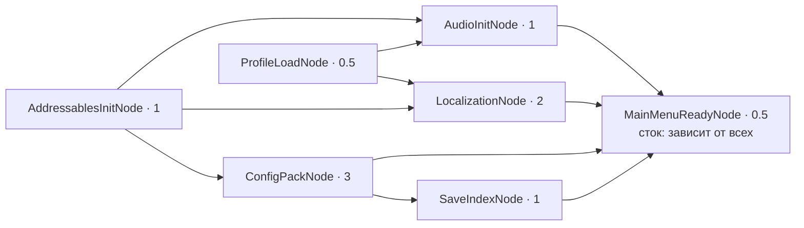
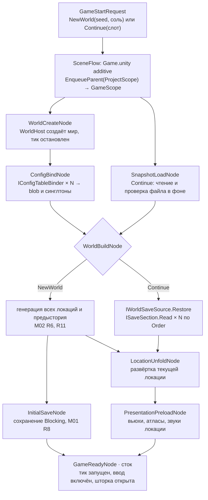
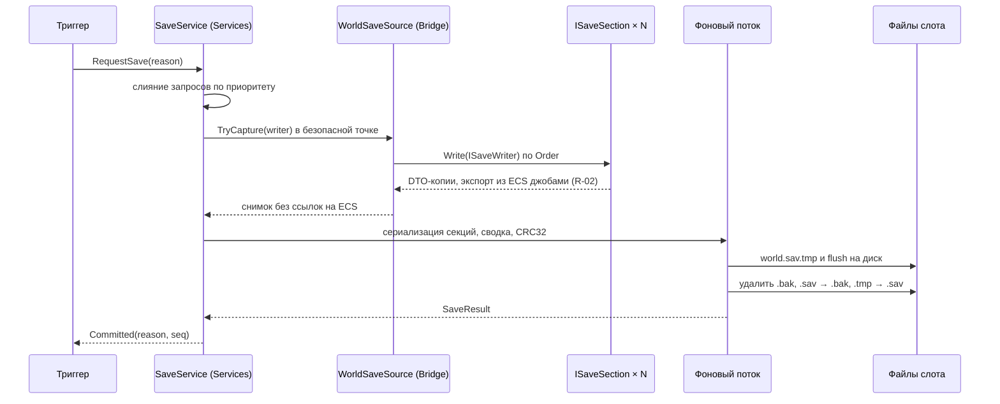
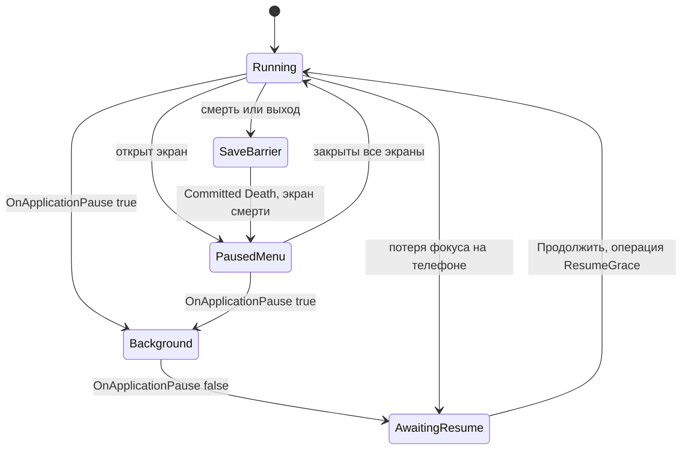

# Сервисы и композиция приложения

> Контур «Сервисы» и корень композиции (`RiseToPanteon.App`): скоупы VContainer, инсталлеры фич, граф загрузки,
> сцены, сохранения, ввод, аудио, жизненный цикл, локализация, логирование, dev-инструменты. Канонические имена — из
> `README.md`, новые публичные типы — в разделе 13. Решения: A-12, A-13, A-22, A-51–A-55, R-02. GDD: M01, M02, D01,
> U01, U04, U08, U09, E08, M04, dev-инструменты L01, L03, B02, W02, W10. API VContainer сверены с исходниками пакета
> 1.19.0 (`Library/PackageCache/jp.hadashikick.vcontainer@*`). **«Проверить на спайке»** — не подтверждено на
> Unity 6000.6.3f1 / IL2CPP.

## 1. Назначение и границы

Контур даёт игре инфраструктуру и собирает приложение. Правил игры в нём нет (ARCH-04), к ECS он не обращается
(ARCH-02): с миром работает только мост через `WorldHost`.

| Отвечает | Не отвечает (где это) |
|---|---|
| Скоупы, каталог инсталлеров, граф загрузки, переходы между сценами (App) | Системы, тик, экспорт, устройство `WorldHost` (`Simulation.md`) |
| Сохранения: триггеры, запись, формат, слоты, профиль устройства | Что хранит фича: её `ISaveSection` в мосту (срез фичи) |
| Ввод → `PlayerInputFrame` | Сенсорные контролы как виджеты (`UI.md`) |
| Аудио: микшер, пул, громкость, пауза звука | Какой звук на какое `SimEvent` (`Presentation.md`) |
| Пауза и жизненный цикл приложения | Стек экранов `IScreenService` (`UI.md`) |
| Контракт локализации, выбор языка | Таблицы строк, импорт, шрифты (`Content.md`, `UI.md`) |
| Логирование, политика ошибок, dev-инструменты | Устройство `IConfigPackProvider` и `IAssetProvider` (`Content.md`) |

`RiseToPanteon.Services` — интерфейсы и реализации сервисов. На Simulation, Bridge, Presentation, UI, App и
Unity.Entities эта сборка не ссылается (README 4.1). `RiseToPanteon.App` содержит скоупы, `FeatureInstallerCatalog`,
`BootGraph`, узлы загрузки и `SceneFlow`. App ссылается на все сборки, **кроме** `Simulation` и Unity.Entities
(README 4.1), и работает с миром только через API `WorldHost`. Интерфейсы Services, реализованные в других
сборках: `ILocalizationService` — UI (только она ссылается на Unity Localization), `IWorldSaveSource` и мировые
`ISaveSection` — Bridge, `ISceneFlow` — App. Порты `IPointerProjector`, `IWorldAnchorService`,
`IAppearancePreviewService` лежат в Contracts и реализуются представлением.

Сервис из `ProjectScope` про `GameScope` не знает. Игровая сессия сама подключается к нему через `Attach*`, получает
`IDisposable` и освобождает его при уничтожении (SVC-08).

## 2. Скоупы VContainer и инсталлеры фич

### 2.1. Скоупы

| Скоуп | Живёт | Регистрирует | Точка входа |
|---|---|---|---|
| `ProjectScope` (`Boot.unity`) | Пока работает приложение; сцена не выгружается | `ILog`, `IAppLifecycle`, `ISaveService`, `ISettingsService`, `IInputService`, `IAudioService`, `IAssetProvider`, `IConfigPackProvider`, `ILocalizationService`, `ISceneFlow`, `ILoadingProgress`, узлы `IBootNode`; от UI — `IScreenService` и главное меню | `BootEntryPoint` |
| `GameScope` (`Game.unity`, родитель — `ProjectScope`) | От входа в игру до выхода в меню | `GameStartRequest`, `WorldHost`, `WorldViewPublisher`, `IOperationSink`, мостовые системы, `IConfigTableBinder` × N, мировые `ISaveSection` × N, `IWorldSaveSource`, `WorldPresenter`, камера, экраны игры, узлы `IGameStartNode` | `GameEntryPoint` |
| `DevScope` (`Dev.unity`, родитель — `GameScope`, только `RTP_DEV`) | Пока загружена `Dev.unity` | Оверлеи, панели, источники dev-операций | `DevEntryPoint` |

Корень — `ProjectScope`, собирается в `Awake` (`autoRun = true`). `VContainerSettings.RootLifetimeScope` не
используется. `Configure` любого скоупа делает две вещи: регистрирует сериализованные ссылки сцены (микшер, корневой
`PanelSettings` — исключение ARCH-13) и вызывает `FeatureInstallerCatalog.Install(InstallScope.X, builder)`. Из
референса WO берём `EnqueueParent` и провайдер ассетов с подсчётом ссылок. Не берём partial-фабрики регистрации,
требующие правки центральных файлов, и множество точек входа.

### 2.2. `IFeatureInstaller` и атрибут скоупа

```csharp
// RiseToPanteon.Core
public interface IFeatureInstaller { void Install(IContainerBuilder builder); }
public enum InstallScope { Project, Game, Dev }
[AttributeUsage(AttributeTargets.Class, Inherited = false)]
public sealed class FeatureInstallerAttribute : Attribute
{
    public FeatureInstallerAttribute(InstallScope scope) => Scope = scope;
    public InstallScope Scope { get; }
    public int Order { get; set; }   // меньше — раньше; по умолчанию 0
}
// Пример: Features/Absorption/Bridge/AbsorptionBridgeInstaller.cs
// Имя — <Фича><Контур>Installer (CodeStructure.md §5); скоуп задаёт атрибут, а не имя.
[Preserve, FeatureInstaller(InstallScope.Game)]
public sealed class AbsorptionBridgeInstaller : IFeatureInstaller
{
    public void Install(IContainerBuilder b) => b.RegisterBridgeSystem<AbsorptionIntakeSystem>();
}
```

**Поиск** (`FeatureInstallerCatalog`, App) выполняется один раз, при первом `Configure` у `ProjectScope`.
Перебираются неабстрактные классы с `IFeatureInstaller` из сборок `AppDomain.CurrentDomain.GetAssemblies()` с именем
`RiseToPanteon.*`, кроме `.Editor` и `.Tests.*`. Без `[FeatureInstaller]`, без публичного конструктора без
параметров или с `InstallScope.Dev` вне `RiseToPanteon.Dev` — ошибка старта. Порядок — по `(Order, Type.FullName)`
с ординальным сравнением, то есть детерминирован. Диапазоны `Order`: `-1000` — инфраструктура Services, `-500` —
инфраструктура моста, `0` — фичи, `+1000` — Dev. Исключение инсталлера оборачивается в `CompositionException` с его
именем и пробрасывается (fail fast).

**IL2CPP.** На инсталлеры никто не ссылается, поэтому каждый помечен `[Preserve]` (`UnityEngine.Scripting`).
Каждая runtime-сборка `RiseToPanteon.*` объявляет `[assembly: AlwaysLinkAssembly]`, иначе линкер пропустит сборку без
входящих ссылок, например `RiseToPanteon.Dev`. EditMode-тест `InstallerCatalogTests` проверяет атрибуты. Стоимость
отражения на слабом телефоне — **проверить на спайке**: если выйдет больше 20 мс, список генерируется при сборке.

Инсталлер только регистрирует. В нём нельзя резолвить, работать с файлами, запускать асинхронную работу и создавать
объекты Unity; исключение — `RegisterComponentOnNewGameObject`. Инсталлер не получает зависимостей через DI.

### 2.3. Проверка регистраций

Один контракт — одна регистрация на всю цепочку скоупов. Несколько регистраций допустимы только для контрактов с
`[CollectionContract]` (Core): `IBootNode`, `IGameStartNode`, `ISaveSection`, `IConfigTableBinder`,
`BridgeSystemDescriptor`, `ILogSink`, `ISaveCommitObserver`.

Сам VContainer дубль не ловит: побеждает последняя регистрация (`Registry.AddToBuildBuffer`). Поэтому каталог после
инсталлеров скоупа обходит `builder[i]`, `i < builder.Count`. По значению `Count` до и после каждого инсталлера видно,
чья это регистрация. Контракты читаются из `RegistrationBuilder.ImplementationType` и `InterfaceTypes`. В 1.19.0 это
поля `protected internal`, поэтому нужно отражение. Родительские скоупы проверяются через
`IObjectResolver.TryGetRegistration`. Найден дубль — бросается `CompositionException` с именами обоих инсталлеров. В
релизе проверка выключена; её роль выполняют dev-сборки и EditMode-тест `CompositionTests`. Чтение полей VContainer
под IL2CPP — **проверить на спайке**.

Дочерний скоуп подмешивает в коллекцию регистрации родителя (`CollectionInstanceProvider.CollectFromParentScopes`),
но только когда у родителя их больше одной. Поэтому у узлов старта игры отдельный контракт `IGameStartNode`, а
потребители `ISaveSection` сами фильтруют секции по `Target`.

### 2.4. Мостовые системы: `RegisterBridgeSystem<T>()`

ECS-интеграция VContainer (`RegisterSystemIntoWorld`, `UseNewWorld`) не используется. При пустом имени мира
`SystemInstanceProvider.GetWorld` берёт `World.DefaultGameObjectInjectionWorld`, а это нарушает ARCH-05. Вместо неё в
Bridge есть расширение `builder.RegisterBridgeSystem<T>() where T : SystemBase`. Оно регистрирует `T` как
`Lifetime.Singleton`, так что экземпляр создаёт VContainer, и добавляет экземпляр `BridgeSystemDescriptor(typeof(T))`.
Система помечена `[DisableAutoCreation]` и `[UpdateInGroup(...)]`, конструктор у неё без параметров, зависимости
приходят через метод `[Inject] void Construct(...)`.

При создании мира `WorldHost` проходит по `IReadOnlyList<BridgeSystemDescriptor>`: резолвит систему, вызывает
`World.AddSystemManaged(system)` (метод есть в Entities 6.6, `World.cs`) и через `AddSystemToUpdateList` кладёт её в
группу из `[UpdateInGroup]`. После этого группы сортируются (README 4.4). Мостовая система живёт столько же, сколько
`GameScope` и мир.

## 3. Граф загрузки и старт игры

### 3.1. Узлы и граф

```csharp
// RiseToPanteon.Core — чтобы срезы фич добавляли свои узлы инсталлерами (README 4.3); BootGraph — App
[CollectionContract]
public interface IBootNode
{
    IReadOnlyList<Type> DependsOn { get; }   // типы узлов-предшественников; узел опознаётся по своему типу
    float Weight { get; }                    // доля в полосе загрузки, > 0
    UniTask RunAsync(IProgress<float> progress, CancellationToken ct);   // повторяемый после сбоя
}
[CollectionContract]
public interface IGameStartNode : IBootNode { }   // узлы старта игры, регистрируются в GameScope
```

Узлы инфраструктуры — тонкие адаптеры в App поверх интерфейсов сервисов, моста и представления. Интерфейсы узлов
лежат в Core, поэтому фича может добавить свой узел в своём контуре и зарегистрировать его своим инсталлером, а зависимости узел объявляет сам. Центральной фабрики графа (как `LoadGraphFactory` в WO) нет.
`BootGraph` — обычный класс; точка входа скоупа создаёт его над коллекцией узлов.

- **Проверка до запуска.** Типы узлов уникальны, каждая зависимость есть в наборе, `Weight > 0`. Циклы ищет обход в
  глубину; в ошибке указан путь `A → B → C → A`. Терминальный узел (`MainMenuReadyNode`, `GameReadyNode`) граф сам
  делает зависимым от всех остальных. EditMode-тест `BootGraphTests` проверяет граф на реальных регистрациях.
- **Выполнение.** Узлы с выполненными зависимостями стартуют параллельно на главном потоке через UniTask; тяжёлую
  работу узел сам уносит в пул потоков. Готовые узлы запускаются в порядке `Type.FullName`, поэтому логи
  детерминированы. Первый сбой отменяет общий токен; граф ждёт остановки остальных и бросает
  `BootFailedException(nodeType, inner)`.
- **Прогресс** `Σ(weight × progress) / Σ weight` уходит в `ILoadingProgress` (Services) для экрана загрузки UI;
  длительность каждого узла — в лог (`Info`, `Boot`).

### 3.2. Загрузка приложения (ProjectScope)



| Узел | Что делает | Зависит от | При сбое |
|---|---|---|---|
| `AddressablesInitNode` | `Addressables.InitializeAsync()` | — | фатально |
| `ProfileLoadNode` | Читает профиль устройства (5.7), применяет `ISettingsService` | — | резервная копия, иначе значения по умолчанию; `Warning` |
| `ConfigPackNode` | `IConfigPackProvider`: «скачанный → встроенный», проверка версии схемы и хеша (A-22, `Content.md`) | Addressables | фатально, если невалиден встроенный пак |
| `LocalizationNode` | `ILocalizationService.InitializeAsync`, язык из профиля (раздел 9) | Addressables, Profile | фатально |
| `AudioInitNode` | Микшер, громкости из профиля, прогрев пула, звуки меню | Addressables, Profile | фатально |
| `SaveIndexNode` | Заголовки слотов миров, совместимость, восстановление прерванной записи (5.5) | ConfigPack (число слотов, `ConfigVersion`) | слот помечается, загрузка продолжается |
| `MainMenuReadyNode` | Главное меню через `IScreenService`: «Продолжить» и «Новый мир» (M02 R12); шторка открыта | все | фатально |

Линейный порядок «Addressables → конфиги → локализация → профиль и индекс → меню» — лишь одна из допустимых
топологических сортировок. Зависимости в графе реальные: язык берётся из профиля, индексу нужен пак.

### 3.3. Старт игры (GameScope)

Главное меню вызывает `ISceneFlow.EnterGameAsync(GameStartRequest)`. Запрос — `NewWorld(seed, salt)` (seed случайный
или из меню разработчика, соль — время создания: M02 R2, R10, R12) или `Continue(slot)` (последний совместимый мир).



Узел, который не нужен текущему запросу (например, `SnapshotLoadNode` для нового мира), сразу завершается.
`WorldBuildNode` подключает источник снимка: `ISaveService.AttachWorld(slot, source)` (5.2). От «Новый мир» до
управления — ≤ 5 с (M02 §5, §13); для «Продолжить» ориентир даст замер. Если старт упал, пишется `Error`,
`SceneFlow` уничтожает мир, выгружает `GameScope` и возвращает в меню с сообщением. Если не читается и резервная
копия, игрок видит «мир повреждён» (M01 R10).

## 4. Сцены и переходы

Сцены и скоупы перечислены в README 4.2. `Boot.unity` имеет индекс 0 и не выгружается. `Game.unity` и `Dev.unity`
грузятся аддитивно; `Dev.unity` — только в dev-сборках. Локации — не сцены (A-51). Переход между ними выполняют
`WorldHost` (`LocationTransitionGroup`) и затемнение в представлении, сцена при этом не загружается.

```csharp
// SceneFlow.EnterGameAsync — родительство и передача запроса (API VContainer 1.19.0)
using (LifetimeScope.EnqueueParent(projectScope))
using (LifetimeScope.Enqueue(b => b.RegisterInstance(request)))
{
    await SceneManager.LoadSceneAsync(SceneNames.Game, LoadSceneMode.Additive).ToUniTask(cancellationToken: ct);
}
SceneManager.SetActiveScene(SceneManager.GetSceneByName(SceneNames.Game));
```

- **Один переход за раз.** `EnqueueParent` и `Enqueue` пишут в глобальные статические стеки `LifetimeScope`, и их
  подхватывает любой скоуп, проснувшийся внутри `using`. Поэтому переходы идут строго по одному, параллельный
  переход — исключение. `PushParent` устарел.
- **Родитель.** `projectScope` получают резолвом `LifetimeScope` в `ProjectScope`: VContainer регистрирует экземпляр
  скоупа сам (`InstallTo`). Тот же резолв в `GameScope` возвращает `GameScope` — так `DevSceneNode` грузит `Dev.unity`.
- **Активная сцена** во время игры — `Game`: созданное `Instantiate` попадает в неё и умирает вместе с ней.
- **Выход в меню** («Сохранить и выйти», M01 R4) — строго по порядку: `RequestSave(Exit)` с ожиданием →
  явный `WorldHost.Shutdown()` (на порядок `Dispose` не полагаемся) → выгрузка `Dev`, затем `Game` → проверка
  хэндлов `IAssetProvider` (в dev — отчёт об утечках) и `Resources.UnloadUnusedAssets()` → активна снова `Boot`.
- **Редактор.** Play всегда начинается с `Boot`: утилита `RiseToPanteon.Editor` выставляет
  `EditorSceneManager.playModeStartScene`.

## 5. Сохранения

У мира один слот. Отката и загрузки раннего состояния нет; резервная копия нужна только для восстановления
(M01 R1, R3, R10). На каждом триггере пишется полный снимок — атомарно, вне главного потока, с одной резервной
копией (A-53, M01 R15). Снимок собирается экспортом ECS → DTO (R-02). Не хранятся: состояние ИИ, флаг «в бою»,
снаряды, VFX, звук (M01 R17). Схемой владеет M01 (I33); каждая фича хранит свою часть в своей `ISaveSection`.

### 5.1. Триггеры

| Триггер | Источник | Приоритет | GDD |
|---|---|---|---|
| Событие шага мира: отдых, переход, кокон, смерть | `SimEvent` → мостовая `SaveTriggerRelay` | Normal | M01 R2, R15, §6; L01 |
| Таймер ~30 с, в бою тоже | `SaveScheduler`: время без паузы, сброс после записи | Normal | M01 R15, R18 |
| Снятие флага «в бою» | `SimEvent` → `SaveTriggerRelay` | Normal | M01 R18 |
| Сворачивание приложения | `IAppLifecycle` | Urgent | M01 R2, R15; U04 R3 |
| Смерть: рассеивание, Эхо, шаг | `SimEvent` → `SaveTriggerRelay` | Blocking | D01 R8; M01 R7; U04 R5 |
| «Сохранить и выйти» | `ISceneFlow.ExitToMenuAsync` | Blocking | M01 R4, R6; U04 R4 |
| Создание мира | `InitialSaveNode` | Blocking | M01 R8; M02 R6 |
| Выход из приложения | `Application.wantsToQuit` / `OnApplicationQuit` | Urgent | M01 R6 |
| [Срез] Закрытие торговли, Мастерской, разбора | UI после операции сделки | Normal | M01 R20 |

**Normal** — захват в ближайшей безопасной точке, новый снимок вытесняет ещё не начатую запись. **Blocking** — пауза
`SaveBarrier` до фиксации, вызывающий ждёт `SaveResult`. **Urgent** — захват сразу, главный поток ждёт конца записи с
таймаутом (раздел 8). Интервал таймера и число слотов — параметры GDD (M01 §5, M02 §5) в конфиге `save` (ARCH-12).

### 5.2. Конвейер



1. **Безопасная точка** — опрос источника в `PostLateUpdate`, после тиков кадра. Ответ `false` (повтор в следующем
   кадре) — если идёт переход между локациями (M01 §10) или не применены операции, поставленные до запроса.
2. **Захват** (главный поток): Burst-джобы экспорта пишут во временные `NativeArray`, оттуда данные копируются в
   управляемые массивы DTO; дальше DTO принадлежит только конвейеру.
3. **Фон** (`UniTask.RunOnThreadPool`): сериализация каждой секции, сводка, таблица секций, CRC32, атомарная запись
   (5.5). На слот — не больше одной записи одновременно.
4. **Фиксация** (главный поток): `SaveResult`, `Committed`, сброс `SaveScheduler`; `IsWriting` — значок
   автосохранения (M01 §7).

```csharp
// RiseToPanteon.Services — эскиз контракта
public interface ISaveService
{
    IReadOnlyList<WorldSlotInfo> Slots { get; }                                // заполняет SaveIndexNode / RefreshSlotsAsync
    UniTask<SaveResult> RequestSave(SaveReason reason);
    UniTask<WorldLoadResult> LoadWorldAsync(int slot, CancellationToken ct);   // проверка, резервная копия, ISaveReader
    IDisposable AttachWorld(int slot, IWorldSaveSource source);                // из GameScope
    bool IsWriting { get; }
    event Action<SaveCommit> Committed;
    // RefreshSlotsAsync(ct); DeleteWorldAsync(slot, ct) — Срез (M02 R15)
}
[CollectionContract]
public interface ISaveSection
{
    string Id { get; }          // стабильный, никогда не переименовывается
    ushort Version { get; }     // версия схемы DTO секции
    SaveTarget Target { get; }  // World | Profile
    int Order { get; }          // порядок чтения: зависимые секции — позже
    void Write(ISaveWriter writer);
    void Read(ISaveReader reader);
}
public interface ISaveWriter { void WriteSection<TDto>(string id, ushort version, TDto dto) where TDto : class; }
public interface ISaveReader { bool TryReadSection<TDto>(string id, out TDto dto, out ushort version) where TDto : class; }
public interface IWorldSaveSource { bool TryCapture(ISaveWriter writer); void Restore(ISaveReader reader); }  // Bridge
```

### 5.3. Формат файла

Раскладка: `[Header 64 B][Summary][SectionTable][Section 0]…[Section N]`, little-endian, строки в UTF-8.

| Поле заголовка | Тип | Назначение |
|---|---|---|
| `Magic` | `u32` = `RTPS` | Опознание файла |
| `FormatVersion` | `u16` | Версия контейнера: заголовок, сводка, таблица секций |
| `Kind` / `Flags` | `u8` / `u8` | `World` или `Profile` / резерв (сжатие), в прототипе 0 |
| `BuildVersion` | `u32` | Номер сборки; в прототипе несовпадение = несовместимо (M01 R9) |
| `ConfigVersion` | `u32` | Версия пака конфигов (`IConfigPackProvider`, `Content.md`): диагностика и миграции |
| `WorldId` | `Guid` | Мир; у профиля — нули |
| `SaveSeq` | `u64` | Монотонный счётчик записей слота; по нему выбирается один из `.sav`, `.tmp` и `.bak` |
| `TimestampUtc` | `i64` | Для «Продолжить» и списка миров; на игру не влияет (M01 R11) |
| `SummaryLength`, `PayloadLength` | `u32` | Длины блоков |
| `Checksum` | `u32` | CRC32 от сводки и payload, только против повреждения (M01 §10) |

**Сводка** содержит всё, что нужно меню, без чтения мира: seed, соль, режим, строку версии сборки и версию
генератора. Со Среза добавляются имя мира, время игры, стадия, ярус и этаж (M02 §6, §7). **Таблица секций** хранит
`{ Id, Version, Offset, Length }`, **секция** — сериализованный корневой DTO.

**Сериализация** — MemoryPack (`[MemoryPackable] partial` DTO в срезе фичи); **проверить на спайке** генератор на
Unity 6.6 с IL2CPP (iOS, Android ARM64) и режим `VersionTolerant`. Запасной вариант — свой `BinaryWriter` через
`ISaveDtoFormatter<T>`; секции от выбора не зависят (за `ISaveWriter` — внутренний `ISaveSerializer`). Сжатия нет (M01 §5).

### 5.4. Слоты и файлы

Файлы лежат в `{Application.persistentDataPath}/saves/`. Профиль — `profile.sav`, `.bak`, `.tmp`. Каждый мир — в
папке `world_N/`: `world.sav`, `.bak`, `.tmp` и, только при `RTP_DEV`, `world.json`. Миров три (M02 §5), у каждого
один слот (M01 R1); «Наследие» пишет в тот же слот (M01 R12).

Состояние слота — `WorldSlotInfo = { Slot, State (Empty | Ok | Incompatible | Corrupted), WorldId, Summary,
BuildVersion, TimestampUtc }`; индексного файла нет, `SaveIndexNode` читает заголовки и сводки. «Продолжить» берёт
слот `Ok` с наибольшим `TimestampUtc` (M02 R12). «Новый мир» занимает слот `Empty` или `Incompatible`, иначе после
подтверждения в UI заменяет самый давний (M02 R13); удаление — Срез (M02 R15). API для загрузки `.bak` и копирования
мира нет: копия = откат (M01 R3).

### 5.5. Атомарность и восстановление

**Запись** (фоновый поток): полный файл в `.tmp` → `Flush(flushToDisk: true)` → удалить `.bak` →
`File.Move(.sav → .bak)` → `File.Move(.tmp → .sav)`. В .NET Standard 2.1 нет `File.Move` с перезаписью. На
`File.Replace` не полагаемся: как он ведёт себя на iOS и Android — **проверить на спайке**.

**Чтение** (`SaveIndexNode`, `LoadWorldAsync`). Кандидаты `.sav`, `.tmp` и `.bak` проверяются по magic, длинам и
CRC32; берётся валидный с наибольшим `SaveSeq`. `.tmp` годится только полностью валидный — это сбой между записью
`.tmp` и заменой. Если выбран не `.sav`, пишется `Warning`, и набор файлов приводится к норме. Если валидных нет, слот
получает статус `Corrupted`: в dev-сборке файлы уходят в `saves/_corrupted/`, в релизе остаются на месте.

**Ошибка ввода-вывода** (нет места, нет доступа) → `SaveResult.Failed` и `Error` со слотом, причиной и исключением.
Прежний валидный файл не трогается, пока новый не записан. Следующий триггер пробует снова, UI показывает
индикатор (`UI.md`).

### 5.6. Смерть: одна атомарная запись

1. В тике симуляция одной операцией применяет рассеивание, Эхо и шаг мира (D01 R8) и экспортирует `SimEvent` смерти.
2. `SaveTriggerRelay` → `RequestSave(SaveReason.Death)`, Blocking. `SaveBarrier` останавливает тик, `IScreenService`
   не открывает меню — смерть важнее (U04 §10). Захват — в конце того же кадра.
3. UI открывает экран смерти по `Committed(Death)`, а не по `SimEvent` (U04 R5, M01 R7). Барьер снимается после
   обработчиков, когда экран смерти уже взял паузу. Сбой записи — один немедленный повтор; не помог — экран смерти
   всё равно открывается, `Error`, состояние запишет следующий триггер.

### 5.7. Профиль устройства

Отдельный файл, общий для всех миров (M01 R13, U08 R2). В прототипе в нём громкость (общая, музыка, эффекты —
U08 R17, R18) и язык (U08 R14). Срез добавляет флаги подсказок и окон, автоприглушение, раскладку и переназначение
(U07 R10, U08 R10, R15). Гл1 — Летопись прошлых Искр (M01 R21, M05).

Профиль состоит из секций `ISaveSection` с `Target = Profile`, зарегистрированных в `ProjectScope`; одна из них —
`ISettingsService`. Пишет его тот же атомарный писатель: через 1 с после последнего изменения и при сворачивании.
Блокировки по сборке у профиля нет. Секция неизвестной версии сбрасывается к значениям по умолчанию с `Warning`.
Повреждённый профиль восстанавливается из резервной копии, иначе — значения по умолчанию.

### 5.8. JSON-выгрузка в dev-сборках

После успешной записи мира `SaveService` в фоне передаёт снимок наблюдателям `ISaveCommitObserver`. В dev-сборке
`RiseToPanteon.Dev` регистрирует `SaveJsonDumper`, который пишет `world.json` через Newtonsoft.Json
(`com.unity.nuget.newtonsoft-json` 3.2.1 уже в проекте транзитивно). Игра этот файл не читает: он для отладки,
агентов и просмотрщика снимка. В релизе наблюдателей нет, выгрузка ничего не стоит (A-53, ARCH-18).

### 5.9. Версии и миграции

| Этап | Правило |
|---|---|
| Прототип | `BuildVersion` не совпадает → `Incompatible`: новая сборка = новый мир (M01 R9), миграций нет. `ConfigVersion` не совпадает → `Warning`. Секция не нашла id конфига → `Incompatible` |
| Срез | Блокировки по сборке нет. Версии — `FormatVersion` контейнера и версия каждой секции. `ISaveMigration` на секцию, цепочкой `from → to`; golden-файлы каждой версии в тестах. Секции нет → значения по умолчанию; незнакомая секция → `Warning` и пропуск |
| Гл1 | Миграции обязательны: глава 2 продолжает то же сохранение (M01 R9, M03) |

Сохранение новее сборки — `Incompatible`, файл не перезаписывается.

### 5.10. Бюджеты и проверки

Ориентиры для замера в прототипе: захват на главном потоке ≤ 3 мс на слабом телефоне (M01 §5), фон ≤ 300 мс.
Устойчивость (M01 §9, §13): 100 убийств процесса в случайный момент — мир цел, потеря ≤ интервала таймера
(dev-инжектор сбоев, автотест на устройстве). EditMode: запись и чтение секции; битый CRC → `.bak`; `.tmp` → восстановление.

## 6. Ввод

**Действия.** Используется общепроектный набор действий Input System — `InputSystem.actions`, ассет
`Assets/Settings/InputSystem_Actions.inputactions`, назначен в Project Settings → Input System. Карта `Player` там пока
от старого прототипа (`Move`, `Attack`, `Restart`, `ToggleMinimap`, `ToggleGizmos`, `Teleport`); её заменяет состав
`Move`, `Point`, `Attack`, `Dash`, `Ability1`–`Ability4`, `Context`, `QuickSlot`, `SlowWalk`, `Menu`, `Map`,
`Equipment`, `Character` (U01 R3, R12, R16; U04 §7). Карта `UI` — стандартная, `Dev` включает только dev-инсталлер.
Действия ищутся один раз: `FindAction("Player/Move", throwIfNotFound: true)`; нет действия — ошибка старта.

**Тач.** Виджеты UI — плавающий стик, до 8 кнопок, мультитач (U01 R2, R3, R15) — каждый кадр пишут в
`ITouchControlsSink`: `SetStick(Vector2)`, `SetButton(PlayerButton, bool held)` и `SetPointerOverUI(bool)` —
последний, чтобы клик мышью по UI не превратился в атаку.

**Слияние** идёт раз в кадр, в фазе `PreUpdate`. К этому моменту Input System уже обработал события в `EarlyUpdate`
(режим «Process Events In Dynamic Update»), а тики ECS в `Update` ещё не начались. Точку в PlayerLoop даёт UniTask
(`PlayerLoopTiming.PreUpdate`). Порядок относительно Entities — **проверить на спайке**.

| Часть `PlayerInputFrame` | Правило |
|---|---|
| Движение | Стик тача, если активен, иначе клавиатура или геймпад; длина ≤ 1. `SlowWalk` — отдельный бит, порог медленного шага решает симуляция (U01 R12) |
| Прицел | Мышь → `IPointerProjector.TryScreenToWorld` (реализация — камера в Presentation) → точка в мире. Тач: автонаведение в симуляции и жесты кнопок способностей (U02) |
| Нажатия | Удержание — ИЛИ по всем источникам. Фронт нажатия ждёт первого тика, который заберёт его через `ConsumeFrame()`: в кадре без тиков он не теряется, в кадре с двумя тиками не срабатывает дважды |

- **Мост.** `PlayerInputIntakeSystem` (`CommandIntakeGroup`) на каждом тике: `ConsumeFrame()` → синглтон `PlayerInput`.
- **Пауза.** Карта `Player` выключена, `UI` включена, кадр нулевой. Накопленные фронты сбрасываются при
  возобновлении, поэтому нажатие «Продолжить» не становится атакой.
- **Схема.** `ActiveScheme` (`KeyboardMouse`, `Touch`, `Gamepad`) определяется по последнему использованному
  устройству. От неё зависят показ сенсорных контролов и глифы (`UI.md`).
- **По этапам.** В прототипе — клавиатура с мышью и тач (U01). В Срезе добавляются привязки геймпада (U01 R13) и
  переназначение клавиш (U08 R15); оверрайды хранятся в профиле через `SaveBindingOverridesAsJson`.

## 7. Аудио

Звук встроенный (A-55). Микшер `MainMixer` — сериализованная ссылка `ProjectScope`. Группы: `Master → Music` (слои
«исследование» и «в бою» с плавным переходом, U09 R17) и `Master → Effects` (ползунок «эффекты», U08 R18) с
дочерними `SFX` (события мира; подгруппа `Signals` — сигналы читаемости, U09 R3, R19), `Ambience` и `UI`.

- **Громкость.** Выведенные параметры `MasterVolume`, `MusicVolume`, `EffectsVolume` — в дБ из линейной громкости
  (`20·log10`, минимум −80), значения берутся из `ISettingsService`.
- **Приглушение под сигнал** (U09 R12) — посыл из `Signals` в Duck Volume на `Music` и `Ambience`. Снимки микшера:
  `Default` и `Paused`.
- **Пул** `AudioSourcePool`: SFX — 24 голоса (ориентир, замер на 40 существах, ARCH-19); по 2 на музыку (переход
  слоёв) и фон; UI — 4. Когда голоса кончаются, вытесняется самый старый с наименьшим приоритетом. Один клип звучит
  не больше 3 раз одновременно в окне 50 мс.
- **Клипы** — через `IAssetProvider` по адресу, он же строковый id (A-56). Звуки локации предзагружает
  `PresentationPreloadNode`; хэндлы освобождаются вместе с `GameScope`.
- **API** `IAudioService`: `PlayOneShot(address, AudioChannel, position?, priority)`, `PlayMusic(address, fade)`,
  `SetMusicLayerWeight(combat01)`, `PlayAmbience(address, fade)`, `SetVolume(VolumeChannel, value)`.
- **Пауза игры** → `AudioListener.pause = true`: звуки локации стоят (U09 R13). У источников `Music` и `UI` выставлено
  `ignoreListenerPause = true` — они звучат дальше под снимком `Paused`. В фоне звук глушит ОС.
- **Граница.** Какой звук на какое событие, решает представление (README 3). Два слоя музыки встроенный звук
  тянет; FMOD — только если понадобится адаптивная музыка сложнее (A-55).

## 8. Жизненный цикл приложения и пауза

**API** `IAppLifecycle` (Services): `IsGamePaused`, `IsAwaitingResume`, событие `GamePauseChanged`;
`AcquirePause(PauseReason) → IDisposable` (игра стоит, пока жива хотя бы одна причина); `ConfirmResume()`; события
`EnteringBackground` и `ResumedAfterBackground`. `PauseReason { Menu, Background, AwaitingResume, SaveBarrier, Dev }`.

- **Колбэки Unity.** `AppLifecycleBehaviour` (`RegisterComponentOnNewGameObject(...).DontDestroyOnLoad()`)
  передаёт сервису `OnApplicationPause`, `OnApplicationFocus` и `OnApplicationQuit`. Кроме того, сервис слушает
  `Application.wantsToQuit` (задержка выхода до финальной записи) и `Application.lowMemory` (`IAssetProvider`
  сбрасывает кэши, пишется `Warning`).
- **Остановка тика.** `WorldHost` подписан на `GamePauseChanged` и на паузе не обновляет `SimulationTickGroup`;
  операции меню применяются «тиком без времени» (A-17, `Simulation.md` §5.3); представление замирает на
  последнем снимке (README 3). После паузы догоняющих тиков нет: хост сбрасывает
  накопитель фиксированного шага (`Simulation.md`). `Time.timeScale` не используется. `IScreenService` держит
  `PauseReason.Menu`, пока открыт хоть один экран (U04 R1).



- **Сворачивание** (`OnApplicationPause(true)`): `Background` → `EnteringBackground` → Urgent
  `RequestSave(Background)`. Посреди перехода между локациями захвата нет: остаётся прошлая запись, переход запишет
  свой шаг после возвращения (M01 §10). Главный поток ждёт записи до 2 с — кадр не рисуется, просадки нет; фоновое
  время iOS и Android — **проверить на устройстве**. Затем `Background` сменяется на `AwaitingResume`.
- **Возвращение** (`OnApplicationPause(false)`): игра стоит до явного «Продолжить» (U04 R3); если экран не открыт,
  UI показывает меню паузы. «Продолжить» → `ConfirmResume()` → `ResumedAfterBackground`.
- **Льгота после возврата** — правило симуляции. `ResumeGraceRelay` (`GameScope`) ставит в `IOperationSink`
  операцию `ResumeGrace`; тип и длительность задают `Simulation.md` и GDD. Критерий U04 §13: после сворачивания и
  возврата в первые секунды урона нет.
- **Потеря фокуса без сворачивания** (шторка уведомлений, пункт управления) → `AwaitingResume` без записи;
  в редакторе и на ПК отключается настройкой. Кокон, метаморфоза, поглощение и рывок на паузе замирают и
  продолжаются с того же тика (E08 §10, U04 §10).
- **Выход** (`wantsToQuit`, `OnApplicationQuit`) — Urgent-запись с таймаутом; убийство процесса — потеря ≤ таймера (M01 R15).

## 9. Локализация (сервис)

- **Где.** Интерфейс `ILocalizationService` — в Services. Реализация `UnityLocalizationService` — в UI, потому что
  на Unity Localization ссылается только UI (README 4.1). В `ProjectScope` её регистрирует инсталлер UI.
- **Строки** хранятся в `Configs/strings/` (JSON) и при сборке импортируются в String Tables (A-54, `Content.md`).
  В редакторе работает горячая перезагрузка.
- **Инициализация** (`LocalizationNode`). Сервис ждёт `LocalizationSettings.InitializationOperation` и выбирает язык:
  из профиля; если там пусто — язык системы, если он поддержан; иначе английский (M04 R11, U08 R14). В прототипе
  язык один — русский (M04 R1). Таблицы главного меню загружаются заранее.
- **API.** `CurrentLocale`, `AvailableLocales`, `SetLocaleAsync(code)` (сохраняет выбор в профиль),
  `Get(table, key)`, `Format(table, key, args)`, событие `LocaleChanged`. Шаблоны и множественное число — Smart
  Strings; склеивать строки в коде нельзя (M04 R6, R7).
- **Экраны** привязывают текст через `LocalizedString` в UI Toolkit (`UI.md`). Сервисы передают ключи, а не готовый
  текст (ARCH-17). Ввод игрока (seed, имя мира) не локализуется (M04 R10).
- **Пакет** `com.unity.localization` в `Packages/manifest.json` ещё не добавлен; имена API сверить при установке
  (**проверить на спайке**). Исключение из ARCH-17 — встроенный текст ru/en аварийного экрана загрузки (раздел 10):
  локализация к тому моменту может не подняться.

## 10. Логирование и ошибки

```csharp
// RiseToPanteon.Services
public enum LogLevel { Verbose, Debug, Info, Warning, Error }
public interface ILog                      // потокобезопасен: пишут и фоновые потоки сохранения
{
    ILog ForCategory(string category);     // "Boot", "Save", "Input", "Audio", "Lifecycle", "Scene", категории фич
    bool IsEnabled(LogLevel level);
    void Write(LogLevel level, string message, Exception exception = null);
}
// LogExtensions: Verbose() и Debug() — [Conditional("RTP_DEV")]; Info, Warning, Error(message, exception) — без него
```

Приёмники (`ILogSink`): `UnityConsoleSink` (Services) — единственное место с `UnityEngine.Debug.Log*`;
`RingBufferSink` (Services) — последние 1000 записей для «Подробнее» на экране ошибки и dev-оверлея; `FileLogSink`
(Dev) — `logs/{session}.log` в `persistentDataPath`, пишется в фоне.

**Релиз.** `Verbose` и `Debug` вырезаются при компиляции вместе с вычислением аргументов. `Info` пишется только в
кольцевой буфер, `Warning` и `Error` — в консоль и в буфер. Стек для `LogType.Log` выключен:
`Application.SetStackTraceLogType(LogType.Log, StackTraceLogType.None)`. Телеметрии нет (A-02).

**Сообщения движка** из `Application.logMessageReceivedThreaded` идут в буфер и файл, в консоль повторно не
попадают. Необработанные исключения уходят в `ILog.Error`: в точках входа — через
`RegisterEntryPointExceptionHandler` в каждом скоупе (у VContainer по умолчанию — `Debug.LogException`), в UniTask —
через `UniTaskScheduler.UnobservedTaskException`.

| Ситуация | Поведение |
|---|---|
| Исключение при построении `ProjectScope` (инсталлер, `Configure`) | `ProjectScope.Awake` ловит его вокруг `base.Awake()` и показывает `BootErrorScreen` без DI; «Повторить» перезагружает `Boot.unity` |
| Сбой узла загрузки | Граф отменяется, пишется `Error`. `BootErrorScreen`: «Повторить» — перезапуск упавшего узла и зависящих от него (узлы повторяемы), «Выйти»; в dev показывается стек |
| Сбой старта игры | `Error`, возврат в меню с сообщением; повреждённый мир — «мир повреждён» |
| Сбой записи сохранения | `SaveResult.Failed`, `Error`; прежний файл цел, повтор при следующем триггере, индикатор в UI |
| Ошибка сервиса во время игры | `Error` с контекстом (категория, операция, слот или id); исключение пробрасывается вызывающему. Молча продолжать в неизвестном состоянии нельзя |

Запрещены пустой `catch` и `catch`, который не логирует и не пробрасывает. `OperationCanceledException` ошибкой не
считается. `BootErrorScreen` — представление UI в `Boot.unity`, App вызывает его напрямую.

## 11. Dev-инструменты

- **Define.** `RiseToPanteon.Dev` компилируется только с `RTP_DEV` (`defineConstraints`). Скрипт сборки задаёт его
  лишь dev-сборкам (`BuildPlayerOptions.extraScriptingDefines`), в редакторе — активный dev Build Profile
  (**проверить на спайке**). `DEVELOPMENT_BUILD` устарел (UAC0009): при компиляции — `RTP_DEV`, в рантайме — `Debug.isDebugBuild`.
- **Dev-сцена.** `Dev.unity` попадает в сборку только в dev-профиле. Её грузит `DevSceneNode : IGameStartNode` (Dev,
  `GameScope`) через `EnqueueParent(GameScope)`; `SceneFlow` выгружает её раньше `Game`.
- **Изоляция.** Релизный код на типы Dev не ссылается. Dev подключается только своими инсталлерами и реализациями
  `ILogSink`, `ISaveCommitObserver`, `IGameStartNode`. Dev-инсталлер целится в Project (панель главного меню с вводом
  seed — M02 R12, §7), в Game (dev-типы операций, dev-экспорт) или в Dev (оверлеи).
- **Читы** — dev-типы `Operation` (ARCH-18); их Validate и Apply — `ISystem` из `RiseToPanteon.Dev` в
  `CommandIntakeGroup`, существующие только в dev-сборке. Оверлеи читают `IWorldView` и dev read-модели, которые
  dev-системы пишут в `ExportGroup` обычным механизмом (`Simulation.md`).
- **Пакетные инструменты** работают в редакторе или через `-batchmode -executeMethod`, точки входа — в
  `RiseToPanteon.Editor`. Мир создаётся через `WorldHost` без сцен и представления (headless, `Simulation.md`),
  сервисы — в `ContainerBuilder` без `LifetimeScope`. Результат — код выхода и файл отчёта.

| Инструмент | GDD | Где | Как |
|---|---|---|---|
| Меню разработчика: ввод seed; seed, соль и версия генератора | M02 R12, §7, §10 | Меню, игра | Dev-инсталлер Project; старт через `ISceneFlow` с seed |
| Панель времени мира; «прогнать N ед. времени» | L01 §7, §9 | Игра, редактор | Dev read-модель часов; операция `DevAdvanceWorldTime` |
| Симулятор шагов мира | L03 §9 | Редактор, batchmode | Headless-мир, N шагов от seed, CSV популяций |
| Наложение состояний ИИ; лог пищевой сети | B02 §9 | Игра | Dev read-модель по `StableId`; события → `ILog`, категория `FoodWeb` |
| Просмотр «seed → планировка» | W02 §9 | Редактор | Окно редактора: генератор headless → текстура |
| Пакетная проверка 1000 seed | W02 §9; M02 §13 | Batchmode, CI | Гарантии генератора, мини-боссы предыстории; ненулевой код выхода при провале |
| Детерминизм «seed → хеш планировки» | W10 §9; M02 §13 | EditMode, batchmode | Хеш планировки по seed и версии генератора |
| Просмотрщик снимка; откат в dev-сборке | W10 §9 | Редактор, игра | `.sav` тем же сериализатором и `world.json`; копии слота в `saves/_dev_snapshots/` с восстановлением |
| Числа урона; лог боя | C01 §9; U03 R13; Combat.md | Игра | Оверлей представления в Dev по `SimEvent` удара; `ILog`, категория `Combat` |
| Инжектор сбоев сохранения | M01 §9, §13 | Устройство | Завершение процесса в случайной точке записи |
| [Срез] Запуск любой катсцены | N04 §9 | Игра | Dev-операция |

## 12. Правила контура

| ID | Правило |
|---|---|
| SVC-01 | Скоупов три: `ProjectScope`, `GameScope`, `DevScope`. Новый скоуп сначала описывается в README. |
| SVC-02 | Регистрация — только в `IFeatureInstaller` с `[FeatureInstaller(scope, Order)]` и `[Preserve]`. Инсталлер только регистрирует: без резолва, файлов, асинхронщины и побочных эффектов. Центральные файлы не правятся; в `Configure` скоупа — только ссылки сцены и вызов каталога. |
| SVC-03 | Один контракт — одна регистрация на цепочку скоупов. Несколько — только для `[CollectionContract]`; дубль — ошибка старта. Потребитель коллекции фильтрует её сам и не полагается на подмешивание родителя. |
| SVC-04 | В каждом скоупе одна точка входа: `BootEntryPoint`, `GameEntryPoint`, `DevEntryPoint`. Стартовая работа фичи — узел `IBootNode` или `IGameStartNode` с явными `DependsOn`; `IStartable` и `IAsyncStartable` в фичах запрещены. |
| SVC-05 | У узла загрузки зависимости заданы типами, `Weight > 0`, запуск повторяем. Граф проверяется до старта: цикл или отсутствующая зависимость — ошибка старта. |
| SVC-06 | Мостовая `SystemBase` регистрируется только через `RegisterBridgeSystem<T>()`, с `[DisableAutoCreation]` и внедрением через метод. ECS-интеграция VContainer не используется. |
| SVC-07 | Сцены грузит и выгружает только `SceneFlow`. Родитель — через `LifetimeScope.EnqueueParent`; переходы идут строго по одному. |
| SVC-08 | Сервис `ProjectScope` получает объекты `GameScope` только через `Attach*`, который возвращает `IDisposable`; `GameScope` освобождает его при уничтожении. |
| SVC-09 | Состояние игры попадает на диск только через `ISaveService`, захват — только в безопасной точке. DTO — свежие копии без ссылок на ECS, `UnityEngine.Object` и живые коллекции. |
| SVC-10 | Запись атомарна (`.tmp` → замена, одна `.bak`), идёт вне главного потока, на слот — одна за раз. Прежний валидный файл удаляется только после успешной новой записи. |
| SVC-11 | У `ISaveSection` стабильный `Id` и `Version`. Схема DTO изменилась — `Version` растёт; со Среза — вместе с миграцией. |
| SVC-20 | Данные `ISaveSection` ссылаются на строки конфигов **строковым id**, никогда плотным индексом пака (`Content.md` CONT-11): индексы меняются при правке конфигов. |
| SVC-12 | Экран смерти открывается по `Committed(Death)`. Пока стоит `SaveBarrier`, меню не открываются. |
| SVC-13 | Пауза игры — только `IAppLifecycle.AcquirePause(reason)` с освобождением хэндла; `Time.timeScale` для паузы не используется. После фона игра стоит в `AwaitingResume` до явного «Продолжить». |
| SVC-14 | Игра получает ввод только как `PlayerInputFrame` из `IInputService`. С Input System напрямую работают только `InputService`, карта `UI` в контуре UI и Dev. |
| SVC-15 | Звук — только через `IAudioService`: `AudioSource` вне пула не создаются, клипы грузятся через `IAssetProvider`. |
| SVC-16 | Текст для игрока — только по ключу через `ILocalizationService` или `LocalizedString`. Единственное исключение — встроенный текст `BootErrorScreen`. |
| SVC-17 | Логирование — только через `ILog`; `Debug.Log*` вызывает только `UnityConsoleSink`. Пустых `catch` нет, исключения логируются с контекстом. |
| SVC-18 | Dev-код — только в `RiseToPanteon.Dev` под `RTP_DEV`, в рантайме — `Debug.isDebugBuild`. `DEVELOPMENT_BUILD` запрещён (UAC0009). Релизный код не ссылается на типы Dev. |
| SVC-19 | Сервисы и App не содержат правил игры и не используют Unity.Entities (ARCH-02, ARCH-04). |

## 13. Типы контура

Пометка «README» — канонические имена из README; остальные типы введены этим документом.

| Тип | Сборка | Скоуп / вид | Назначение |
|---|---|---|---|
| `IFeatureInstaller` (README); `FeatureInstallerAttribute`, `InstallScope`, `CollectionContractAttribute` | Core | интерфейс, атрибуты, enum | Инсталлер фичи, его скоуп и порядок; контракт с несколькими регистрациями |
| `ProjectScope`, `GameScope`, `DevScope` (README); `FeatureInstallerCatalog`, `CompositionException` | App | `LifetimeScope`; static, исключение | Скоупы; поиск, порядок, установка и проверка инсталлеров |
| `BootGraph` (README), `BootFailedException` | App | класс, исключение | Исполнитель графа загрузки, сбой узла |
| `IBootNode`, `IGameStartNode` (README) | Core | интерфейсы | Узлы загрузки приложения и старта игры; фичи добавляют свои инсталлерами |
| `BootEntryPoint`, `GameEntryPoint` / `DevEntryPoint` | App / Dev | `IAsyncStartable` | Единственные точки входа скоупов |
| `AddressablesInitNode`, `ProfileLoadNode`, `ConfigPackNode`, `LocalizationNode`, `AudioInitNode`, `SaveIndexNode`, `MainMenuReadyNode` | App | `IBootNode`, Project | Узлы загрузки (3.2) |
| `WorldCreateNode`, `SnapshotLoadNode`, `ConfigBindNode`, `WorldBuildNode`, `InitialSaveNode`, `LocationUnfoldNode`, `PresentationPreloadNode`, `GameReadyNode`; `DevSceneNode` | App; Dev | `IGameStartNode`, Game | Узлы старта игры (3.3); загрузка `Dev.unity` |
| `ISceneFlow` / `SceneFlow`; `GameStartRequest`, `ILoadingProgress` | Services / App; Services | Project | Переходы между сценами; `NewWorld(seed, salt)` или `Continue(slot)`; прогресс для UI |
| `BridgeContainerExtensions`, `BridgeSystemDescriptor` | Bridge | static, `[CollectionContract]` | `RegisterBridgeSystem<T>()` и список систем для `WorldHost` |
| `ISaveService`, `ISaveSection` (README); `ISaveWriter`, `ISaveReader`, `IWorldSaveSource` | Services | Project; интерфейсы | Сохранения, секция фичи, запись и чтение секций, источник снимка мира |
| `SaveReason`, `SaveTarget`, `SaveResult`, `SaveCommit`, `WorldSlotInfo`, `WorldLoadResult`, `SaveHeader` | Services | значения | Причины, результат, слоты, заголовок файла |
| `ISaveCommitObserver`; `ISaveMigration`; `ISaveDtoFormatter<T>` | Services | `[CollectionContract]`; Срез; запасной путь | Наблюдатель после записи (dev JSON); миграция секции; формат DTO без MemoryPack |
| `WorldSaveSource`, `SaveTriggerRelay`, `PlayerInputIntakeSystem`, `ResumeGraceRelay` | Bridge | Game | Источник снимка; триггеры из `SimEvent`; ввод в ECS; операция льготы |
| `SaveJsonDumper`, `FileLogSink` | Dev | Project | JSON-выгрузка сохранения; лог в файл |
| `ISettingsService`, `GameSettings` | Services | Project | Настройки из профиля устройства |
| `IInputService`, `ITouchControlsSink` (README), `InputScheme` | Services | Project | Ввод; приём тача и флага «указатель над UI» от UI; активная схема |
| `IPointerProjector` (README) | Contracts | Game | Экран → мир для прицела мышью; реализует Presentation |
| `PlayerButton` | Contracts | enum | Кнопки из состава `PlayerInputFrame`; **нужно канонизировать в README и `Simulation.md`** |
| `IAudioService` (README), `AudioChannel`, `VolumeChannel`, `AudioSourcePool` | Services | Project | Звук, каналы микшера, громкость, пул |
| `IAppLifecycle` (README), `PauseReason`, `AppLifecycleBehaviour` | Services | Project | Пауза, фон, возобновление; пересылка колбэков Unity |
| `ILocalizationService` / `UnityLocalizationService` | Services / UI | Project | Язык и строки |
| `ILog`, `LogLevel`, `LogExtensions`, `ILogSink`, `UnityConsoleSink`, `RingBufferSink` | Services | Project | Логирование |
| `BootErrorScreen` | UI | `Boot.unity` | Аварийный экран загрузки без DI |

Внутренние типы без публичного контракта: `ISaveSerializer`, `SaveScheduler`.
