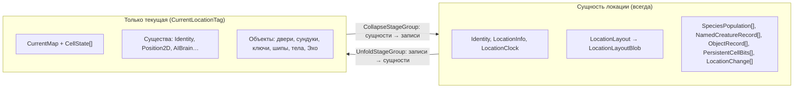
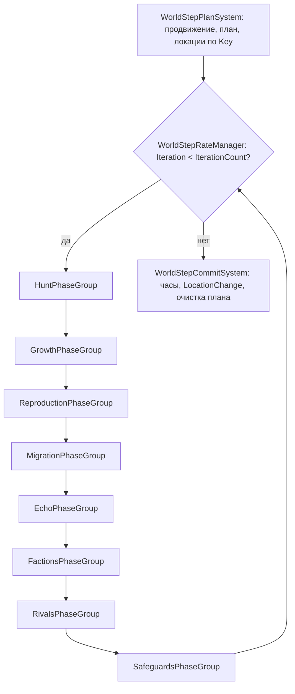
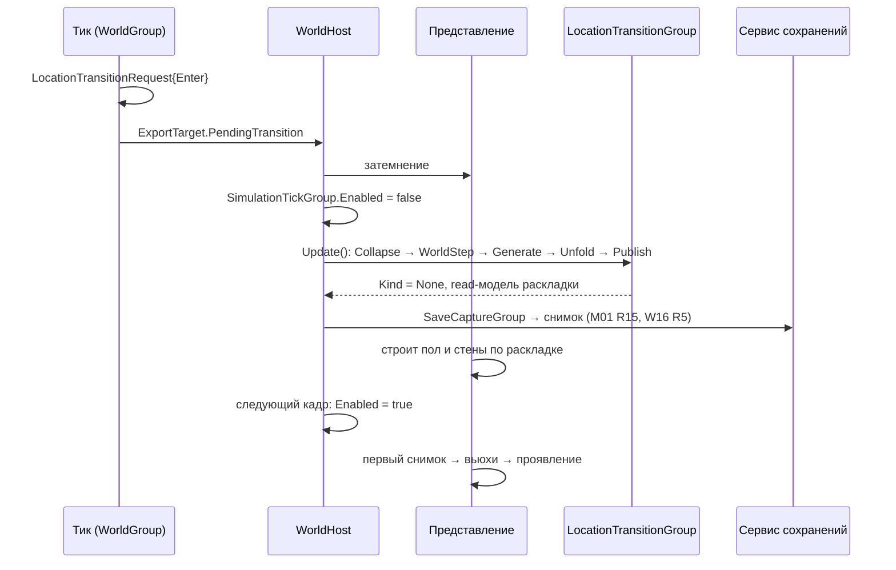

# Симуляция — контур ECS

> ECS-мир, тик, данные мира, команды, события, экспорт, шаг мира, генерация и переходы; правила систем.
> Имена README (§4.3, §4.4, §5) используются без изменений, новые — §14. Поведение задаёт GDD: «GDD L03 R3» =
> фича L03, правило R3.
> API сверено с исходниками `Library/PackageCache/com.unity.entities@de96d69a35c5/` (Entities 6.6) и
> `com.unity.collections@10fff0607388/`. Непроверенное помечено «проверить на спайке».

## 1. Назначение и границы контура

Симуляция — единственное место, где живут правила игры (ARCH-04): существа и ИИ (B01–B03), бой (C01–C07),
поглощение и эволюция (E01–E08), смерть и Эхо (D01–D02), время и шаг мира (L01, L03), следы (L05), генерация
(W02), постоянство и переходы (W10, W16). Код — сборка `RiseToPanteon.Simulation` и срезы
`Features/<Фича>/Simulation/`, влитые в неё через `.asmref` (`CodeStructure.md`).

| Живёт в контуре | Не бывает в контуре никогда |
|---|---|
| Unmanaged `IComponentData`, буферы, blob-структуры конфигов и планировок | GameObject, `UnityEngine.Object`, MonoBehaviour, ассеты, Addressables, `UnityObjectRef<T>` |
| `ISystem` + Burst-джобы; группы систем и их `IRateManager` | `UnityEngine.Time/Input/Random`, `SystemAPI.Time`, `System.Random`, `DateTime`, потоки и `Thread` |
| Генератор планировки, шаг мира, свёртка и развёртка локаций | Файлы, сеть, сервисы, VContainer, `IOperationSink`, `IWorldView`, `ISaveSection` |
| Системы захвата и восстановления данных сохранения (`*SaveData`) | Сериализация в байты, формат файла, решение «когда сохранять» (мост и сервисы) |
| Экспорт снимка, событий и read-моделей в память, которую выдал мост | Managed-компоненты, managed shared, Aspects, SubScenes и baking, Transforms (`LocalTransform`), Unity Physics |
| Технические константы (`SimConstants`) | Числа баланса (ARCH-12), строки для игрока (ARCH-17), `World.DefaultGameObjectInjectionWorld` (ARCH-05) |

Почему без SubScenes и baking: ECS-мир наполняется в рантайме из пака конфигов, генерации по seed и сохранений;
авторские комнаты — данные (`Content.md` §7), а не сцены.

Шов с мостом — только компоненты-синглтоны Simulation. Внутрь: `PlayerInput`, `OpQueue` + `OpRequest` (§5),
`…Config` (§10.1), `…SaveData` (§10.2), `LocationTransitionRequest`, который исполняет хост (§8.2). Наружу:
`ExportTarget` и `…ReadModelTarget` с памятью моста (§6.3), `…SaveData` после захвата. Симуляция не ссылается
на `Bridge`, `Services`, `Presentation`, `UI` (README §4.1).

## 2. Хост мира (WorldHost)

`WorldHost` (Bridge) владеет миром (ARCH-05). Логику состава мира он не дублирует: её держит
`SimulationWorldBuilder` (Simulation), которым пользуются и хост, и тесты.

### 2.1. Создание

1. `new World("Simulation", WorldFlags.Game)`.
2. `SimulationWorldBuilder.Populate(world)`:
   1. `world.CreateSystemManaged<LocationTransitionGroup>()` и `…<SaveCaptureGroup>()`. Обе ручные группы помечены
      `[DisableAutoCreation]` — единственное исключение из правила «атрибут только у мостовых систем»: иначе группа
      попала бы в `SimulationSystemGroup` и обновлялась каждый кадр. Создать их нужно до шага 3: `FindGroup`
      находит только существующую группу, иначе warning и дочерняя система не обновляется (`DefaultWorldInitialization.cs`);
   2. `DefaultWorldInitialization.GetAllSystems(WorldSystemFilterFlags.Default)` → фильтр белого списка (§2.2);
   3. `DefaultWorldInitialization.AddSystemsToRootLevelSystemGroups(world, types)` — корневые группы, все системы,
      раскладка по `[UpdateInGroup]`, рекурсивная сортировка корневых групп;
   4. `SortSystems()` у ручных групп — ошибки порядка всплывают при старте, а не при первом переходе;
   5. `FixedStepSimulationSystemGroup.Timestep = SimConstants.DT` (1/30 с), `world.MaximumDeltaTime` (§3.3);
   6. проверка обязательного состава (§2.2) с исключением: ошибки `OnCreate` при создании списком только логируются.
3. Мостовые `SystemBase` (`[DisableAutoCreation]`, созданы VContainer): `world.AddSystemManaged(system)` →
   `group.AddSystemToUpdateList(system)` для группы из их `[UpdateInGroup]` → `group.SortSystems()`.
4. `ScriptBehaviourUpdateOrder.AppendWorldToCurrentPlayerLoop(world)`.

### 2.2. Состав мира

`GetAllSystems(Default)` возвращает системы **всех** загруженных сборок: кроме нужных — `Unity.Scenes`
(SceneSystemGroup и др.), `Unity.Transforms`, companion-системы `Unity.Entities.Hybrid` и системы прототипа
`RuntimeRoguelike.Dots.*` (есть в `Assets/_Project/Dots`). Поэтому белый список обязателен:

| Источник | Что берём |
|---|---|
| `Unity.Entities` | Все системы по умолчанию: корневые группы, `FixedStepSimulationSystemGroup`, ECB-системы пакета, `WorldUpdateAllocatorResetSystem` |
| `Unity.Entities.Hybrid` | Только `UpdateWorldTimeSystem` |
| `RiseToPanteon.Simulation` | Все |
| `RiseToPanteon.Dev` | Все, только при `RTP_DEV` (обработчики dev-операций, §5.4) |

Обязательный состав (проверка при старте):

| Система или группа | Откуда | Зачем |
|---|---|---|
| `UpdateWorldTimeSystem` | Белый список | Без неё `World.Time` не движется и `FixedStepSimulationSystemGroup` не тикает |
| `WorldUpdateAllocatorResetSystem` | Белый список | Перематывает `WorldUpdateAllocator`; без неё кадровая память растёт. Флаги фильтра — `LocalSimulation`, попадание в список `Default` проверить на спайке (иначе добавить явно) |
| `FixedStepSimulationSystemGroup` | Белый список | Родитель `SimulationTickGroup` |
| `SimulationTickGroup` и подгруппы, `EndSimulationTickEcbSystem` | Simulation | Тик (§3) |
| `LocationTransitionGroup`, `SaveCaptureGroup` | Создаются явно (2.1) | Работа вне тика |

`UpdateWorldTimeSystem` и ECB-системы пакета приходят из `GetAllSystems` — явно их не добавляют (README §4.4).
ECB-системы пакета создаются, но симуляция их не использует (SIM-06).

### 2.3. Пауза, ручные группы, возобновление

| Действие | Как |
|---|---|
| Пауза (меню, сворачивание — GDD U04, M01; README §3) | Источник — ARCH-21; мост по сигналу ставит `SimulationTickGroup.Enabled = false`. `FixedStepSimulationSystemGroup` продолжает «догонять» время пустыми итерациями, поэтому накопленного долга нет |
| Операции на паузе | «Тик без времени» (§5.3) |
| Переход, шаг мира, новый мир, загрузка | Тик на паузе → хост ставит `LocationTransitionRequest` (или его поставил тик) → `LocationTransitionGroup.Update()`, пока `Kind != None` → `EntityManager.CompleteAllTrackedJobs()` (§8.2) |
| Снимок сохранения | Тик на паузе или между кадрами → `SaveCaptureGroup.Update()` → `CompleteAllTrackedJobs()` → секции читают `*SaveData` (§10.2) |
| Возобновление | `Enabled = true` **в кадре после** тяжёлой работы: длинный кадр `FixedRateCatchUpManager` превращает в пачку тиков до `MaximumDeltaTime` |

### 2.4. Уничтожение

`RemoveWorldFromCurrentPlayerLoop(world)` (сам `Dispose` этого не делает) → `world.Dispose()` (завершает джобы,
`OnDestroy` в обратном порядке создания освобождает контейнеры и runtime-blob'ы) → мост освобождает буферы
`WorldViewPublisher` и blob'ы конфигов (§10.1). Автоматического `Dispose` при выходе из Play Mode нет — отвечает `GameScope`.

### 2.5. Тестовые миры

`SimulationWorldBuilder.CreateTestWorld()` — тот же состав без `UpdateWorldTimeSystem`, мостовых систем и PlayerLoop;
тик — `world.GetExistingSystemManaged<SimulationTickGroup>().Update()` (время задаёт `SimClock`). Подробно — §12.

## 3. Тик и группы

### 3.1. Дерево групп

```
FixedStepSimulationSystemGroup            Timestep = SimConstants.DT (1/30 с)
└── SimulationTickGroup                   rate manager TickGateRateManager: тика нет, пока ждёт LocationTransitionRequest
    ├── TickBeginSystem          [First]  SimClock.Tick += 1
    ├── CommandIntakeGroup       [First]  после TickBeginSystem
    │   ├── StableIdIndexSystem  [First]  перестройка StableId → Entity (§4.6)
    │   ├── мостовой приём       [First]  PlayerInput, OpRequest (Bridge)
    │   ├── <Фича>OpSystem                Validate → Apply своих операций (§5.2)
    │   └── OpQueueFinalizeSystem [Last]  непринятые → Rejected, события результата, очистка очереди
    ├── AIGroup                           восприятие, решения FSM, запросы и расчёт путей
    ├── MovementGroup    (After AIGroup)  намерения → скорость → стены → расталкивание → SpatialGrid [Last]
    ├── CombatGroup      (After Movement) приёмы, снаряды, попадания, урон, статусы, InCombat
    ├── LifecycleGroup   (After Combat)   смерть, тела, поглощение, опыт, эволюция, появление и удаление
    ├── WorldGroup       (After Lifecycle) WorldClockAccumulateSystem, триггеры шага и переходов, следы реального времени
    ├── EndSimulationTickEcbSystem [Last] проигрывание структурных изменений тика
    └── ExportGroup              [Last]   после ECB: ViewExportSystem, read-модели, SimEventExportSystem [Last]

LocationTransitionGroup                   ручная; хост обновляет при запросе (§8.2)
    ├── CollapseStageGroup → WorldStepGroup → GenerateStageGroup → RestoreStageGroup
    ├── UnfoldStageGroup → PublishStageGroup
    └── TransitionCompleteSystem [Last]
        WorldStepGroup: WorldStepPlanSystem [First] → WorldStepSubstepGroup (8 групп фаз, §7.4) → WorldStepCommitSystem [Last]

SaveCaptureGroup                          ручная; мост обновляет перед записью снимка (§10.2)
```

### 3.2. Правила порядка

- У каждой системы и группы есть `[UpdateInGroup]` с группой из дерева; без него система попадает
  в `SimulationSystemGroup` и выполняется каждый кадр вне тика.
- `[UpdateBefore/After]` действуют только внутри одной группы и одной «корзины» (`OrderFirst` / без флага /
  `OrderLast`); между корзинами сортировщик их игнорирует с warning (`ComponentSystemSorter.cs`), цикл — исключение.
- Фича ссылается в `UpdateBefore/After` только на свои системы и на инфраструктуру этого документа; порядок между
  фичами задаёт выбор группы (Combat раньше Lifecycle).
- `OrderFirst` — служебные системы начала группы (часы, индексы, приём команд), `OrderLast` — завершающие (ECB,
  финализация, очистка). Фича ставит их только с обоснованием в записи системы в заметке. `[CreateAfter]` — только если
  `OnCreate` читает чужой синглтон.

### 3.3. Фиксированная частота

Тик — 30 Гц (README §3): `FixedStepSimulationSystemGroup` с `FixedRateCatchUpManager` выполняет тик 0..N раз за кадр
и ограничивает догон значением `world.MaximumDeltaTime` (по умолчанию 1/3 с ≈ 10 тиков). Хост ставит
`MaximumDeltaTime` в 3–4 тика (0,1–0,133 с): на слабом телефоне игра замедляется, а не уходит в спираль
отставания (значение — проверить на спайке). Представление интерполирует; `Alpha` считает мост.

`TickGateRateManager` на `SimulationTickGroup` возвращает `true` один раз за вызов, если
`LocationTransitionRequest.Kind == None`. Запрос, поднятый в тике, останавливает остальные тики этого кадра:
игрок не проходит дальше линии перехода, мёртвый не «живёт» ещё несколько тиков.

### 3.4. Пониженная частота ИИ

По GDD B02 §5 частота ИИ снижается только по замеру. Механизм заложен сразу:
`AIBrain.ThinkPeriod` (из конфига, по умолчанию 1) и `AIBrain.ThinkPhase` = `StableId mod ThinkPeriod`.
Решение FSM и восприятие выполняются, когда `(SimClock.Tick + ThinkPhase) % ThinkPeriod == 0` — нагрузка размазана
по тикам; движение, столкновения, бой и статусы идут каждый тик по последнему решению. Больший период дальним от
игрока существам — только после профилирования.

## 4. Модель данных

### 4.1. Виды компонентов и именование

| Вид | Когда | Имя | Пример |
|---|---|---|---|
| Данные | Горячее состояние сущности; мелкие компоненты под конкретную систему | Существительное | `Position2D`, `LocationClock` |
| Тег | Постоянная принадлежность к множеству | `…Tag` | `CurrentLocationTag` |
| Enableable-флаг | Частая смена состояния без структурных изменений | `…Tag` / `…Request` | `DeadTag`, `PathRequest` |
| Синглтон | Одна штука на мир; тип виден по имени | Существительное | `WorldMeta`, `SimClock`, `OpQueue` |
| Буфер | Переменное число записей; `[InternalBufferCapacity]` — всегда явно, 0 для длинных | Имя элемента | `SpeciesPopulation`, `OpRequest` |
| Blob-конфиг | Таблица пака; синглтон с одной ссылкой | `<Table>Config { Table }` + `<Table>TableBlob` из строк `<Table>Row` (`Content.md` §4) | `SpeciesConfig { BlobAssetReference<SpeciesTableBlob> Table; }` |
| Контейнер в синглтоне | Данные, общие для систем и джобов (зависимость — через тип компонента) | Существительное | `SpatialGrid`, `StableIdIndex` |
| Данные сохранения | DTO для `ISaveSection` | `…SaveData` | см. §10.2 |
| Цель read-модели | Память моста для read-модели фичи | `…ReadModelTarget` | см. §6.3 |

Не используем: managed-компоненты; `ISharedComponentData` в тике (фрагментация, смена значения — структурное
изменение); cleanup-компоненты (представление сравнивает снимки по `StableId`, освобождать по сущности нечего);
`Entity` в данных, живущих дольше тика (ARCH-10, §4.6). Поля авторитетных чисел — `int`/`long`/fixed-point,
длительности — в тиках (`int`).

### 4.2. Синглтоны мира

| Синглтон | Содержимое | Сохраняется |
|---|---|---|
| `WorldMeta` | `Seed` (ulong), `Salt` (ulong, время создания — GDD M02 R10), `GeneratorVersion`, `Mode`, `WorldTime` и `AccumulatedStep` (§7.2), `CurrentLocation` (StableId) | Да |
| `SimClock` | `Tick` (ulong) | Да (для производных сидов) |
| `StableIdAllocator` | `Next` (ulong) | Да |
| `StableIdIndex` | `NativeParallelHashMap<StableId, Entity>` | Нет, строится |
| `OpQueue` + буфер `OpRequest`, `PlayerInput` | Команды тика (§5) | Нет |
| `SimEventBuffer` | `NativeList<SimEvent>` текущего тика (§6.1) | Нет |
| `ExportTarget` | Контейнеры моста для снимка и событий (§6.3) | Нет |
| `CurrentMap` + буфер `CellState` | Карта развёрнутой локации (§4.4) | Через запись локации |
| `LocationTransitionRequest` | Запрос работы вне тика (§8.2) | Нет |
| `LayoutBlobRegistry` | Все runtime-blob'ы планировок (владелец — `LayoutBlobRegistrySystem`) | Нет |
| `SpatialGrid` | Сетка соседей текущей локации (§9.2) | Нет |

### 4.3. Локации: свёрнутая и развёрнутая

Все локации — сущности в свёрнутом виде (GDD W01 R5, L03 R2); развёрнута только текущая.



| Компонент | Смысл | Источник GDD |
|---|---|---|
| `Identity` | `StableId` локации | ARCH-10 |
| `LocationInfo` | Статические параметры из графа: ярус, этаж, индекс, `Key` (упакованные ярус·этаж·индекс), прямоугольник, плотность среды, отрезки переходов. Выводится из seed, в сохранении — только `Key` ↔ `StableId` | W01 R14, R20; W02 R2; M01 R8 |
| `LocationClock` | Время мира последнего догона (raw, §7.2) | L01 R9 |
| `LocationLayout` | Ссылка на неизменяемый blob планировки; отсутствует, пока локация не построена | W02 R3, M02 R6 |
| `SpeciesPopulation` | Вид, численность с дробным остатком, съеденное видом-хищником | L03 R2, R8–R9 |
| `NamedCreatureRecord` | Поимённые (мини-боссы; в Срезе — носитель Эха и др.): `StableId`, вид, ступень, логово, съеденное, жив | L03 R13–R16; M01 |
| `ObjectRecord` | Состояние объектов: индекс объекта в blob или динамический объект (предмет на полу, Эхо), `StableId`, состояние | W10 R11; D02 R8 |
| `PersistentCellBits` | Слои битов клеток (трещины давления и т. п.), 64 клетки на элемент | W10 §10 |
| `LocationChange` | Запись изменений с последнего визита — агрегат по ключу (вид, вид события), ограниченного размера | L03 R5, L05 R9 |
| `CurrentLocationTag` | Только у текущей локации | L01 R1 |

Фича хранит свои данные свёрнутой локации своим буфером на той же сущности (например, следы L05).

### 4.4. Карта текущей локации

`CurrentMap { StableId Location; BlobAssetReference<LocationLayoutBlob> Layout; int2 Size; }` + буфер
`CellState` (одна запись на клетку, `InternalBufferCapacity(0)`): изменяемые флаги клетки — проходимость с учётом
дверей, трещины, эффекты среды (Срез), раскрытие тумана. Blob хранит неизменяемое: тайлы, стены, лицевые грани,
комнаты, проёмы, слоты объектов, гнёзда, точки кормёжки, якоря, переходы (GDD W02 R3–R8). Производные данные
навигации (проходимость с учётом габарита, граф комнат) строит развёртка и держит фича навигации.

### 4.5. Существа и объекты

Существо и интерактивный объект — сущности только в текущей локации. Ядро архетипа существа: `Identity`,
`ViewSource`, `Position2D`, `Velocity2D`, `MoveIntent`, `BodyCircle` (радиус ≤ 0,8 клетки, GDD W02 R11), `AIBrain`,
`RandomState`, `StatusEffect[]`, `DeadTag` (выключен) и компоненты фич (здоровье, характеристики, приёмы).
Параметры вида — по индексу в `SpeciesConfig`, не копией. Одиночных особей вдали нет: при свёртке живые
особи становятся численностью, при развёртке численность — новыми особями с новыми `StableId`. Поимённые
сохраняют `StableId` из `NamedCreatureRecord`.

### 4.6. StableId: выдача и поиск

- Выдаёт только `StableIdAllocator` (`Next++`) в однопоточном коде (`IJob` или главный поток) после сортировки
  заявок по ключу; параллельный джоб пишет заявки, но id не выдаёт. Объектам параллельной генерации (§8.1) id выдаёт
  этап фиксации по `LocationInfo.Key` и индексу объекта; `StableId` локации при загрузке — из сохранения по `Key`.
- `StableIdIndexSystem` перестраивает `StableIdIndex`, когда изменился
  `EntityManager.GetComponentOrderVersion<Identity>()` (создание или удаление сущностей с `Identity`), параллельным
  джобом `TryAdd`. Содержимое карты от порядка вставки не зависит; обходить её для авторитетной логики нельзя.
- Ссылка дольше тика (цель ИИ, владелец снаряда, ключ у мини-босса) — `StableId`; разрешение — через
  `StableIdIndex` (для 40 существ цена ничтожна). `Entity` живёт только внутри тика или одного вызова ручной группы.

## 5. Команды

### 5.1. PlayerInput

Мостовая система приёма (`CommandIntakeGroup`, `OrderFirst`) пишет последний `PlayerInputFrame` кадра (вектор
движения, прицел, битовая маска `PlayerButton` из Contracts) в синглтон
`PlayerInput { PlayerInputFrame Frame; }` перед каждым тиком. Одноразовые нажатия засчитываются только в первом
тике кадра (`Services.md` §6). Системы читают `PlayerInput` только на чтение: управление игроком — в
`MovementGroup` и `CombatGroup`, контекстная кнопка — в системах фич. Без тика (пауза) ввод не применяется.

### 5.2. Операции: Validate → Apply

- Мост кладёт `Operation` из `IOperationSink` в буфер `OpRequest { Operation Op; OpResult Result; ushort Reason; }`
  на сущности `OpQueue`, проставляя `Seq` (растёт за сессию) и `Tick`; значит, `Operation` в Contracts — unmanaged
  и фиксированного размера. Диапазоны `ushort`-типов по фичам — в `CodeStructure.md`.
- Одна система на фичу, `<Фича>OpSystem`, обрабатывает свой диапазон по возрастанию `Seq`: `Validate` — чистая
  статическая функция только на чтение, возвращает причину отказа; затем `Apply`. Следующая операция проверяется
  после применения предыдущей; порядок между фичами — фиксированный порядок систем группы.
- Операций единицы за тик: Burst `OnUpdate` на главном потоке (в заметке: `Исключение ARCH-06: единицы операций за тик`); структурные
  изменения — через `EndSimulationTickEcbSystem`.
- Отказ: `Result = Rejected`, `Reason` — код фичи из её блока id (`<F>RejectReasons`, `CodeStructure.md` §7) или общая причина инфраструктуры (`InfraRejectReasons`, §5.3). `OpQueueFinalizeSystem` превращает `Pending` в
  `Rejected(UNHANDLED)` с dev-ошибкой, выпускает `SimEvent` результата (UI показывает отказ), очищает буфер.
- Операция не порождает операций: симуляция не пишет в `OpQueue`; последствия — компоненты и `…Request`.
  Лог `(Tick, PlayerInputFrame, Operation[])` ведёт мост — для воспроизведения багов на том же устройстве и сборке.
- Инфраструктурные операции (блок `0x00`, `InfraOpTypes`, `CodeStructure.md` §7): `RESUME_GRACE` — несколько секунд
  неуязвимости после возвращения из фона (GDD U04 §13); её отправляет мост (`ResumeGraceRelay`) после
  `IAppLifecycle.ConfirmResume()`.

### 5.3. Операции на паузе

«Тик без времени» (README §3; GDD C01 R18, E08 R16) — хост на паузе выполняет `CommandIntakeGroup.Update()`
→ `EndSimulationTickEcbSystem.Update()` → `ExportGroup.Update()`. `TickBeginSystem` не выполняется — `SimClock`
не растёт, ИИ, движение, бой и мир стоят. Обработчик, которому нужно прошедшее время, отказывает общей причиной
`InfraRejectReasons.NEEDS_RUNNING_TICK` (`CodeStructure.md` §7.1), либо фича делает операцию отложенной до
ближайшего тика.

### 5.4. Dev-операции

Читы и dev-команды (ARCH-18) — операции dev-диапазона. Их `…OpSystem` лежат в сборке `RiseToPanteon.Dev`
(белый список только при `RTP_DEV`) и подчиняются тем же правилам. Без `RTP_DEV` такие операции отклоняются как
`UNHANDLED`. Пример: `DEV_ADVANCE_WORLD_TIME` (`InfraDevOpTypes`) — «прогнать N ед. времени мира» (GDD L01 §9) — ставит
`LocationTransitionRequest` вида `StepInPlace` с заданной величиной.

## 6. События и экспорт

### 6.1. SimEvent

`SimEvent { Type, Subject, Target, Position, Value }` (Contracts) — только выход (ARCH-01): ни одна система
симуляции не читает `SimEventBuffer` как вход логики. Внутренние связи — компоненты и буферы-запросы.
Contracts не ссылается на Entities, поэтому `SimEventBuffer { NativeList<SimEvent> Events; }` — синглтон
с контейнером, а не `IBufferElementData`.

| Производитель | Как пишет |
|---|---|
| Однопоточный (`IJob`, главный поток) | `Events.Add` прямо в свой джоб; доступ через `SystemAPI.GetSingletonRW<SimEventBuffer>()` даёт зависимость по типу |
| Параллельный (`IJobEntity`/`IJobChunk`) | `SimEventWriter` поверх `NativeStream` (память — `state.WorldUpdateAllocator`, число индексов — `CalculateChunkCountWithoutFiltering()`), индекс = `unfilteredChunkIndex` (в `IJobEntity` — `OnChunkBegin/End` из `IJobEntityChunkBeginEnd`); затем `SimEventMergeJob` (`IJob`) дописывает поток в `Events` по возрастанию индекса |

`NativeList.ParallelWriter` в `Events` запрещён: порядок недетерминирован, ёмкость не растёт. Типы событий —
`ushort`-диапазоны фич из `CodeStructure.md`. `SimEventExportSystem` (последняя в `ExportGroup`) переносит события
в `ExportTarget` и очищает `Events` — буфер пуст в начале любого обновления, включая «тик без времени».

### 6.2. ExportGroup

Экспорт идёт после `EndSimulationTickEcbSystem`, то есть видит состояние после структурных изменений тика.
Экспорт только читает игровые компоненты (`in`/`RefRO`) и пишет только в цели экспорта.

| Система | Что пишет |
|---|---|
| `ViewExportSystem` | Строка `ViewState` (README §4.3; `AnimState` и `Flags` — `Presentation.md` §1.2) на каждую сущность с `Identity` + `ViewSource` + `Position2D`. Список заранее `ResizeUninitialized(count)`, строка пишется по `[EntityIndexInQuery]` — без `ParallelWriter`, порядок детерминирован |
| Экспорт read-моделей фич | Своя read-модель (`*ReadModel`, Contracts) в свой `…ReadModelTarget`; перезапись и `Version++` только при изменении (`[WithChangeFilter]` / `DidChange` источника) |
| `SimEventExportSystem` | События тика — в список событий кадра (дописывание; кадр может содержать несколько тиков) |

Базовые read-модели README §4.3 — read-модели фич: их экспортируют срезы-владельцы (`CodeStructure.md` §7.4) тем же
механизмом `…ReadModelTarget`. Раскладка локации — большая и меняется только при переходе — публикуется в
`PublishStageGroup` (§8.2), раз на развёртку; изменения клеток в тике — `CellStateReadModel` по изменению буфера
`CellState`.

Заголовок `ExportTarget` несёт номер тика и `PendingTransition` (вид ожидающего запроса): так хост узнаёт о запросе
без чтения ECS; номер тика мост отдаёт наружу как `IWorldView.CurrentTick`.

### 6.3. Передача памяти мосту

Память снимка принадлежит мосту (`WorldViewPublisher`). Перед обновлением мира мостовая система кладёт в синглтон
`ExportTarget` свои `Persistent`-контейнеры: два слота `NativeList<ViewState>`, индекс текущего слота и
`NativeList<SimEvent>` событий кадра. `ViewExportSystem` каждый тик пишет в свободный слот и переключает индекс —
после N тиков у моста два последних снимка для интерполяции. Read-модели — так же: мостовая часть среза выдаёт
`NativeReference<…ReadModel>` в `…ReadModelTarget` своей фичи.

После кадра мост вызывает `EntityManager.CompleteDependencyBeforeRW<ExportTarget>()` (и для целей read-моделей)
и отдаёт данные через `IWorldView`. Симуляция пишет только в свой синглтон, представление и UI читают только
`IWorldView` — ARCH-01, ARCH-02 соблюдены. Контейнеры мост освобождает после `world.Dispose()` или после того,
как убрал их из синглтона и завершил джобы.

## 7. Шаг мира

### 7.1. Триггеры и накопление

- `WorldClockAccumulateSystem` (`WorldGroup`) прибавляет к `WorldMeta.AccumulatedStep` опыт от поглощений игроком
  в долях стоимости уровня, к которому он копится (L01 R2, E01 R17); время, переходы, отдых и своё Эхо — нет (L01 R3–R4).
- Шаг применяют четыре события (L01 R5): система фичи ставит `LocationTransitionRequest` вида `StepInPlace` (отдых,
  кокон), `Enter` (переход) или `Death` с минимумом и режимом (кокон — `max(накопленное, минимум)`; смерть —
  недостающая часть только размножением, L01 R6). Нулевое накопленное без минимума шага не даёт (L01 R8).
- Шаг считается вне тика, в `WorldStepGroup` внутри `LocationTransitionGroup`: тик на паузе, событие прикрыто своей
  анимацией или затемнением; бюджет — §7.6.

### 7.2. Числа

| Величина | Представление | Почему |
|---|---|---|
| `WorldTime`, `AccumulatedStep`, `LocationClock` | `long`, 1 ед. = `SimConstants.WORLD_TIME_SCALE` = 10 000 | Подшаг 0,1 ед. = `SimConstants.WORLD_SUBSTEP` = 1 000 ровно, без двоичной погрешности |
| Численность популяции, съеденное | `long`, 1 особь = `SimConstants.POPULATION_ONE` = 65 536; целая часть — особи, младшие 16 бит — дробный остаток (L03 R2, R8) | Особь исчезает, когда остаток переходит через целое |
| Коэффициенты правил (r_пары, N_насыщения, скорость размножения) | Целые raw в blob-конфиге; перевод из десятичной строки JSON — при сборке пака или в binder, не float-арифметикой в рантайме | Одинаковый результат на всех устройствах |

Обёртка — fixed-point-тип Core (README §4.1) при совпадении масштаба. Каждое умножение сразу нормализуется
сдвигом или делением с явным округлением вниз; переполнение промежуточных значений проверяют тесты. `float`,
`double`, `math.exp/pow` в шаге запрещены.

### 7.3. Подшаги и план

- `WorldStepPlanSystem`: `WorldTime += продвижение`, `AccumulatedStep = 0`; локации события (текущая в момент
  события, поле запроса) — `Clock = WorldTime` и исключение из плана: прожитое на глазах не применяется повторно
  (L01 R9, W16 R5, D01 R3). Остальные догоняются (L01 R16).
- У локации k = ⌊(WorldTime − Clock) / 1 000⌋ подшагов; `Clock += k · 1 000`, остаток < 0,1 ед. переносится —
  результат зависит только от суммы времени, не от дробления (L01 R10, L02 R9). Подшаги выравниваются по концу:
  при K итерациях локация с k подшагами участвует в [K − k, K), соседи шагают в близком времени.
- Минимальная часть смерти — отдельная итерация с маской «только размножение» (в Срезе + восстановление запаса)
  и величиной недостающей части; часы она не двигает (L01 R6, L03 R39). Из этой итерации исключается локация
  смерти (L01 R6).
- Предыстория (L01 R19, L03 R38) — тот же конвейер: 5–8 ед. от нулевых часов; продление, если мини-боссы
  не выросли (M02 §10), — детерминированное правило фичи. Ленивый догон ярусов (Гл1) — исключение из плана.
- Случайность в шаге — только `SeedMath.Derive(Seed, домен правила, LocationInfo.Key, часы локации на начало
  подшага)`, никогда не от числа вызовов (L01 R11).

### 7.4. Конвейер правил



- `WorldStepPlanSystem` (`OrderFirst`; главный поток — вне тика, сотни локаций) строит `WorldStepPlan`: сущности
  локаций по возрастанию `LocationInfo.Key`, первая итерация каждой, маски фаз и `dt`. Память —
  `state.WorldUpdateAllocator`: конвейер укладывается в один вызов хоста.
- `WorldStepSubstepGroup` повторяет детей, пока `WorldStepRateManager.ShouldGroupUpdate` возвращает `true`
  (`ComponentSystemGroup.OnUpdate` вызывает его в цикле). Менеджер только сравнивает и увеличивает
  `WorldStepPlan.Iteration`.
- Восемь групп фаз задают порядок L03 R3. Правило фичи — система в группе своей фазы: читает план в `OnUpdate`,
  выходит, если фазы нет в маске итерации, и планирует **однопоточный** `IJob` по локациям итерации в порядке `Key`
  через `ComponentLookup`/`BufferLookup`. Порядок «подшаг → фаза → локации по Key» — L03 R3; с ним
  межлокационные ограничения (страховка вида в ярусе L03 R29, лимит мини-боссов на этаж B03 R9) детерминированы
  без сортировок. Параллелить — только по независимым ярусам, если потребует профиль, с golden-тестом.
- `WorldStepCommitSystem` (`OrderLast`) фиксирует часы и агрегированную `LocationChange` (L03 R5–R6). Текущая
  локация в план не входит: охота и рост в ней идут в реальном времени, размножения нет (L03 R18).

### 7.5. Чеклист детерминизма шага

1. Только целые и fixed-point (§7.2); коэффициенты — из blob как целые.
2. Порядок: подшаг → фаза → локации по `LocationInfo.Key` → виды по индексу → поимённые по `StableId`.
3. Нет обходов хеш-карт, `ParallelWriter`, параллельных свёрток; случайность — только `SeedMath.Derive` (§7.3).
4. Результат для одной локации не зависит от дробления (тест §12); смена результата при том же seed — новый golden.

### 7.6. Бюджет

≤ 100 мс на целевом слабом телефоне для худшего события GDD: «30 минут охоты» ≈ 5–10 ед. = 50–100 итераций
по всем локациям мира (L01 §10). Оценка Гл1: ≈ 34 этажа × 4–8 локаций. Замер — perf-тест (§12).

## 8. Генерация и переходы между локациями

### 8.1. Генератор планировки

- Вход (W02 R2): `Seed`, `GeneratorVersion`, `LocationInfo`, шаблоны особых комнат из `Configs/` (`Content.md` §7) как
  blob-конфиг; не порядок посещения и не состояние игрока. Граф (W01 R20) строит статическая Burst-функция из seed —
  при создании мира и при загрузке (M01 R8); ярусы адресуются номером, не порядком вызова (W01 §10).
- Сиды: `SeedMath.Derive(Seed, домен «планировка», Key)`, попытка k — `SeedMath.Derive(сид локации, k)`; соли мира
  в планировке нет: один seed — одна планировка (W10 R4).
- Алгоритм (W02 R5): резерв прямоугольников особых комнат и ручных вставок до разбиения → BSP → слияние ячеек
  в комнаты 8–20 клеток → проёмы ≥ 2 клеток в общих стенах → наполнение (переходы, двери и ключи, контейнеры,
  шипы, гнёзда, точки кормёжки, якорь; W02 R16) → валидация.
- Валидация: достижимость всех комнат с каждого перехода для тела шириной 2 клетки; ключ достижим, не проходя свою
  дверь; сокровищница на этаже 1; объекты не в проёмах и не под гранью; зона входа свободна (W02 R11–R21, W16 R14).
  Провал — следующая попытка; после 8 — запасной шаблон из конфигов (W02 §5). Номер попытки — в dev-лог.
- Исполнение: `IJobParallelFor` по локациям, результат — в свой индекс `NativeStream`; однопоточная фиксация
  по `Key` строит `LocationLayoutBlob`, выдаёт `StableId`, заполняет `ObjectRecord`, регистрирует blob в
  `LayoutBlobRegistry`. `BlobBuilder` в Burst-джобе — проверить на спайке; до того blob строится на главном потоке.
- Прототип строит все 9 локаций при создании мира ≤ 5 с вместе с предысторией; Срез — при первом входе, ≤ 0,5 с на
  локацию на телефоне (W02 R1, §5; W10 §13; ARCH-19).

### 8.2. LocationTransitionGroup

Хост обновляет группу, пока `LocationTransitionRequest.Kind != None`. Этап выполняет только то, что нужно виду
запроса, и выходит сразу, если ему делать нечего. Структурные изменения в этапах — пакетными методами
`EntityManager` в системе-применителе этапа (в заметке: `Исключение ARCH-06: тик на паузе`), тяжёлые расчёты — Burst-джобами
до применения. После последнего обновления хост вызывает `CompleteAllTrackedJobs()`.

| Вид (`TransitionKind`) | Collapse | WorldStep | Generate | Restore | Unfold | Publish | Затем |
|---|---|---|---|---|---|---|---|
| `NewWorld` | — | — | граф, планировки, расселение (B01 R21) | — | — | — | `Prehistory` |
| `Prehistory` | — | 5–8 ед. | — | — | стартовая | да | снимок |
| `Enter` (W16) | текущая | да | цель, если не построена (Срез) | — | цель | да | снимок |
| `StepInPlace` (отдых, кокон) | — | да | — | — | — | — | снимок |
| `Death` (D01) | если возрождение в другой локации | да + минимум | — | — | локация якоря; иначе перенос игрока | если сменилась локация | снимок |
| `LoadSave` | — | — | граф из seed | все `*SaveData` | текущая из снимка | да | — |



Правила этапов:

- **Collapse** (L03 R28, W10 R7): живые особи → `SpeciesPopulation` (остаток сохраняется); поимённые →
  `NamedCreatureRecord` (здоровье не хранится, L03 R34); объекты → `ObjectRecord`; трещины → `PersistentCellBits`;
  тела — по L03 R37; сущности уничтожаются; `CurrentLocationTag` снимается. Часы ставит план шага (§7.3).
- **Unfold** (L03 R28, W10 R8, W16 R14, L05 R9): особи — в комнате гнезда и соседних по
  `SeedMath.Derive(Seed, домен «развёртка», Key, Clock)`; здоровье полное; зона входа 4–5 клеток свободна; следы
  по `LocationChange`, после чего запись очищается; строятся `CurrentMap`, `CellState`, навигация и `SpatialGrid`.
  Из сохранения (`LoadSave`) существа встают по снимку текущей локации: позиция, здоровье, статусы, без ИИ (M01 R17).
- **Publish**: read-модель раскладки (копия данных blob в память моста, Contracts о blob не знает).
- **Death**: смерть, Эхо и шаг — одна операция; снимок пишется до экрана смерти, между ними сохранений нет (D01 R8,
  M01 R7). Мост не запускает периодический снимок, пока запрос не завершён.
- Бюджет перехода ≤ 1 с (≤ 2 с на слабых) вместе с затемнением (W16 §5). Ориентир: свёртка ≤ 10 мс, шаг ≤ 100 мс,
  генерация (Срез) ≤ 500 мс, развёртка и публикация ≤ 50 мс, остальное — представление; проверить на спайке.

## 9. ИИ, движение, бой — архитектурные паттерны

Только паттерны; поведение — B02, C01–C07, E01, D01.

### 9.1. ИИ

- Одна FSM для всех видов (B02 R1): состояние, цель (`StableId`) и таймеры в тиках — в `AIBrain`; параметры вида
  (радиусы, разрыв бегства, рацион, приёмы) — в blob-конфиге по индексу вида. Решение — чистая Burst-функция
  «восприятие + состояние + параметры → новое состояние и намерение» по приоритету стимулов B02, тестируется без мира.
- Восприятие через `SpatialGrid`: зрение 7 клеток с проверкой линии видимости по непрозрачным клеткам blob
  (стены закрывают), слух 10 клеток (B02 §5). Шум — внутренний буфер-запрос тика, не `SimEvent`.
- Путь: `PathRequest` (enableable) → система пути обрабатывает не больше N запросов за тик (N из конфига),
  отбирая по `StableId`, A* по сетке с учётом габарита → `PathWaypoint[]`. Погоня за игроком — общее поле
  расстояний от клетки игрока, пересчёт при смене клетки.
- Состояние ИИ не сохраняется (M01 R17): после загрузки и развёртки — «блуждание».

### 9.2. Движение

- Свободное движение (C01 R3, C04 R1): `MoveIntent` (ИИ или `PlayerInput`) → `Velocity2D` → `Position2D` с шагом
  `SimConstants.DT`; `float` допустим — реальное время не обязано совпадать между устройствами (§11.3).
- Жёстко держат только стены и запертые двери (`CellState`). Тела мягко расталкиваются (C01 R22): сущность считает
  импульс по соседям из `SpatialGrid` и пишет только свою скорость — параллельно, без гонок. Коллизия ≤ 1,6 клетки.
- `SpatialGrid` строится в конце `MovementGroup`: массив `(ячейка, StableId, индекс)` → `SortJob` → диапазоны
  ячеек (детерминированно, `JobsAndBurst.md` §7). Его читают бой этого тика и ИИ следующего.

### 9.3. Бой

- Случайности нет (C01 R6, C06 R4): урон, здоровье, перезарядки — целые; никаких `Random` в бою.
- Приём — фазы в тиках: телеграф (C01 R20) → действие → восстановление; перезарядка — тик готовности.
- Попадания: приём в фазе действия пишет запрос-область (круг, дуга, отрезок) в поток; разрешение — по
  `SpatialGrid`; фильтр «кроме своего вида» для существ, «все» для игрока (C01 R15). Урон собирается в поток,
  затем однопоточно сортируется по (цель, источник `StableId`) и применяется — порядок не зависит от потоков.
- Статусы — `StatusEffect[]`: вид, остаток и период тиков (отравление — тик раз в 0,5 с = 15 тиков, C06 §5),
  сила, источник. Повтор обновляет длительность (C06 R17); убывающая отдача контроля — запись на цели (C06 R18).
- Смерть — `DeadTag` включается в бою; тела, поглощение и опыт — в `LifecycleGroup`. Снаряды — сущности со
  `StableId` (есть в снимке), не сохраняются (M01).
- `InCombat` (C01 R21): на игрока охотятся или с последнего урона < 4 с (120 тиков). Снятие флага — `SimEvent`,
  по которому сервис делает внеочередной снимок (M01 R18).

## 10. Конфиги и сохранения со стороны симуляции

### 10.1. Конфиги

- Blob-структуры таблиц и синглтоны `<Table>Config { Table }` (§4.1) объявлены в Simulation в срезе фичи; blob и
  синглтон до первого тика создаёт `IConfigTableBinder` (`Content.md` §4.6). Система, которой нужен конфиг, делает
  `state.RequireForUpdate<…Config>()`.
- Чтение — по ссылке: `var cfg = SystemAPI.GetSingleton<XConfig>(); ref var table = ref cfg.Table.Value;`, в джоб —
  копия `BlobAssetReference`. Ссылку на blob конфига не копируют в компоненты сущностей: сущность хранит индекс.
- Владение: blob освобождает тот, кто его создал. Blob'ы конфигов и их горячая замена в редакторе —
  `ConfigBlobStore` (`Content.md` §4.6, §5). Runtime-blob'ы планировок — только `LayoutBlobRegistrySystem.OnDestroy`;
  замена варианта планировки (Гл1, W10 R16) — сначала перенаправить ссылки, затем освободить.

### 10.2. Сохранения

- `ISaveSection` — в Bridge (срез фичи). Симуляция даёт каждой фиче синглтон `…SaveData` (blittable DTO в
  `NativeList`, владелец — система захвата фичи) и две системы:
  - захват — в `SaveCaptureGroup`: читает ECS и заполняет `…SaveData` Burst-джобами;
  - восстановление — в `RestoreStageGroup`: создаёт сущности и записи из `…SaveData`, заполненного секцией.
- Захват — только с тиком на паузе или между кадрами, поэтому снимок согласован; байты и запись вне главного
  потока — сервис (`Services.md` §5, M01 R15). Состав — по M01: мир, все локации (планировка целиком — байты blob, M01 R14),
  снимок текущей локации, поимённые, персонаж, Эхо; технические поля — `SimClock`, `StableIdAllocator`, `Key` ↔ `StableId`.
- Не сохраняются: ИИ (`AIBrain`, пути, восприятие — M01 R17), флаг «в бою», снаряды, `StableIdIndex`, `SpatialGrid`,
  граф (из seed). Таймеры (статусы, перезарядки, тела) — остатком в тиках, не абсолютным тиком.
- Тест круга: захват → восстановление в чистом мире → захват дают побайтно равные `…SaveData`.

## 11. Производительность и детерминизм

### 11.1. Бюджеты

Общие бюджеты — ARCH-19; шаг мира — §7.6, генерация — §8.1, переход по этапам — §8.2. Сверх них:

| Что | Бюджет | Источник |
|---|---|---|
| Активных существ в локации | 30–40 | B02 §5 |
| Тик симуляции | Ориентир ≤ 4 мс CPU на слабом телефоне при 40 существах, из них главный поток ≤ 1,5 мс; проверить на спайке | оценка |

### 11.2. Правила производительности

Оптимизация — с первого дня: Burst-джобы и эффективные алгоритмы даже там, где нагрузки пока нет (ARCH-06).
Базовые правила — SIM-03…SIM-07, SIM-21 и `JobsAndBurst.md` §7. Дополнительно: мелкие компоненты под систему,
параметры вида — в blob; `[EntityIndexInQuery]` — только где нужен плотный индекс (экспорт); замеры — на
устройстве (Development Build), Burst Safety Checks выключены, после прогрева.

### 11.3. Источники недетерминизма

Детерминизм обязателен для шага мира и генерации (один seed и версия генератора → один результат; M02 R7,
L01 R11). Реальное время детерминировано в пределах устройства и сборки (реплей багов), но не между устройствами.

| Источник | Мера |
|---|---|
| `float` между платформами и Mono/Burst | В шаге и генерации — только целые и fixed-point; `float` — только в движении реального времени |
| Обход `Native(Parallel)HashMap/Set/MultiHashMap` | Собрать ключи → отсортировать → обходить |
| `ParallelWriter` любых контейнеров | `NativeStream` по индексу чанка или сортировка после записи |
| Sort key ECB | `[ChunkIndexInQuery]` / `unfilteredChunkIndex`; один ECB на джоб |
| Нестабильная сортировка (IntroSort) | Последний ключ компаратора — `StableId` |
| `Entity.Index`, порядок чанков | Логика и сохранения — по `StableId` и `LocationInfo.Key` |
| Копия `Random` в поле джоба | Состояние — в `RandomState`, запись обратно; или новый генератор из `SeedMath.Derive` |
| `System.HashCode`, `GetHashCode` по умолчанию | Хеш сидов — `math.hash` или `xxHash3`, закреплён golden-тестом |
| Время кадра, число потоков, `JobsUtility.ThreadIndex` | Не входят в логику; время — `SimClock` |
| Асинхронная компиляция Burst в редакторе | Авторитетная логика целочисленная — Mono и Burst дают одно; golden-тесты действуют в любом режиме |

## 12. Тестирование симуляции

### 12.1. Мир для тестов

EditMode-тесты (`RiseToPanteon.Tests.EditMode`): мир — `SimulationWorldBuilder.CreateTestWorld()` или
`new World(...)` + `world.CreateSystem<T>()` для одной системы; конфиги — blob'ы фикстуры (`Dispose` в `TearDown`
после `world.Dispose()`); тик — `SimulationTickGroup.Update()`, переход — запрос + `LocationTransitionGroup.Update()`;
перед проверками — `EntityManager.CompleteAllTrackedJobs()`. `DefaultGameObjectInjectionWorld` не трогаем.

### 12.2. Golden-тесты

- **Шаг мира:** 10 seed (GDD L03 §13) × 20 ед. времени → хеш состояния всех локаций (популяции raw, поимённые,
  часы, `LocationChange`) сравнивается с закоммиченным значением.
- **Генерация:** 100 seed × 2 прогона — одинаковые хеши графа и планировок (W10 §13); 1000 seed — 100 % проходят
  валидацию (W02 §13) — медленный набор, ночной прогон.
- **Между устройствами:** те же хеши в Development-сборке на iOS и Android (dev-команда); до этого совпадение
  платформ не доказано (`JobsAndBurst.md` §5). Golden меняется только намеренно — с `GeneratorVersion` или
  правилами шага, в том же коммите, с причиной.

### 12.3. Что покрыть обязательно

| Область | Тест |
|---|---|
| Время мира | Независимость от дробления для одной локации (L01 R10); 50 переходов и отдыхов без поглощений не меняют популяций (L01 R8); 10 смертей подряд без поглощений не создают мини-боссов, повтор кокона минимума не даёт (L01 R6) |
| Предыстория | Один seed → одни и те же мини-боссы на этажах 2–3 (L01 R19) |
| Постоянство | «Убил, вышел, вошёл» без времени — убитых нет (W10 R7); свёртка → развёртка сохраняет численность и остаток |
| Операции | Для каждой операции: отказ по каждой причине, применение, порядок по `Seq`, `UNHANDLED` |
| События и экспорт | Строка `ViewState` на каждую экспортируемую сущность; нет `Entity` в экспорте; версия read-модели растёт только при изменении |
| Сохранения | Круг захват → восстановление → захват (§10.2); нет ИИ-состояния в `…SaveData` |
| StableId | Уникальность; одинаковая выдача при одинаковой истории |
| ИИ и бой | Чистые функции решения FSM и урона — табличные тесты; урон без случайности |
| Производительность | Performance Testing: шаг мира ≤ 100 мс, генерация ≤ 0,5 с на локацию, тик с 40 существами — на устройстве |

## 13. Правила контура

| ID | Правило |
|---|---|
| SIM-01 | У каждой системы и группы — `[UpdateInGroup]` с группой из дерева §3.1. Система вне групп контура — баг. |
| SIM-02 | `UpdateBefore/After` — только между членами одной группы и одной корзины `OrderFirst`/—/`OrderLast`; фича ссылается только на свои типы и на инфраструктуру этого документа. |
| SIM-03 | Форма системы по ARCH-06: `partial struct : ISystem` с `[BurstCompile]` на struct и `OnCreate/OnUpdate/OnDestroy`; джобы — `IJobEntity`/`IJobChunk`. `SystemBase` — только мост и группы. |
| SIM-04 | В тике нет `Complete()`, `Run()`, структурных изменений через `EntityManager`. |
| SIM-05 | Сверх ARCH-08: `SystemAPI.Time` и `UnityEngine.Time` запрещены; длительности — в тиках (`int`). |
| SIM-06 | Сверх ARCH-07: ECB-системы пакета не используются; sort key — `[ChunkIndexInQuery]`/`unfilteredChunkIndex`; один ECB на джоб. |
| SIM-07 | Частые смены состояния — `IEnableableComponent`; add/remove тегов в тике — только для редких событий жизни сущности. |
| SIM-08 | Сверх ARCH-10: `StableId` разрешается через `StableIdIndex`; `Entity` не хранится и в компонентах, живущих дольше тика, и в `ViewState`. |
| SIM-09 | `StableId` выдаёт только `StableIdAllocator` в однопоточном коде в детерминированном порядке; из параллельного джоба id не выдаётся. |
| SIM-10 | Сверх ARCH-09: состояние — в `RandomState` или генератор из `SeedMath.Derive(seed, домен, стабильные ключи)`; сид ≠ 0; в авторитетной логике — только `NextInt/NextUInt`. В бою случайности нет. |
| SIM-11 | Сверх ARCH-11: генерация — тоже только целые и fixed-point (§7.2); `float`/`double` в шаге мира и генерации запрещены. |
| SIM-12 | Авторитетный результат не зависит от обхода хеш-карт, от `ParallelWriter` и от нестабильной сортировки: ключи сортируются, последний ключ компаратора — `StableId`. |
| SIM-13 | Шаг мира: порядок фаз L03 R3 через группы фаз; правило — однопоточный `IJob` по локациям плана в порядке `LocationInfo.Key`; локация события (текущая) не шагается. |
| SIM-14 | Итог правила шага, меняющий видимое, пишется в `LocationChange`; правило без следа не реализуется (L03 R5–R6). |
| SIM-15 | Изменения набора сущностей локаций (свёртка, шаг, генерация, восстановление, развёртка) — только в этапах `LocationTransitionGroup`. Тик только ставит `LocationTransitionRequest`. |
| SIM-16 | Операция: одна `…OpSystem` на диапазон фичи; `Validate` — только чтение, затем `Apply`, по возрастанию `Seq`; симуляция не пишет в `OpQueue`; непринятая операция — `Rejected(UNHANDLED)`. |
| SIM-17 | `SimEventBuffer` — только выход: системы его не читают. Параллельные производители — `SimEventWriter` + `SimEventMergeJob`; `ParallelWriter` в `Events` запрещён. |
| SIM-18 | Экспорт — только в `ExportGroup` (раскладка — в `PublishStageGroup`); игровые компоненты — только на чтение; запись — только в `ExportTarget` и `…ReadModelTarget`; версия read-модели растёт только при изменении. |
| SIM-19 | Конфиг читается из синглтона `…Config` по ссылке (`ref …Table.Value`); ссылка на blob конфига не копируется в компоненты сущностей. |
| SIM-20 | Blob освобождает тот, кто его создал: конфиги — `ConfigBlobStore` (`Content.md` §4.6); планировки — только `LayoutBlobRegistrySystem`; замена — сначала перенаправить ссылки, затем `Dispose`. |
| SIM-21 | Контейнер, общий для систем, лежит только в синглтоне; владелец — одна система (`OnCreate`/`OnDestroy`); кадровая память — `state.WorldUpdateAllocator`. |
| SIM-22 | `IBufferElementData` объявляет `[InternalBufferCapacity]` явно (0 — для длинных и переменных). |
| SIM-23 | Сохранения: система захвата — в `SaveCaptureGroup`, восстановления — в `RestoreStageGroup`, данные — `…SaveData`; состояние ИИ не сохраняется; таймеры — остатком в тиках. |
| SIM-24 | Частота ИИ снижается только через `AIBrain.ThinkPeriod/ThinkPhase` из конфига; движение, бой и статусы — каждый тик. |
| SIM-25 | Хост собирает мир только через `SimulationWorldBuilder` с белым списком сборок; системы прототипа и `Unity.Scenes`/`Unity.Transforms` в мир не попадают. |
| SIM-26 | Сверх ARCH-05: статических полей с `World`/`EntityManager` нет. |
| SIM-27 | У каждой системы с правилом — EditMode-тест; у шага мира и генерации — golden-тесты §12.2; golden меняется только вместе с версией и причиной. |
| SIM-28 | Бюджеты §11.1 проверяются perf-тестами; превышение — баг (ARCH-19). |

## 14. Типы контура

Новые публичные типы этого документа. Типы README (`SimClock`, `SimConstants`, `OpQueue`, `OpRequest`,
`SimEventBuffer`, `StableIdAllocator`, группы §4.4, `EndSimulationTickEcbSystem`, `LocationTransitionGroup`)
используются как есть; в `SimConstants` добавлены константы `WORLD_TIME_SCALE`, `WORLD_SUBSTEP`, `POPULATION_ONE`.
`SpeciesConfig`/`SpeciesTableBlob` — только пример соглашения §4.1 (как в `Content.md`), типы среза `Creatures`.

| Тип | Вид | Назначение |
|---|---|---|
| `SimulationWorldBuilder` | static class | Состав мира: белый список, ручные группы, `Timestep`, проверка состава; тестовый мир (§2) |
| `TickBeginSystem`; `TickGateRateManager` | ISystem; IRateManager | `SimClock.Tick += 1`; тика нет, пока ждёт `LocationTransitionRequest` (§3.1, §3.3) |
| `SaveCaptureGroup` | ComponentSystemGroup, ручная | Системы захвата `…SaveData` (§10.2) |
| `PlayerInput` | IComponentData, синглтон | `PlayerInputFrame` текущего тика (§5.1) |
| `OpResult`; `OpQueueFinalizeSystem` | enum; ISystem | `Pending`/`Applied`/`Rejected` в `OpRequest`; `UNHANDLED`, события результата, очистка очереди (§5.2) |
| `SimEventWriter`; `SimEventMergeJob`; `SimEventExportSystem` | struct; IJob; ISystem | Запись событий из параллельного джоба в `NativeStream`; перенос в `SimEventBuffer` по индексам; экспорт и очистка (§6.1) |
| `ExportTarget` | IComponentData, синглтон | Контейнеры моста: два слота `ViewState`, события кадра, заголовок (§6.3) |
| `ViewSource`; `ViewExportSystem` | IComponentData; ISystem | `ViewKey`, `AnimState`, `Flags` сущности; строки `ViewState` (§6.2) |
| `Identity` | IComponentData | `StableId` сущности (§4.6) |
| `StableIdIndex`; `StableIdIndexSystem` | синглтон; ISystem | `StableId → Entity` и его перестройка по версии порядка `Identity` (§4.6) |
| `WorldMeta` | IComponentData, синглтон | Seed, соль, версия генератора, время мира, накопленный шаг, текущая локация (§4.2) |
| `LocationInfo`, `LocationClock`, `LocationLayout`, `CurrentLocationTag` | IComponentData | Параметры из графа и `Key`; часы; ссылка на планировку; метка текущей (§4.3) |
| `LocationLayoutBlob` | blob-структура | Неизменяемая планировка (§4.4) |
| `SpeciesPopulation`, `NamedCreatureRecord`, `ObjectRecord`, `PersistentCellBits`, `LocationChange` | IBufferElementData | Содержимое свёрнутой локации и запись изменений (§4.3) |
| `CurrentMap`; `CellState` | синглтон; IBufferElementData | Карта развёрнутой локации и изменяемое состояние клеток (§4.4) |
| `LayoutBlobRegistry`; `LayoutBlobRegistrySystem` | синглтон; ISystem | Runtime-blob'ы планировок и их владелец (§4.2, §10.1) |
| `Position2D`, `Velocity2D`, `MoveIntent`, `BodyCircle` | IComponentData | Позиция, скорость, желаемое движение, радиус коллизии (§9.2) |
| `SpatialGrid` | IComponentData, синглтон | Сортированная сетка соседей (§9.2) |
| `AIBrain` | IComponentData | Состояние FSM, цель, таймеры, `ThinkPeriod`, `ThinkPhase` (§3.4, §9.1) |
| `PathRequest`; `PathWaypoint` | enableable; IBufferElementData | Запрос пути и точки пути (§9.1) |
| `RandomState` | IComponentData | Состояние `Unity.Mathematics.Random` сущности (§11.3) |
| `StatusEffect`; `InCombat`; `DeadTag` | буфер; IComponentData; enableable | Статусы; флаг «в бою» и тик последнего урона; гибель в этом тике (§9.3) |
| `SeedMath` | static class | Производные сиды: `Derive(seed, домен, ключи…)` (§7.3, §8.1) |
| `WorldClockAccumulateSystem` | ISystem | Накопление шага от поглощений (§7.1) |
| `WorldStepGroup`; `WorldStepSubstepGroup`; `WorldStepRateManager` | группы; IRateManager | Шаг мира внутри `LocationTransitionGroup`; повтор фаз по итерациям (§7.4) |
| `WorldStepPlanSystem`; `WorldStepPlan`; `WorldStepCommitSystem` | ISystem; синглтон; ISystem | План: локации по `Key`, итерации, маски фаз, `dt`; фиксация часов и записи изменений (§7.4) |
| `HuntPhaseGroup`, `GrowthPhaseGroup`, `ReproductionPhaseGroup`, `MigrationPhaseGroup`, `EchoPhaseGroup`, `FactionsPhaseGroup`, `RivalsPhaseGroup`, `SafeguardsPhaseGroup` | ComponentSystemGroup | Фазы подшага в порядке L03 R3 (§7.4) |
| `LocationTransitionRequest`; `TransitionKind` | синглтон; enum | Вид, локация события, цель, точка входа, минимальный шаг и режим; `None`, `NewWorld`, `Prehistory`, `Enter`, `StepInPlace`, `Death`, `LoadSave` (§8.2) |
| `CollapseStageGroup`, `GenerateStageGroup`, `RestoreStageGroup`, `UnfoldStageGroup`, `PublishStageGroup`; `TransitionCompleteSystem` | группы; ISystem | Этапы `LocationTransitionGroup`; завершение запроса или переход к следующему виду (§8.2) |
