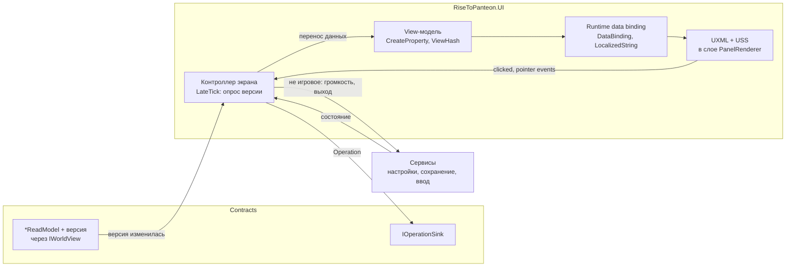

# UI — экраны, HUD, сенсорное управление

> Экраны, HUD и сенсорное управление. Канонические имена — `README.md`; что показывать — GDD (`Interface.md`,
> U01–U08, M04). Ориентация — альбомная. «Проверить на спайке» — API или поведение не подтверждено
> документацией 6.6. Имена read-моделей и операций фич, кроме базовых (README §4.3), здесь рабочие: окончательные
> задаёт срез-владелец.

## 1. Назначение и границы

Контур UI рисует всё, что лежит поверх мира в экранных координатах: HUD, экраны и меню, плашки, подсказки
обучения, сенсорные контролы. Технология — UI Toolkit: компонент `PanelRenderer` + ассет `PanelSettings`,
runtime data binding, пакет Localization (UI-01). `UIDocument` в 6.6 помечен obsolete.

| UI делает | UI не делает |
|---|---|
| Показывает read-модели из `IWorldView` и состояние сервисов | Не ссылается на `Simulation`, `Bridge`, `Presentation`, Unity.Entities (ARCH-02) |
| Превращает действия игрока в `Operation` через `IOperationSink` | Не меняет и не хранит состояние игры (ARCH-04, ARCH-14) |
| Передаёт касания экранных контролов в `IInputService` | Не собирает `PlayerInputFrame` — это работа `IInputService` |
| Открывает экраны и держит паузу, пока открыто меню (`IScreenService`) | Не рисует в мире: метки над существами, кольцо цели, указатель прицела — Представление (UI-08) |
| Показывает текст только по ключам из `Configs/strings/` | Не содержит строк для игрока в C# и UXML (ARCH-17) |

Ссылки сборки `RiseToPanteon.UI` и статус пакета `com.unity.localization` — `CodeStructure.md` §3.1. Dev-экраны —
`RiseToPanteon.Dev` (UI-22); импорт строк — `RiseToPanteon.Editor`.

**Панели.** Только Screen Space Overlay; world-space-панели UI Toolkit не используются.

| Панель | `PanelSettings` | Sort Order | Где живёт | Содержимое |
|---|---|---|---|---|
| HUD | `HudPanelSettings` | 0 | `Game.unity`, `GameScope` | HUD, сенсорные контролы, плашки, подсказки обучения |
| Меню | `MenuPanelSettings` | 10 | `Boot.unity`, `ProjectScope` | Слои `screen`, `modal`, `system`: главное меню, пауза, кокон, смерть, диалоги |
| Dev | `DevPanelSettings` | 100 | `Dev.unity`, `DevScope` | Читы, оверлеи, стенд экранов (только `RTP_DEV`) |

На панель — один `PanelRenderer` с корневым `UILayers.uxml` (корневая настройка сцены, ARCH-13). Своего
`PanelRenderer` у экрана нет: выключение компонента удаляет дерево элементов и освобождает ресурсы, поэтому
экран — поддерево в контейнере слоя. Корень панели приходит в `RegisterUIReloadCallback`
(`void OnUIReload(PanelRenderer renderer, VisualElement root)`); хост `UIPanelHost` подключает слои только
оттуда — колбэк повторяется и при живой перезагрузке UXML. Масштаб панелей — Scale With Screen Size,
опорное разрешение 1920×1080 с упором в высоту (Match Width Or Height = 1): в альбомной ориентации ограничивает
высота. Сенсорные контролы считаются в миллиметрах отдельно (§7.4).

## 2. Архитектура экрана

Экран — это UXML (структура), USS (стиль), контроллер (C#, связывает части и ловит действия)
и view-модель (C#, данные для привязки). UXML и USS лежат в Addressables под разными ключами (§10).



1. В `LateTick`, после обновления мира в этом кадре, контроллер видимого экрана сверяет версии read-моделей.
2. Если версия новая, контроллер переносит данные в view-модель, и её версия растёт.
3. Привязки обновляют UXML. Binding system пропускает view-модель, у которой `GetViewHashCode()` не менялся.
4. Нажатие вызывает колбэк контроллера (`Button.clicked`, pointer events), и тот отправляет `Operation`
   в `IOperationSink` или вызывает сервис. View-модель «в ожидании результата» не меняется: новое состояние
   приходит только через read-модель.

Пример — экран выбора кокона (U04 R8): данные — из read-модели, действия — операциями.

```csharp
public sealed class CocoonScreenController : ScreenController<CocoonViewModel>
{
    private readonly IWorldView _world;
    private readonly IOperationSink _ops;
    private ReadModelWatch<CocoonChoiceReadModel> _choice;

    public CocoonScreenController(IWorldView world, IOperationSink ops, CocoonViewModel model)
        : base(model)
    {
        _world = world;
        _ops = ops;
    }

    public override void Refresh()
    {
        if (_choice.Changed(_world, out var rm)) Model.Apply(in rm);
    }

    protected override void OnBind(VisualElement root)
    {
        root.dataSource = Model;
        root.Q<Button>("cocoon-screen__confirm").clicked += ConfirmClickedHandler;
        root.Q<Button>("cocoon-screen__cancel").clicked += CancelClickedHandler;
    }

    private void ConfirmClickedHandler() => _ops.Enqueue(CocoonOps.ChooseVariant(Model.SelectedIndex));

    private void CancelClickedHandler() => _ops.Enqueue(CocoonOps.Cancel());
}
```

- `OnBind` вызывается один раз после `Instantiate`; привязки UXML читают из `root.dataSource`.
- `Refresh` вызывается каждый `LateTick`, пока экран виден.
- `CocoonOps` — фабрики операций в Contracts фичи; формат `Operation` — `Simulation.md`.

## 3. IScreenService: стек, модальность, пауза, приоритеты

`ScreenService`, реализация канонического `IScreenService`, живёт в `ProjectScope` вместе с главным меню
(README §4.2). Инсталлеры фич (`IFeatureInstaller`) регистрируют `ScreenDefinition` в своём скоупе. Когда
скоуп уничтожается, его экраны закрываются и их ассеты освобождаются.

```csharp
public interface IScreenService
{
    event Action OnStackChanged;

    bool IsBlockingInput { get; }

    bool Open<TScreen>() where TScreen : IScreenController;
    bool Open<TScreen, TArgs>(TArgs args) where TScreen : IScreenController, IScreenWithArgs<TArgs>;
    void Close<TScreen>() where TScreen : IScreenController;
    bool Back();
    bool IsOpen<TScreen>() where TScreen : IScreenController;
}
```

- `Open` возвращает `false` при отказе по приоритету.
- `Back` — Esc, «назад» Android.
- `IsBlockingInput` — открыт экран слоя `screen`, `modal` или `system`.

| Слой | Поведение | Экраны Прототипа (приоритет) |
|---|---|---|
| `hud` (панель HUD) | Постоянный, паузу не ставит, прячется под полноэкранными экранами | HUD |
| `screen` | Стек: виден верхний, нижние — `display: none` | Главное меню (10), меню паузы (40), кокон (80) |
| `modal` | Поверх верхнего экрана с затемнением; нижний виден, но ввода не получает | Подтверждение (60) |
| `system` | Закрывает `screen` и `modal`; пока открыт, другие экраны не открываются | Смерть (100) |

- **Приоритет.** Запрос с приоритетом ниже, чем у верхнего экрана, отклоняется. Исключение — modal, который
  открывает сам верхний экран. Так смерть в кадре открытия меню побеждает меню (U04 §10).
- **Повторное открытие** поднимает экран наверх и передаёт аргументы: вкладка «Карта» по тапу на миникарту (U05 §7).
- **Пауза.** Пока в стеке есть экран с `PausesGame`, сервис держит `PauseReason.Menu` (README §3, ARCH-21).
  Паузу ставит любое меню (U04 R1, U01 R18), включая настройки (U08 R3); сами экраны паузу не трогают.
  `Time.timeScale` пауза не меняет, поэтому анимации UI идут и на паузе.
- **Скрытие HUD.** Экран с `HidesHud` прячет HUD и сбрасывает сенсорные контролы (захваты отпущены, ввод
  обнулён), чтобы после паузы стик не «залипал».
- **Сворачивание.** После возврата из фона при идущей игре и пустом стеке открывается меню паузы (U04 R3).
- **Back** решает верхний экран (`OnBack`); смерть и кокон в фазе формирования «назад» игнорируют.
- **Переход между локациями** (затемнение): открываются только `system`-экраны, прочие запросы отклоняются.
- **Экраны, которые открывает игра.** Кокон и смерть открывает триггер фичи — `ILateTickable`, который следит
  за read-моделью (например, за флагом ожидания выбора в `CocoonChoiceReadModel`). Симуляция экраны не открывает.
- **Порядок открытия:** проверка приоритета → причина паузы в `IAppLifecycle` → `OnOpen(args)` и `Refresh()`
  до показа → HUD скрыт → `display: flex` у корня экрана.

## 4. View-модели и read-модели

**Read-модель** (`*ReadModel`, Contracts) — blittable-структура, которую экспорт пишет вместе со снимком.
Владелец — `WorldViewPublisher` (двойной буфер). Версия read-модели растёт при изменении содержимого.
Данные валидны в пределах кадра: view-модель их копирует и не хранит ссылок на буферы.

**Опрос.** `ReadModelWatch<T>` помнит последнюю увиденную версию; `Changed()` возвращает `true` один раз
на каждую новую. Опрос идёт в `LateTick` (`ILateTickable` VContainer в `ScreenService`) и только у видимых
экранов и HUD. При открытии экрана из пула его наблюдатели сбрасываются, первый `Refresh` берёт свежие данные.

**View-модель** — C#-класс UI, по одному на экран, вкладку или виджет HUD. Базовый `ViewModel` реализует
`IDataSourceViewHashProvider` (`GetViewHashCode()` = версия VM) и `INotifyBindablePropertyChanged`. Свойства —
`[CreateProperty]`, класс — `[GeneratePropertyBag]` (без рефлексии, важно для IL2CPP). В VM — готовые к показу
значения: доли для полос, ключи строк, спрайты иконок, `LocalizedString` с переменными. Режим привязки `ToTarget`
пишется явно (по умолчанию `TwoWay`); `TwoWay` — только для локальных полей: громкость, выбранная карточка.

| Данные | Владелец | Живёт | UI может |
|---|---|---|---|
| `*ReadModel` | `WorldViewPublisher` (Мост) | кадр | читать, копировать |
| `SimEvent` (реплика, подбор, триггер обучения) | `WorldViewPublisher` | кадр чтения | читать |
| View-модель | контроллер экрана | пока экран в пуле | писать |
| Локальное состояние экрана (вкладка, выбор, прокрутка, масштаб карты) | view-модель | пока экран открыт | писать; не сохраняется, на игру не влияет |
| Настройки, статус сохранения, устройство ввода | сервисы | сессия | читать; менять через API сервиса |

**Имена и иконки** объектов (предметы, виды, черты) read-модель передаёт числовыми id. Ключ строки и адрес
иконки UI берёт из данных отображения пака конфигов через `IConfigPackProvider` (формат — `Content.md`),
иконку грузит `IAssetProvider` (ARCH-13).

**Отправка операций.** После `Enqueue` контрол заблокирован до новой версии нужной read-модели, поэтому
двойных операций нет. Ограничения, видные заранее (снаряжение в бою, U04 R12), UI показывает затемнением
с причиной по флагам read-модели; окончательная проверка — Validate в симуляции. Очки характеристик,
снаряжение и выбор кокона отправляются на паузе (U04 R8, R9, R12); результат приходит «тиком без времени»
(README §3) без снятия паузы. UI результат не предсказывает.

## 5. HUD

HUD — постоянный экран слоя `hud` в `GameScope`, открывается при входе в игру. Корень `Hud.uxml` состоит
из слотов `HudSlot` (`TopLeft`, `TopRight`, `TopCenter`, `Toasts`, `Controls`). Фичи добавляют виджеты через
`IHudWidget` в своём инсталлере, центральный файл HUD не правится (ARCH-15).

| Элемент | GDD | Где | Источник данных |
|---|---|---|---|
| Полоса здоровья; в коконе — прочность с отметкой «малого здоровья» | U03 R1, R16 | UI, слева сверху | `PlayerReadModel` |
| Полоса опыта, уровень числом, счётчик избытка | U03 R1, R12, R15 | UI, слева сверху | `PlayerReadModel` |
| Индикатор готовности к линьке или метаморфозе (2 состояния + «готово») | U03 R7 | UI, слева сверху | `PlayerReadModel` |
| Иконки статусов с кольцом таймера; кольцо времени кокона | U03 R1 (C06, E08) | UI, слева сверху | `PlayerReadModel` |
| Переключатель приглушения с индикатором снятия ~1 с | U01 R9, U03 R1 | UI, под полосами | `PlayerReadModel`; нажатие → `IInputService` (как клавиша G) |
| Миникарта (~18% высоты, север вверху, радиус 12 клеток, существа в поле зрения) | U03 §5, U05 R13, §5 | UI, справа сверху | `MinimapReadModel`; тап → меню паузы, вкладка «Карта» |
| Счётчик ключей локации у миникарты; кнопка меню | U03 R24, U01 R10 | UI, справа сверху | `MinimapReadModel`; кнопка → `IScreenService` |
| Полоса мини-босса с прозвищем | U03 R13, M04 R12 | UI, вверху по центру | `BossBarReadModel` |
| Кнопки и стик; перезарядка; иконка и число быстрой ячейки; иконка контекстной кнопки | U01, U03 R9 | UI, слой `Controls` | `AbilityBarReadModel`, `PlayerReadModel` |
| Реплика над персонажем 3–4 с | U03 R8, §5 | UI, привязка к точке мира (ниже) | `SimEvent` «реплика» |
| Плашки подбора и системные окна; подсказки управления | U03 R21, U07 | UI, слот `Toasts` и слой подсказок | `SimEvent`, `IToastQueue` |
| Значок автосохранения на время записи | M01 §7 (рекомендация) | UI, угол экрана | `ISaveService` |
| Метки опасности (цвет + форма); короткая полоса раненой цели (3 с) | U03 R5, R13, R14, R17 | **Представление**, спрайты в мире | снимок, read-модели |
| Кольцо цели автонаведения; указатель ручного направления | U02 R5, R8 | **Представление** (указатель читает `IInputService`) | снимок, ввод |
| Искажение краёв (распад, давление), пульсация низкого здоровья | U03 R2–R4, C07 | **Представление**, шейдер экрана | read-модели |
| Числа урона (только отладочная сборка) | U03 R13 | **Представление** под `RTP_DEV` | `SimEvent` |

**Реплика** — текст (локализация, перенос, размер текста из U08), поэтому она в UI, а не спрайтом в мире. Точку
над говорящим даёт порт `IWorldAnchorService` (`StableId` → экранная точка с интерполяцией; реализует
Представление по игровой камере), в координаты панели её переводит `RuntimePanelUtils.ScreenToPanel`.

**Очередь плашек** (`IToastQueue`): на экране одна плашка или подсказка (U07 §5), паузы нет. Системное окно ждёт
конца реплики (U07 R12) и откладывается, пока поднят флаг «в бою» (U07 R9); между подсказками ≥ 10 с, окна
подряд — по одному (U07 R13). Когда показать подсказку, решает симуляция: флаги показа лежат в сохранении мира
(U07 R10). UI получает `SimEvent`, а после показа отправляет `MarkOnboardingShown`.

## 6. Экраны прототипа

Набор по U04 R2 и §9: меню паузы с вкладками Персонаж (с Атласом) · Экипировка · Карта, Кокон, Смерть, главное
меню «Продолжить / Новый мир». Вкладки — дочерние контроллеры меню паузы, их регистрирует `IPauseMenuTab`
(Журнал в Срезе — 4-я вкладка, U04 R17). Вкладка создаётся при первом показе и остаётся в пуле.

| Экран | GDD | Слой (приоритет) | Данные | Действия → куда |
|---|---|---|---|---|
| Главное меню | U04 R13, M02 | `screen` (10), `ProjectScope` | `ISaveService`: есть ли сохранение | «Продолжить», «Новый мир» → сервисы загрузки и создания мира (мира ещё нет, операции невозможны) |
| Меню паузы | U04 R1, R4, §5; U08 R17 | `screen` (40) | вкладки; настройки | «Продолжить» → закрыть; «Сохранить и выйти» → `ISaveService` и переход в главное меню; громкость → сервис настроек; автоприглушение → `SetAutoSuppression` (влияет на симуляцию, W08) |
| Персонаж + Атлас | U04 R7, R9, R11 | вкладка | `CharacterReadModel`, `AtlasReadModel` | `AllocateAttributePoint` (можно в бою), `AssignAbilitySlot` (замена занятого слота — только у якоря, решает Validate) |
| Экипировка и инвентарь | U04 R2, R12 | вкладка | `InventoryReadModel`, флаг «в бою» | `EquipItem`, `UnequipItem`, `DropItem`, `UseConsumable`; в бою затемнены |
| Карта | U05 R2–R6, R11, §7 | вкладка; тап по миникарте | `MapReadModel` | нет: панорама, масштаб, этаж, схема этажей и якорей — локально |
| Кокон | U04 R8, §7 | `screen` (80), триггер | `CocoonChoiceReadModel`; превью — `IAppearancePreviewService` | `ChooseCocoonVariant`, `CancelCocoon` (до формирования бесплатно) |
| Смерть | U04 R5, R10 | `system` (100), триггер | `DeathReportReadModel`; открывается после подтверждения записи сохранения | `ConfirmRespawn` |
| Подтверждение | U08 §7 | `modal` (60) | аргументы | колбэк открывшего экрана |

**Карта** рисуется только по `MapReadModel` — последнему увиденному состоянию, хранимому отдельно
от актуального (U05 R2); туман UI не вычисляет. Пол этажа — текстура «клетка = тексель», при новой версии
дописываются изменившиеся клетки. Иконки (~12 видов, U05 §9) — из пула, метка гибели одна (U05 R5). Панорама
и масштаб — `style.translate`/`style.scale` контейнера с `UsageHints.GroupTransform`, щипок — два захваченных
касания (§7.3). **Превью облика** рисует Представление в `RenderTexture` по описанию варианта, UI показывает его
через `Background.FromRenderTexture`. Порты `IAppearancePreviewService` и `IWorldAnchorService` реализует
Представление, так что прямой зависимости UI ↔ Представление нет.

## 7. Сенсорное управление (U01, U02) и связь с IInputService

Путь касания: `FloatingStick` и `TouchActionButton` → `TouchControlsController` (состояние за кадр) →
`ITouchControlsSink` → `IInputService`, где экранный ввод сливается с действиями Input System в `PlayerInputFrame`
(`Services.md` §6).

### 7.1. Состав и раскладка

Контролы — слой `Controls` в HUD. Корень и контейнеры — `PickingMode.Ignore`, чтобы пустые места не глотали
касания. Слева — зона стика `touch-controls__stick-zone`: левые 40% ширины безопасной зоны ниже верхней полосы
HUD (U01 R2, §5). Справа — дуга кнопок вокруг атаки (U01 §7): атака, рывок, 1–4 способности (только открытые
слоты, U01 R4), контекстная кнопка, быстрая ячейка — не больше 8 (U01 R3). Иконку контекстной кнопки и её
затемнение даёт read-модель (U01 R5, R7). `TouchActionButton` переопределяет `ContainsPoint`: зона нажатия —
круг, и она может быть больше видимой кнопки.

### 7.2. Жесты

| Контрол | Тап | Удержание | Удержание + сдвиг > 15% радиуса кнопки (U02 §5) |
|---|---|---|---|
| Атака | одна атака с автонаведением | серия в темпе атаки (U01 R17, C03 R12) | серия в ручном направлении (U02 R11) |
| Способность | применение по отпусканию, автонаведение (U02 R4) | — | указатель; отпускание — применение, возврат пальца на кнопку — отмена (U02 R5) |
| Рывок, контекст, ячейка | действие | — | — |

Ручное направление — вектор от центра кнопки к пальцу в экранных координатах. Камера не вращается (C10),
поэтому экранное направление совпадает с мировым; если вращение появится, это место пересматривается.

### 7.3. Мультитач

- Каждое касание приходит в UI Toolkit со своим `pointerId` (`PointerId.touchPointerIdBase` + индекс). Контрол
  на `PointerDownEvent` захватывает палец (`CapturePointer(pointerId)`) и дальше принимает `PointerMoveEvent`
  и `PointerUpEvent` только с этим id. Так стик и кнопки работают одновременно (U01 R15).
- Стик: первое касание в зоне ставит основание в точку касания (со сдвигом внутрь безопасной зоны); пока палец
  захвачен, другие касания в зоне игнорируются. Выход — нормированное отклонение с мёртвой зоной 10% хода
  (U01 §5); аналоговая величина сохраняется для медленного шага (< 50% хода, Срез, C08).
- `PointerUpEvent`, `PointerCancelEvent` и `PointerCaptureOutEvent` (палец ушёл за край, системный жест,
  сворачивание) сбрасывают контрол: стик в ноль, персонаж стоит (U01 §10).
- Нажатия (тап атаки, рывок, контекст) защёлкивает `IInputService` до первого тика (`Services.md` §6).
- Система событий UI Toolkit с Input System берёт касания из действий `UI/Point` и `UI/Click`
  (`<Touchscreen>/touch*/…`). Одновременные касания через неё — **проверить на спайке** на устройстве (стик +
  атака + способность). Запасной путь: `IInputService` читает `Touchscreen` напрямую, попадание — через
  `IPanel.Pick`, те же элементы остаются визуалом и зонами нажатия.
- В карте действий `Player` нет привязок к `<Touchscreen>`, иначе касание стало бы и кнопкой, и игровым вводом
  (состав карты — `Services.md` §6).

### 7.4. Миллиметры → пиксели

Минимумы U01 §5 заданы в миллиметрах: кнопка ≥ 10 мм, атака ≥ 14 мм. Панель масштабируется по высоте экрана,
поэтому размеры контролов считает `TouchMetrics` по токенам темы в мм (§8). Перевод мм в единицы панели:

```csharp
public float MmToPanel(float mm, IPanel panel)
{
    float dpi = Screen.dpi;
    if (dpi < MIN_SANE_DPI || dpi > MAX_SANE_DPI) dpi = FALLBACK_DPI;
    return mm * dpi / 25.4f / panel.scaledPixelsPerPoint;
}
```

`Screen.dpi` на части Android равен 0 или врёт, поэтому вне `MIN_SANE_DPI`…`MAX_SANE_DPI` (100…800) берётся
`FALLBACK_DPI` = 460. Деление на `scaledPixelsPerPoint` переводит пиксели в единицы панели.

Запасной DPI завышен сознательно: при ошибке кнопки выйдут крупнее минимума, а не мельче. Размер — `max(токен,
минимум U01)`, пересчёт — при смене разрешения или безопасной зоны; множитель из настроек (80–130%, U08 §5, Срез)
минимум не нарушает (U08 R16).

### 7.5. Клавиатура, мышь, геймпад, пауза

- Если последнее устройство — клавиатура или мышь (сообщает `IInputService`), HUD получает класс
  `hud--pointer`: экранные кнопки сменяет компактная панель способностей с глифами клавиш и перезарядкой
  (U01 §7, U03 §7). Наведение мышью собирает `IInputService` (U02 R6).
- Каждый кадр UI передаёт в `ITouchControlsSink.SetPointerOverUI` флаг «указатель над UI» (`IPanel.Pick` в позиции курсора),
  чтобы клик по кнопке меню не стал атакой. На паузе и при сворачивании все захваты отпускаются (§3).
- Esc, Tab, I, C (U04 §7) приходят из `IInputService` командами интерфейса и превращаются в вызовы
  `IScreenService`. Геймпад и фокус-навигация UI Toolkit — Срез (U01 R13).
- Настройка раскладки (Срез; U08 R16, R20: размер, прозрачность, положение, зеркальный пресет) — данные профиля,
  которые читает `TouchControlsController`. Код контролов от раскладки не зависит.

## 8. Стили и тема

Тема лежит в `Assets/_Project/Code/UI/Theme/`. `RtpTheme.tss` задан как Theme Style Sheet во всех `PanelSettings`
и подключает `Theme.uss` (токены) и `Components.uss` (общие компоненты `rtp-*`). USS экрана лежит в срезе фичи
и пользуется только токенами. `Theme.uss` — единственное место с «сырыми» значениями; единицы — опорные px панели
(высота 1080):

```css
:root
{
    --color-bg-panel: rgba(14, 11, 18, 0.92);
    --color-text-primary: #ECE4D2;
    --color-text-muted: #9C9384;
    --color-accent: #C9A24B;
    --color-hp: #B8322C;
    --color-xp: #6FA8C9;
    --space-1: 4px;
    --space-2: 8px;
    --space-3: 16px;
    --space-4: 32px;
    --radius-card: 12px;
    --font-size-caption: 24px;
    --font-size-body: 32px;
    --font-size-title: 44px;
    --size-touch-min: 120px;
    --touch-button-mm: 10;
    --touch-attack-mm: 14;
    --touch-stick-radius-mm: 12;
}
```

- **Размеры касания.** `--size-touch-min` (120 px ≈ 7 мм на телефоне 5″) — цель нажатия в меню, ориентир.
  `--touch-button-mm` и `--touch-attack-mm` — минимумы U01 §5, их читает C# (`CustomStyleProperty<float>`).
  `--touch-stick-radius-mm` — ориентир, настраивается в прототипе.
- **Токены.** В USS экрана — только `var(--…)`. Токены в мм — безразмерные числа: `TouchMetrics` читает их
  в `CustomStyleResolvedEvent` через `customStyle.TryGetValue(new CustomStyleProperty<float>("--touch-button-mm"),
  out var mm)`. В USS нет `calc()`, поэтому производный размер — отдельный токен.
- **Размер текста** (U08 §5, Срез: 100/120/140%) — класс на корне панели (`rtp-root--text-120`), переопределяющий
  токены `--font-size-*`. Переменные USS наследуются вниз по дереву.
- **Безопасная зона.** Под корнем каждого слоя — `SafeAreaElement`: `padding` по `Screen.safeArea`, переведённой
  в координаты панели (ось Y в `ScreenToPanel` — проверить на спайке). Проверка каждый кадр: при смене альбомной
  ориентации вырез переходит на другую сторону (U01 R1). Фоны и затемнения доходят до краёв экрана,
  интерактивное — только внутри безопасной зоны.
- **Без текстур, где можно.** Фон, рамки, скругления и цвета задаёт USS. Текстуры — только иконки (спрайтовые
  атласы по группам: HUD, предметы, статусы) и превью. Скругление с `overflow: hidden` — это стенсил-маска (§10).
- **Шрифты.** `FontAsset` (TextCore, SDF) с кириллицей, латиницей, цифрами и пунктуацией с первого дня (M04 R9):
  статический атлас известных глифов плюс динамический запасной шрифт в `PanelTextSettings`. В теме — через
  `-unity-font-definition`; не больше двух начертаний (текст, заголовок), ориентир.
- **Запас +30% длины** (M04 §5): у текстовых контейнеров только `min-width`/`max-width`, перенос включён;
  кнопки HUD — иконки без текста (M04 §7); многоточие — крайняя мера, только в списках. Проверка — псевдолокаль.
- **Качество графики** (U08 R1, R7) меняет только мир: панели рисуются поверх в полном разрешении экрана,
  в том числе при сниженном render scale URP (проверить на спайке).

## 9. Локализация

Источник строк, ключи, их проверки и импорт в String Table Collections — `Content.md` §8; сервис
`ILocalizationService` и выбор языка — `Services.md` §9. UI берёт текст только через `LocalizedString` (UI-09).

Статичный текст в UXML задаётся привязкой, атрибут `text` остаётся пустым:

```xml
<ui:UXML xmlns:ui="UnityEngine.UIElements" xmlns:l="UnityEngine.Localization">
    <ui:Label name="pause-menu__title" class="pause-menu__title rtp-text--title">
        <Bindings>
            <l:LocalizedString property="text" table="ui" entry="ui.pause.title" />
        </Bindings>
    </ui:Label>
</ui:UXML>
```

- **В C#** — `label.SetBinding("text", localizedString)`. Для подстановок VM держит `LocalizedString`
  с локальными переменными (`IntVariable`, `StringVariable`) и меняет их `Value` при новой версии read-модели.
  Текст обновляется сам, в том числе при смене языка.
- **Подстановки и множественное число** — по `Content.md` §8.1 (UI-10). Числа форматирует культура локали,
  в русском — с десятичной запятой (M04 §10).
- **Списки** (инвентарь, Атлас): строки элементов берутся синхронно из предзагруженной таблицы и кэшируются
  до смены языка; `LocalizedString` на каждый элемент не создаётся (предзагрузку проверить на спайке).
- **Язык.** В Прототипе только `ru`, переключателя нет (M04 §7); выбор языка — `Services.md` §9.
- **Проверки.** Автотест «нет кириллицы в C# и UXML» (M04 §13); псевдолокаль с удлинением +30% (M04 §9,
  методы псевдолокали проверить на спайке); `UIContractValidator` ищет непустые атрибуты `text` в UXML.

## 10. Загрузка и производительность

**Адреса.** UXML и USS — отдельные ключи `ui/<фича>/<файл>.uxml` и `.uss` (`ui/cocoon/cocoon-screen.uxml`).
UXML не подключает свой USS через `<Style>`: стили навешивает `ScreenService` (`root.styleSheets.Add`), общие
USS не дублируются. `<Template>`, шрифты и спрайты из `url()` — зависимости адресного ассета; иконки из конфигов
грузит `IAssetProvider` по id (CONT-18). UI-ассеты Прототипа помечены меткой `ui-preload`.

**Открытие ≤ 0,2 с (U04 §5)** на слабом телефоне:

1. **Предзагрузка.** `ProjectScope` грузит главное меню и общие USS; узел загрузки игры (`BootGraph`) — все
   ассеты `ui-preload` до первого кадра игры. Ждать загрузки при открытии экрана запрещено.
2. **Прогрев.** Экраны с `Pooled` (меню паузы с вкладками, кокон, смерть) создаются `VisualTreeAsset.Instantiate()`
   после загрузки локации, по одному за кадр, и остаются в слое с `display: none`. Открытие = `Refresh()` +
   `display: flex` + переход по `opacity`/`translate`.
3. **Непулируемые** экраны (главное меню после входа в игру) уничтожаются, ассеты освобождаются по счётчику
   ссылок `IAssetProvider`.
4. **Замер.** Dev-оверлей пишет время от `Open` до первого кадра с экраном; превышение бюджета — баг (ARCH-19).

**Быстрая отрисовка** (руководство Unity 6.6 по производительности UI Toolkit):

- Длинные и неограниченные списки — `ListView` с виртуализацией (`virtualizationMethod = FixedHeight`);
  сотни элементов в `ScrollView` не создаются.
- Анимируются только `translate`, `scale`, `rotate`, `opacity`, но не `width`, `height`, `top`, `left`,
  `margin`. Заполнение полосы — `scale` по X с `transform-origin` слева (`ValueBar`).
- `UsageHints`: `DynamicTransform` — ручка стика и часто двигающиеся элементы; `GroupTransform` — содержимое
  карты; `DynamicColor` — мигающие полосы; `MaskContainer` — общий предок вложенных масок.
- Прятать — `display: none` (ни раскладки, ни отрисовки); `visibility` и `opacity: 0` элемент не выключают.
- Прямоугольная обрезка батч не ломает, стенсил (скругление + `overflow: hidden`) ломает. Вложенность
  стенсил-масок — не больше 7 уровней, наша норма — 2. Миникарта — прямоугольная маска.
- В батче не больше 8 текстур: иконки экрана — из одного-двух атласов. Dynamic Atlas принимает мелкие иконки
  (Max Sub Texture Size), текстуры карты и превью туда не попадают.
- В HUD нет аллокаций каждый кадр: строки и числа обновляются только при новой версии. Vertex Budget панели
  HUD подбирается профилированием. Ориентир — обновление UI в бою ≤ 0,5 мс CPU на слабом телефоне.

## 11. Как агенту сверстать экран

Раскладка среза фичи (подробно — `CodeStructure.md`):

```text
Assets/_Project/Features/Cocoon/UI/
├── Cocoon.UI.asmref               → RiseToPanteon.UI
├── CocoonUIInstaller.cs           IFeatureInstaller: ScreenDefinition, VM, контроллер, триггер
├── CocoonScreen.uxml              адрес ui/cocoon/cocoon-screen.uxml
├── CocoonScreen.uss               адрес ui/cocoon/cocoon-screen.uss
├── CocoonCard.uxml                шаблон карточки (<Template>), без своего USS
├── CocoonScreenController.cs
├── CocoonViewModel.cs
└── CocoonScreenTrigger.cs         открывает экран по CocoonChoiceReadModel
Configs/strings/ru/ui.json         ключи ui.cocoon.*
```

Соглашения об именах (BEM):

- Блок — экран или компонент в kebab-case (`cocoon-screen`, `cocoon-card`); элемент — `блок__элемент`
  (`cocoon-screen__card-list`); модификатор — `блок--мод` или `блок__элемент--мод` (`cocoon-card--selected`,
  `hud__ability--cooldown`). Общие классы темы — с префиксом `rtp-` (`rtp-button`, `rtp-text--title`).
- `name` есть только у элементов, которые ищет код, и повторяет их BEM-класс. Селекторы в USS экрана — только
  по классам (`.cocoon-card__title`), не глубже двух уровней; `#name` и селекторы по типу — только в теме.
- Файлы: `<Имя>Screen.uxml/.uss`, `<Имя>ScreenController.cs`, `<Имя>ViewModel.cs`; вкладка — `<Имя>Tab`,
  виджет HUD — `<Имя>Widget`.

Шаги:

1. Прочитать §7 «Интерфейс» фичи в GDD и U04: какие данные на экране, какие действия. Действию, меняющему
   игру, нужна операция — она есть в `Contracts` фичи или добавляется по `Simulation.md`.
2. Добавить строки в `Configs/strings/<locale>/<table>.json` и запустить импорт.
3. UXML: корень с классом блока, `name` у элементов для кода, текст через `<Bindings>`, данные через
   `<ui:DataBinding property="…" data-source-path="…" binding-mode="ToTarget" />`. Инлайн-стили запрещены.
4. USS: только классы и токены темы; анимируются только трансформации и прозрачность.
5. VM (наследник `ViewModel`, `[GeneratePropertyBag]`, `[CreateProperty]`) с методом `Apply` из read-модели.
   Контроллер (наследник `ScreenController<TViewModel>`): в `OnBind` — поиск элементов и клики, в `Refresh` —
   опрос версий, действия — операциями.
6. Зарегистрировать `ScreenDefinition` (ключи, слой, приоритет, `PausesGame`, `HidesHud`, `Pooled`, `Closable`)
   в инсталлере; добавить адреса в группу Addressables с меткой `ui-preload`.
7. Тесты EditMode: контракт UXML (каждое `Q` контроллера находит элемент, ключи есть в таблицах, в атрибутах
   нет текста) и перенос read-модели в VM на `FakeWorldView`.
8. Проверка вида. В 6.6 скриншот для проверки снимается только в Play Mode: агент запускает стенд `UISandbox`
   (Dev) с фикстурой read-модели и снимает экран в 16:9, 20:9 и 4:3, затем на псевдолокали +30%. Время
   открытия — по dev-оверлею. Если изменилась механика — обновить GDD (ARCH-20).

UI Builder — только для просмотра: сохранение из него вносит инлайн-стили, такой диф отклоняется. UI Agent
(Unity AI Assistant) пишет в `Assets/UI` — результат переносится в срез фичи и приводится к соглашениям.

## 12. Правила контура

| ID | Правило |
|---|---|
| UI-01 | UI — UI Toolkit на `PanelRenderer`. `UIDocument` запрещён; uGUI — только исключение, записанное в этом документе. |
| UI-02 | `RiseToPanteon.UI` не ссылается на `Simulation`, `Bridge`, `Presentation`, Unity.Entities (ARCH-02); разрешённые ссылки — `CodeStructure.md` §3.1. |
| UI-03 | Действие, меняющее игру, — только `Operation` через `IOperationSink`. Не игровые действия (громкость, выход, загрузка мира) — через API сервисов (ARCH-04, ARCH-14). |
| UI-04 | UI не хранит состояние игры. VM — проекция read-моделей и сервисов, её можно пересоздать в любой момент; локальное состояние экрана на игру не влияет. |
| UI-05 | Read-модели опрашиваются по версии в `LateTick`, только у видимых экранов и HUD; данные копируются, ссылки на буферы не хранятся. |
| UI-06 | Экран = UXML + USS + контроллер + VM и открывается только через `IScreenService`. Своего `PanelRenderer` у экрана нет. |
| UI-07 | Паузу держит `IScreenService` по `PausesGame`. Любое меню ставит паузу (U04 R1); HUD, плашки и подсказки — нет. |
| UI-08 | В мире UI не рисует: метки опасности, полосы над существами, кольцо цели, указатель прицела, искажение краёв — Представление. |
| UI-09 | Текст для игрока — только `LocalizedString` по ключам из `Configs/strings/`: атрибут `text` в UXML пуст, литералов в C# нет (ARCH-17, M04 R2). |
| UI-10 | Строки не склеиваются: именованные подстановки Smart Strings, числа с существительными — plural-форматтер (M04 R6, R7). |
| UI-11 | Стили — только в USS, инлайн-стилей в UXML нет; цвета, отступы, шрифты и радиусы в USS экрана — только `var(--…)` из `Theme.uss`. `element.style` в коде — только для вычисляемых значений: позиция, заполнение, безопасная зона, размеры в мм. |
| UI-12 | Имена по BEM (§11); `name` — только у элементов, которые ищет код; селекторы экранов — только по классам. |
| UI-13 | Вёрстка выдерживает +30% длины текста: у текстовых контейнеров нет фиксированной ширины, проверка — псевдолокаль (M04 §5, §13). |
| UI-14 | Кнопки боя ≥ 10 мм, атака ≥ 14 мм — через `TouchMetrics` (U01 §5, U08 R16). Интерактивные элементы — внутри безопасной зоны. |
| UI-15 | Каждый контрол захватывает свой `pointerId`; `Up`, `Cancel` и `CaptureOut` его сбрасывают; на паузе все захваты отпускаются. |
| UI-16 | В карте действий `Player` нет привязок к `<Touchscreen>`: касания идут только через экранные контролы. |
| UI-17 | Анимируются только `translate`, `scale`, `rotate`, `opacity`. Неограниченные списки — `ListView` с виртуализацией. |
| UI-18 | Стенсил-масок не больше 2 уровней (жёсткий предел 7); в батче не больше 8 текстур — иконки из атласов. |
| UI-19 | Экран открывается ≤ 0,2 с на слабом телефоне (U04 §5): ассеты предзагружены, частые экраны в пуле, время замеряется. |
| UI-20 | UXML, USS и иконки — через `IAssetProvider` по адресу; `url()` в UXML и USS — только зависимости адресного ассета (ARCH-13). |
| UI-21 | В HUD нет аллокаций каждый кадр: тексты и числа обновляются только при новой версии. |
| UI-22 | Dev-UI — только `RiseToPanteon.Dev` под `RTP_DEV`, через тот же `IScreenService` и слой Dev; читы — dev-операциями (ARCH-18). |
| UI-23 | У нового экрана есть тест контракта UXML и тест переноса VM; вид проверяется скриншотом в Play Mode. |

## 13. Типы контура

**`RiseToPanteon.UI`** — инфраструктура в `Assets/_Project/Code/UI/`:

| Тип | Вид | Назначение |
|---|---|---|
| `ScreenService` | класс | Реализация `IScreenService`: слои, стек, приоритеты, пауза, пул, опрос видимых экранов в `LateTick` |
| `ScreenDefinition` | класс | Регистрация экрана: ключи UXML и USS, слой, приоритет, `PausesGame`, `HidesHud`, `Pooled`, `Closable` |
| `ScreenLayer` | enum | `Hud`, `Screen`, `Modal`, `System`, `Dev` |
| `IScreenController`, `ScreenController<TViewModel>` | интерфейс, абстрактный класс | Жизненный цикл (`Bind`, `OnOpen`, `Refresh`, `OnBack`, `OnClose`) и база контроллера экрана, вкладки, виджета |
| `IScreenWithArgs<TArgs>` | интерфейс | Экран, открываемый с аргументами (вкладка, контекст) |
| `ViewModel` | абстрактный класс | База VM: версия, `IDataSourceViewHashProvider`, `INotifyBindablePropertyChanged` |
| `ReadModelWatch<T>` | структура | Опрос версии read-модели через `IWorldView` |
| `UIPanelHost` | MonoBehaviour | Держит `PanelRenderer` панели, подключает слои в `RegisterUIReloadCallback` |
| `IHudWidget`, `HudSlot` | интерфейс, enum | Виджет HUD от фичи и слот для него |
| `IPauseMenuTab` | интерфейс | Вкладка меню паузы от фичи |
| `IToastQueue`, `ToastRequest` | интерфейс, структура | Очередь плашек и системных окон (U03 R21, U07) |
| `FloatingStick`, `TouchActionButton` | `[UxmlElement]` | Плавающий стик и кнопка действия с захватом касания |
| `TouchControlsController` | класс | Собирает состояние контролов за кадр и передаёт в `ITouchControlsSink`, раскладка, сброс на паузе |
| `UnityLocalizationService` | класс | Реализация `ILocalizationService` (Services) на пакете Unity Localization |
| `TouchMetrics` | класс | Перевод мм → единицы панели, чтение токенов в мм |
| `SafeAreaElement` | `[UxmlElement]` | Отступы по `Screen.safeArea` |
| `ValueBar`, `RadialProgress` | `[UxmlElement]` | Полоса со `scale`-заполнением; кольцо перезарядки, статуса, таймера кокона |

**Экраны Прототипа** (срезы фич, §6), у каждого своя `<Имя>ViewModel`: `HudController`,
`MainMenuScreenController`, `PauseMenuScreenController`, `CharacterTab`, `EquipmentTab`, `MapTab`,
`MinimapWidget`, `CocoonScreenController`, `DeathScreenController`, `ConfirmDialogController`; триггеры
`CocoonScreenTrigger`, `DeathScreenTrigger`.

**Другие сборки:** `StringTableImporter`, `UIContractValidator` — Editor; `UISandbox` (стенд экранов
с фикстурами), `ScreenOpenTimingOverlay` — Dev; `FakeWorldView` — `Tests.EditMode`.

**Порты на границе контуров** — `IWorldAnchorService`, `IAppearancePreviewService`, `ITouchControlsSink`
(README §4.3); как UI их использует — §5, §6, §7.

**Read-модели фич**, которые читает UI (владельцы — срезы по `CodeStructure.md` §7.4; базовые — README §4.3):
`PlayerReadModel`, `AbilityBarReadModel`, `MinimapReadModel`, `MapReadModel`, `BossBarReadModel`,
`CharacterReadModel`, `AtlasReadModel`, `InventoryReadModel`, `CocoonChoiceReadModel`, `DeathReportReadModel`;
операции — из §5–§6.
